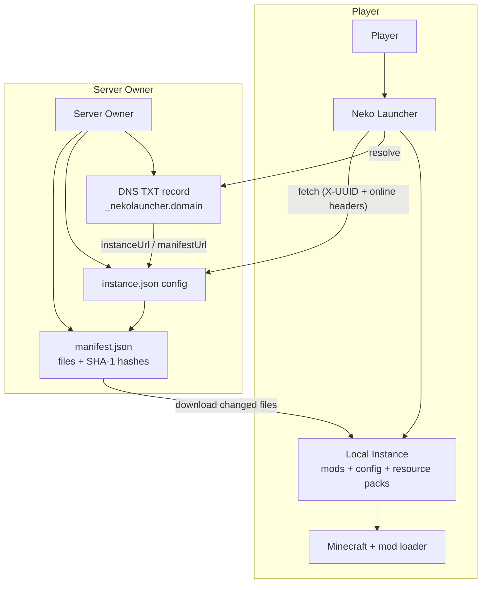

# Neko Launcher Wiki

Welcome to the official documentation hub for **Neko Launcher** — a Minecraft launcher built with Tauri 2 that lets players join curated servers in a couple of clicks, and lets server owners publish their own instances (mods, config, resource packs) over plain HTTP with automatic updates.

This wiki is split into two audiences: **players** who just want to launch and play, and **server owners / developers** who want to distribute a custom instance and gate access to it.

---

## 🗺️ How the ecosystem fits together

At a high level, a **server owner** publishes an instance description (config, file manifest) and optionally a DNS record so the launcher can auto-discover it. A **player** points the launcher at that server (or scans it automatically), and the launcher downloads only the files that changed, verifies them, and launches Minecraft with the right mod loader.

Every request the launcher makes to a server owner's endpoints carries an `X-UUID` header (the player's Minecraft UUID) and an `online` header (`"true"` for real Microsoft/Xbox accounts, `"false"` for offline), so operators can gate access if they want.

---

## 🚀 Quick start

### For players

* **[Download Neko Launcher](https://neko-launcher.com)** — grab the installer for your platform.
* **[Join a server by IP address](./how-to/join-with-ip-address)** — connect to a server in five steps.
* **[Make your own instance](./how-to/make-your-own-instance)** — set up a personal instance from scratch.

### For server owners & developers

* **[Neko Launcher integration guide](./neko-launcher/)** — the full server-integration overview.
* **[Instance configuration](./neko-launcher/instance-configuration)** — the `instance.json` schema and every option.
* **[Instance manifest](./neko-launcher/instance-manifest)** — how files are distributed and verified.
* **[DNS discovery](./neko-launcher/dns-discovery)** — publish a TXT record so the launcher finds your server automatically.
* **[HTTP headers](./neko-launcher/http-headers)** — the `X-UUID` / `online` headers and how to gate access.
* **[Social links](./neko-launcher/social-links)** — surface your Discord, website, and other links in the launcher.
* **[Announcements](./neko-launcher/announcement-instance)** — push notices, news, and events into the instance.

---

## 📚 Documentation sections

### Neko Launcher integration

Everything a server owner needs to publish and maintain an instance.

| Page | What it covers |
| --- | --- |
| **[Overview](./neko-launcher/)** | Introduction to server integration |
| **[Instance configuration](./neko-launcher/instance-configuration)** | `instance.json` fields, loader setup, metadata |
| **[Instance manifest](./neko-launcher/instance-manifest)** | The `manifest.json` file array + SHA-1 verification |
| **[DNS discovery](./neko-launcher/dns-discovery)** | Auto-discovery via TXT records |
| **[HTTP headers](./neko-launcher/http-headers)** | Access gating with `X-UUID` and `online` |
| **[Social links](./neko-launcher/social-links)** | Community and platform links |
| **[Announcements](./neko-launcher/announcement-instance)** | Notices, news, and events |

### How-to guides

Short, screenshot-driven walkthroughs.

* **[Join with an IP address](./how-to/join-with-ip-address)**
* **[Make your own instance](./how-to/make-your-own-instance)**

---

## 🔧 What the launcher does

* ✅ Instance management for **Fabric, Forge, Quilt, and NeoForge**
* ✅ Automatic mod, config, and resource-pack updates via manifest diffing
* ✅ SHA-1 verification of every downloaded file
* ✅ DNS-based server auto-discovery
* ✅ Access gating through per-request auth headers
* ✅ Microsoft/Xbox and offline account support
* ✅ Multi-language UI (EN / TH and more)
* ✅ Light and dark themes

### Supported mod loaders

| Loader | Notes |
| --- | --- |
| **Fabric** | Lightweight and modern |
| **Forge** | Traditional and extensive |
| **Quilt** | Community-driven Fabric fork |
| **NeoForge** | Modern Forge alternative |

---

## 🌐 Resources

* **[Download / launcher site](https://neko-launcher.com)** — get the app
* **[Furimoe](https://furi.moe)** — the main project site
* **[Discord community](https://alice-discord.furi.moe)** — chat, support, and announcements
* **[GitHub organization](https://github.com/alice-magic)** — source and issue tracking
* **[Wiki repository](https://github.com/alice-magic/wiki)** — the source for these docs

---

## 📖 Contributing

Found a mistake or want to add a page? These docs live on GitHub:

1. Open the **[wiki repository](https://github.com/alice-magic/wiki)**.
2. Submit an issue or a pull request.
3. Keep examples real and runnable — every config, DNS record, and header shown here matches what the launcher actually reads.

---

## See Also

* [Neko Launcher integration overview](./neko-launcher/)
* [Instance configuration](./neko-launcher/instance-configuration)
* [DNS discovery](./neko-launcher/dns-discovery)
* [How to join with an IP address](./how-to/join-with-ip-address)
* [How to make your own instance](./how-to/make-your-own-instance)
