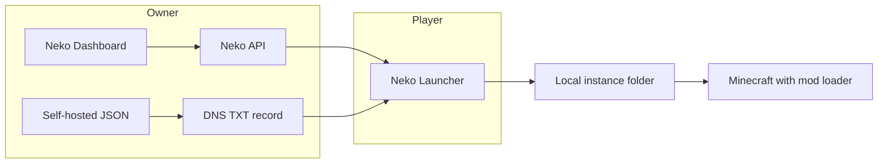

# Neko Launcher Wiki

**Neko Launcher** is a Minecraft launcher for curated servers. A player installs a server's modpack in one click and is kept in sync automatically; a server owner publishes and manages that modpack from a web dashboard, decides who may join, and can even collect an entry fee.

This wiki has three audiences:

| You are… | Start here |
|---|---|
| A **player** who wants to join a server | [Player guide](players/README.md) |
| A **server owner** who wants to publish a modpack and manage players | [Dashboard guide](dashboard/README.md) |
| A **developer** integrating with the launcher or hosting an instance yourself | [Technical reference](neko-launcher/README.md) |

---

## How it fits together

An **instance** is one server's modpack: a description (name, Minecraft version, mod loader, wallpaper, links) plus a **manifest** listing every file with a SHA-1 hash. The launcher downloads only what changed, verifies each file, installs the right loader and starts the game.

There are two ways to publish an instance:

- **Neko Dashboard** (recommended) — upload files at [neko-launcher.com/dashboard](https://neko-launcher.com/dashboard); the API serves the instance, hosts the files, runs the whitelist, applications, invite links and entry fees.
- **Self-hosted** — host two JSON files anywhere and point a DNS TXT record at them. Players type your domain into the launcher.

```mermaid
graph LR
  subgraph Owner
    D[Neko Dashboard] --> API[Neko API]
    H[Self-hosted JSON] --> DNS[DNS TXT record]
  end
  subgraph Player
    L[Neko Launcher]
  end
  API --> L
  DNS --> L
  L --> I[Local instance folder]
  I --> MC[Minecraft with mod loader]
```

---

## Player guide

- [Getting started](players/README.md) — install, sign in, find a server, play.
- [Join a server with an IP address](how-to/join-with-ip-address.md)
- [Apply to a server and pay an entry fee](how-to/apply-to-a-server.md)

## Dashboard guide

- [Workspaces, plans and members](dashboard/README.md)
- [Instances and their settings](dashboard/instances.md) — visibility, whitelist, read-only, hidden mods.
- [Files and versions](dashboard/files-and-versions.md)
- [Whitelist, applications and invite links](dashboard/whitelist-and-applications.md)
- [Entry fee](dashboard/entry-fee.md) — PromptPay QR, payment link or bank transfer, verified by slip.
- [Announcements](dashboard/announcements.md)
- [Discovery](dashboard/discovery.md) — get listed inside the launcher.

## Technical reference

- [Overview and architecture](neko-launcher/README.md)
- [Instance configuration](neko-launcher/instance-configuration.md) — schema v2.
- [Instance manifest](neko-launcher/instance-manifest.md) — schema v2.
- [DNS discovery](neko-launcher/dns-discovery.md) — self-hosting with a TXT record.
- [HTTP headers and authentication](neko-launcher/http-headers.md)
- [Announcement feed](neko-launcher/announcement-instance.md)
- [Social links](neko-launcher/social-links.md)
- [Server API](neko-launcher/server-api.md) — whitelist checks for server plugins.
- [Deep links](neko-launcher/deep-links.md) — `nekolauncher://` and `neko-launcher.com/j/…`.
- [Create your own instance](how-to/make-your-own-instance.md) — both routes, step by step.

---

## Downloads and support

- Download: [neko-launcher.com](https://neko-launcher.com)
- Dashboard: [neko-launcher.com/dashboard](https://neko-launcher.com/dashboard)
- Support: [neko-launcher.com/support](https://neko-launcher.com/support)
- This wiki is open source: [github.com/alice-magic/wiki](https://github.com/alice-magic/wiki)
