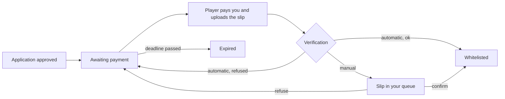

# Entry Fee

Charge a one-time fee when a player's application is approved. The player pays **you** directly; Neko Launcher only checks the proof of payment and then writes the whitelist entry.

---

## How it works

- Neko Launcher never holds the money and cannot refund it.
- The fee applies to every approval on the instance, including OPEN and AUTO modes.
- A player sees the fee before applying (*Joining costs 150 THB, paid after approval*).

## Settings

**Applications → Form settings → Entry fee.**

| Setting | Meaning |
|---|---|
| **Amount** | In THB. |
| **How players pay** | **PromptPay QR** — a QR with the amount embedded is generated from your PromptPay ID (phone, citizen ID or e-wallet ID). **Payment link** — any HTTPS page you provide (Stripe, LINE Pay, …). **Bank transfer** — bank, account number and account name shown to the player. |
| **Receiving account name** | Optional. With automatic verification, a slip paid to a different name is refused. |
| **Slip verification** | **Manual** — you look at each slip. **Automatic** — checked with the bank on upload (PRO plan and above). |
| **Hours to pay** | Deadline after approval; `0` for none. Unpaid applications expire and free their slot. |
| **Slip attempts** | How many refused slips a player may resend before the application is rejected. |
| **Note to the payer** | Per language, shown above the QR or bank details: what the fee covers, whether it is refundable. |

## Automatic verification

On PRO and higher plans the slip is verified through **EasySlip** on Neko's account; you do not need a key. Each uploaded slip is checked for:

- the **amount** matching the fee,
- the slip not having been **used before** (also across all applications on your instance),
- the **receiving account name**, when you filled one in.

A pass whitelists the player at once. A failure tells the player why (*amount does not match*, *already used*, *different account*, *no slip QR found*) and lets them resend. If the verification service is unavailable, the slip falls back to your manual queue instead of being refused.

A payment link cannot be verified automatically; players upload a screenshot for you to confirm.

## Reviewing payments

**Applications → Responses** with the filters **Slip to check** and **Awaiting payment**:

- **View slip** opens the image (a private link valid for ten minutes).
- **Confirm payment** whitelists the player.
- **Refuse slip** (with a note) sends it back for another attempt.
- **Mark as paid** on an application still awaiting payment, for money received another way.
- **Reject** ends the application.

Each application records the transaction reference, the time of payment and the number of attempts; the CSV export includes them.

## Rules and responsibilities

- What you charge, taxes, refunds and disputes are between you and your players. State your refund policy in the note.
- Applicants' answers and slips are personal data you receive; handle them accordingly.
- Neko may disable applications or fees on an instance used to defraud players.

## See also

- [Whitelist and applications](whitelist-and-applications.md)
- [Apply to a server (player side)](../how-to/apply-to-a-server.md)
- [Workspaces and plans](README.md)
