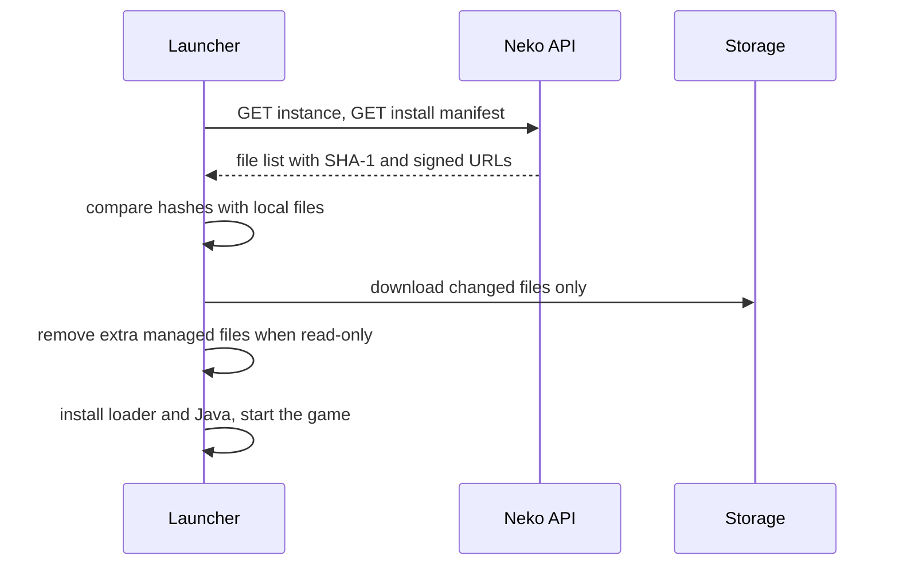

# Files and Versions

The **Files** tab holds the instance's content; the **Versions** tab publishes it. Players never see a draft: they sync to the active version.

---

## The file manager

Browse the instance folder as players will receive it. You can:

- **Upload** files or whole folders by drag-and-drop, with progress per file.
- **Create folders**, **rename**, **move** (single files or a selection), **delete** files and folders.
- **Edit** text files (configs, properties, TOML, JSON) in place.
- **Import a `.mrpack`**: mods listed in the pack are linked to Modrinth; overrides are uploaded.
- **Modrinth**: search and install a mod for the instance's Minecraft version and loader, or update one.
- **Archive**: download the whole instance as a zip, or restore from one.

### Where files are stored

| Source | Stored | Players download from |
|---|---|---|
| Uploaded | Private storage in the Neko cloud | A short-lived signed link issued per launch |
| Modrinth mod | Not stored; the Modrinth file is linked | Modrinth's CDN |

Only uploaded files count toward the workspace's storage limit. Workspaces on higher plans can connect their own Cloudflare R2 bucket in workspace settings.

### Managed and ignored paths

Everything in the file manager is **managed**: with *read-only* on, players receive it exactly and cannot keep changes. Paths on the instance's **ignored** list are written once and then left alone, so put player-facing defaults there (an `options.txt` with sensible key binds, a starter resource pack) and players keep their edits. See [Instances](instances.md).

## Versions

A version freezes the current file list, with a version string (`1.2.0`) and a changelog. Players sync to the **active** version.

- **Publish** a new version after changing files.
- **Activate** an older version to roll back instantly; files are not re-uploaded.
- **Restore files** from a version into the draft to edit from there.
- **Delete** a version you no longer need (the active one cannot be deleted).

The launcher shows the active version and the changelog on the instance page, with a version history.

## How syncing works on the player's machine

Each file has a download deadline proportional to its size; a stalled download fails the launch with a message instead of hanging, and the next Play resumes from what was already fetched.

## See also

- [Instances](instances.md)
- [Instance manifest](../neko-launcher/instance-manifest.md)
