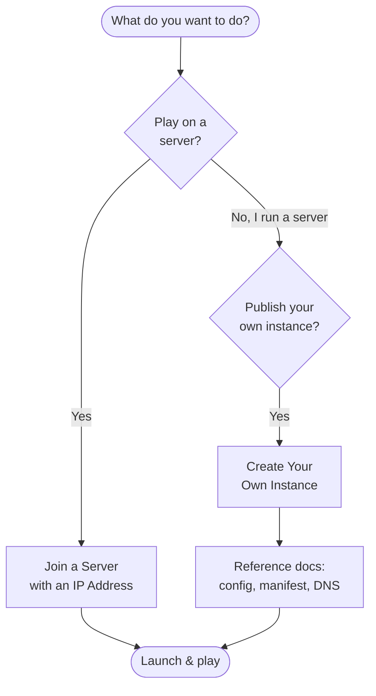

# How-To Guides

Step-by-step guides for **Neko Launcher** — connecting to servers as a player, and building your own custom instances as a server operator.

Whether you just want to join a friend's server by IP or you're setting up a fully managed modpack for your community, start here.

---

## 🎮 For Players

Guides for getting into a game quickly.

- **[Join a Server with an IP Address](./join-with-ip-address.md)**
  Connect directly to a server using its IP or domain when you can't find it through normal search. Neko Launcher auto-discovers the server's instance via DNS and installs the right loader and files for you.

New to the launcher? Start with the [Neko Launcher overview](../neko-launcher/README.md) for installation and basic usage, then follow the join guide above.

---

## 🛠️ For Server Operators

Guides for publishing your own instance so players can install it with one click.

- **[Create Your Own Instance](./make-your-own-instance.md)**
  Build and host a custom instance — pick a Minecraft version and loader (Fabric, Forge, Quilt, or NeoForge), define your file manifest, and wire it up so players can join automatically.

Once you're ready to go deeper, the reference docs cover every field and format:

| Topic | What it covers |
|-------|----------------|
| [Instance Configuration](../neko-launcher/instance-configuration.md) | Every field in `instance.json` (name, loader, tags, metadata, and more) |
| [Instance Manifest](../neko-launcher/instance-manifest.md) | The `manifest.json` file array and SHA-1 hashing |
| [DNS Discovery](../neko-launcher/dns-discovery.md) | TXT records that let players join by domain (`instanceUrl` / `manifestUrl`) |
| [HTTP Headers](../neko-launcher/http-headers.md) | `X-UUID` and `online` headers for gating access |
| [Announcements](../neko-launcher/announcement-instance.md) | Publishing notices, news, and events inside an instance |
| [Social Links](../neko-launcher/social-links.md) | Adding Discord, website, and other links |

---

## 🧭 Which guide do I need?

---

## 🩹 Troubleshooting

If something isn't working:

- ✅ Check your internet connection.
- ✅ Update Neko Launcher to the latest version — auto-update runs on launch in production builds.
- ✅ If a server is in another region, latency or region locks may block you; a VPN can help.
- ✅ Double-check the server's IP or domain for typos.
- ✅ Still stuck? Ask in the [Discord community](https://alice-discord.furi.moe).

---

## See Also

- [Join a Server with an IP Address](./join-with-ip-address.md)
- [Create Your Own Instance](./make-your-own-instance.md)
- [Neko Launcher Overview](../neko-launcher/README.md)
- [Instance Configuration](../neko-launcher/instance-configuration.md)
- [DNS Discovery](../neko-launcher/dns-discovery.md)

---

📌 **Want to contribute a guide?** Reach out to the maintainers on [Discord](https://alice-discord.furi.moe).
