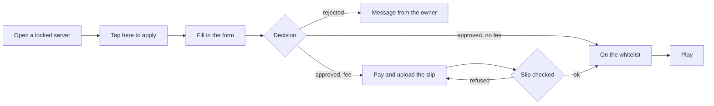

# Apply to a Server and Pay an Entry Fee

Locked servers can take **applications**. You fill in the owner's form, the owner (or the system) decides, and on some servers you then pay a one-time **entry fee** before you are let in. This works the same inside the launcher and on the website.

---

## The flow

## 1. Find the application

- **In the launcher:** open the server (from Discover, search or an invite link). The bar at the bottom says you have no access; if it ends with **Tap here to apply**, the server is recruiting.
- **On the website:** the owner may give you `https://neko-launcher.com/apply/<server>` or an invite link `https://neko-launcher.com/j/<code>`. Sign in with the Microsoft account you play on.

You need a Microsoft account that owns Minecraft. Offline accounts cannot apply.

## 2. Fill in the form

Forms can have several pages. Required questions are marked with `*` and **Next** stays disabled until the page is complete. Some answers route you to different pages (for example, a *Builder* is asked different questions than a *Developer*). Your Minecraft name and UUID may be filled in for you.

A server can set a **minimum age**; if your answer is below it the application is refused on the spot.

Submit once. You cannot have two open applications on the same server.

## 3. Wait for the decision

| Server mode | What happens |
|---|---|
| Open | No form; you are whitelisted immediately. |
| Automatic | The form is checked and you are whitelisted immediately. |
| Manual | The owner's team reviews it. You are told in the launcher, on the website and, if you applied on the website, by email. |

A rejected application may carry a note from the owner and a cool-down before you may apply again.

## 4. Pay the entry fee (some servers)

If the server charges a fee you see it before you apply (*Joining costs 150 THB, paid after approval*). Once approved, the application shows a **payment step** instead of the form:

- **PromptPay QR** — scan with your banking app; the amount is already filled in.
- **Payment link** — a button opens the owner's payment page.
- **Bank transfer** — bank, account number and name to copy.

The owner's note above the QR explains what the fee covers. Pay the exact amount, then **upload the slip** (JPEG, PNG or WebP, up to 4 MB).

- Servers with **automatic verification** check the slip with the bank on the spot: amount, whether the slip was used before, and the receiving account. A mismatch is explained and you may send another slip, up to the owner's limit.
- Otherwise the slip goes to the owner's team, who confirm it by hand.

There is usually a **deadline**; an unpaid application expires after it and you may apply again.

> The money goes straight to the server owner. Neko Launcher does not hold it and cannot refund it; refunds are between you and the owner.

## 5. Play

Once the payment is confirmed you are on the whitelist. Press **Play** in the launcher.

---

## Messages you may see

| Message | Meaning |
|---|---|
| *No Minecraft account linked* | Sign in again with a Microsoft account that owns the game. |
| *You already have access* | You are on the whitelist or a member of the owner's team; just play. |
| *You have already applied* | Wait for the decision. |
| *Approved — payment needed* | Pay and upload the slip. |
| *Slip received* | The owner is checking your payment. |
| *The last slip did not match the amount* / *has already been used* / *was paid to a different account* | Automatic verification refused it; check and send a correct slip. |
| *You can apply again after …* | Cool-down after a rejection. |

## See also

- [Player guide](../players/README.md)
- [Whitelist and applications (owner side)](../dashboard/whitelist-and-applications.md)
- [Entry fee (owner side)](../dashboard/entry-fee.md)
