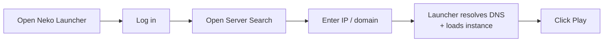

# How to Join a Server with an IP Address

Can't find a server through the normal browse list? You can connect directly by typing its **IP address** (or domain) into the search bar. Neko Launcher takes it from there — resolving the server's DNS records, pulling down the instance config, and dropping you straight into the game.

## 🔎 How direct-join works

When you enter an address, the launcher looks up special DNS **TXT records** on that domain to discover how to configure the instance. It queries two names, in order:

1. `_nekolauncher.<domain>` (primary)
2. `_alicemagiclauncher.<domain>` (fallback)

If a record is found, the launcher reads the `instanceUrl` and `manifestUrl` it points to, downloads the instance definition, and prepares everything automatically — no manual setup required. (Server operators: see [Make Your Own Instance](make-your-own-instance.md) for how to publish those records.)

## 🕹️ Join flow



## Steps to join

### Step 1 — Open Neko Launcher

Launch the Neko Launcher application on your computer.


### Step 2 — Log in

Click **Login** and sign in with your account. For online servers you'll want a real Microsoft/Xbox account — the launcher sends your account status with each request so operators can gate access to authenticated players.


### Step 3 — Open the server search page

Find the search entry point in the top-right corner of the main window.


### Step 4 — Enter the IP address

Type the server's address (for example, `play.furi.moe`) into the search field. The launcher resolves its DNS records and loads the matching instance.


### Step 5 — Click Play

Press **Play** (or **Join**) to launch the game and connect to the server.


## Example address

```text
play.furi.moe
```

Both a bare IP and a domain work, as long as the domain publishes the Neko Launcher TXT records described above.

## 🛠️ Troubleshooting

If the server won't load or you hit an error:

- **Make sure you're logged in.** Online servers may reject requests from unauthenticated (offline) accounts.
- **Double-check the address.** A typo means no DNS records are found.
- **Confirm the server is running** and reachable from your network.
- **Check your internet connection.** DNS lookups and config downloads both need network access.
- **Try again from another network or a VPN** if the server is region-restricted.
- **Ask the server administrator** whether their Neko Launcher DNS records are published correctly if nothing loads — the domain needs a `_nekolauncher` (or `_alicemagiclauncher`) TXT record pointing at a valid `instanceUrl`.

> 📌 **Tip:** If a domain doesn't auto-configure, it likely isn't set up for Neko Launcher yet. Server owners can add support by following [Make Your Own Instance](make-your-own-instance.md).

## See Also

- [Make Your Own Instance](make-your-own-instance.md) — publish DNS records and host your own server instance
- [How-To Guides](README.md) — back to the how-to index
