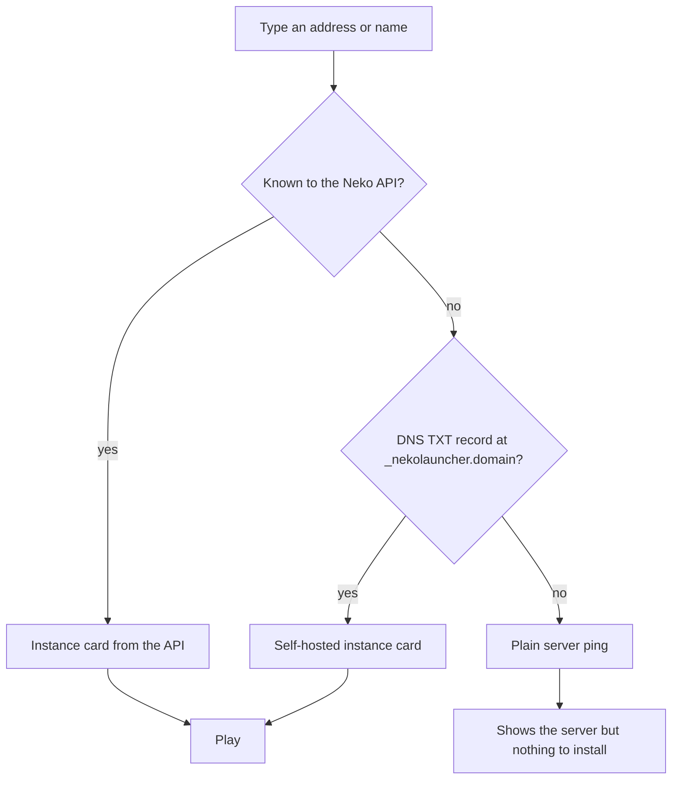

# How to Join a Server with an IP Address

Neko Launcher can add a server from nothing more than its address. Type `play.example.com` into the search box and the launcher works out what it is.

---

## What happens when you search


```mermaid
flowchart TD
    A[Type an address or name] --> B{Known to the Neko API?}
    B -- yes --> C[Instance card from the API]
    B -- no --> D{DNS TXT record at _nekolauncher.domain?}
    D -- yes --> E[Self-hosted instance card]
    D -- no --> F[Plain server ping]
    C --> G[Play]
    E --> G
    F --> H[Shows the server but nothing to install]
```

1. **Neko API first** — if the text matches an instance name or an invite code, the launcher shows that instance and whether your account may install it.
2. **DNS TXT record** — otherwise it looks up `_nekolauncher.<domain>` (and the legacy `_alicemagiclauncher.<domain>`). A record there points at the instance's settings and manifest. See [DNS discovery](../neko-launcher/dns-discovery.md).
3. **Plain ping** — with neither, the launcher pings the Minecraft server and shows its MOTD and player count, but there is no modpack to install.

Addresses that look like an IP (`203.0.113.7:25565`) skip the API step.

---

## Steps

### Step 1 — Open Neko Launcher


### Step 2 — Sign in

Use a Microsoft account that owns Minecraft. Some servers require it (online mode); an offline account will see the server but cannot play it.


### Step 3 — Open the search box

Click **Search server** at the top of the window.


### Step 4 — Enter the address

Type the domain or IP the owner gave you and wait for the card to appear. A green border means the instance was found and you may install it; yellow means found but locked for your account; red means blocked or online-mode only.


### Step 5 — Play

Click the card or the play button. The instance is added to your sidebar and the download starts.


---

## Example

`play.furi.moe` has a TXT record at `_nekolauncher.play.furi.moe`:

```
v=2;ip=play.furi.moe;settings=https://example.com/instance.json;manifest=https://example.com/manifest.json
```

Typing `play.furi.moe` installs the modpack described by those two files and connects to `play.furi.moe`.

---

## Troubleshooting

| Problem | Cause and fix |
|---|---|
| Card says *Instance not found*, only a server ping | No TXT record for that domain. Ask the owner for the exact address, an invite link, or the instance name. |
| Card is yellow | The instance exists but your account is not on its whitelist. Apply if the owner takes applications. |
| Card is red | Blocked by the platform, or the server needs a Microsoft account and you are on an offline one. |
| Download fails after the card | The settings or manifest URL in the TXT record is unreachable. The owner should test both with `curl`. |
| Wrong modpack for a domain you own | DNS caches for 60 seconds inside the launcher and for the record's TTL at the resolver. Wait, then search again. |

## See also

- [DNS discovery](../neko-launcher/dns-discovery.md)
- [Deep links](../neko-launcher/deep-links.md)
- [Apply to a server](apply-to-a-server.md)
