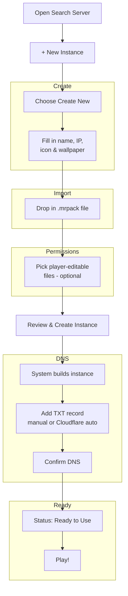

# Create Your Own Instance

Neko Launcher lets you turn any Minecraft modpack into a shareable, server-locked **instance**: players discover it by IP, download exactly the files you ship, and get kept in sync automatically. This guide walks through the built-in **Create New** wizard from start to finish.

The whole flow takes about 12 steps and breaks down into five phases: create the instance, import your `.mrpack`, set edit permissions, wire up DNS discovery, and go live.

## 🗺️ The flow at a glance



## 📦 Phase 1 — Create the instance

### 1. Open the Server Search page

Click the **Search Server** button in the top-right corner of the launcher.


### 2. Start a new instance

In the search window, click the **`+ New Instance`** button in the bottom-right corner.


### 3. Choose the creation type

Select **Create New**. (If you already have instance data hosted somewhere, choose **Connect to Existing Instance** instead.)


### 4. Fill in the instance details


- **Instance Name** — the display name players will see.
- **IP Address** — the domain players connect to (e.g. `play.furi.moe`). This is also where DNS discovery attaches, so use a domain you control.
- **Icon and Wallpaper** — optional images to brand your instance.

> **Tip:** Double-check everything, then click **Next**.

## 🎒 Phase 2 — Import your modpack

### 5. Drop in your `.mrpack`

Drag and drop the `.mrpack` file you want to ship into the drop zone.

> You can create a `.mrpack` by exporting a modpack from the [Modrinth App](https://modrinth.com/app). Neko Launcher reads the pack and turns it into a manifest of files (each with a URL, size, and **SHA-1** hash) that players download and verify.


## 🔓 Phase 3 — Set edit permissions

### 6. Choose player-editable files (optional)

Mark which files players are allowed to change locally — things like resource packs, keybind configs, or options. Everything else stays managed and gets restored to match your manifest on the next sync. Skip this step if you don't need it.


> Under the hood these become the instance's `ignored` paths, so managed files can't be silently overwritten by clients.

## 🚀 Phase 4 — Create & wire up DNS

### 7. Review and create

Click **Next**, review the summary, then click **Create Instance**.


### 8. Wait for processing

The launcher builds the instance and uploads its config and manifest. Give it a moment.


### 9. Add the DNS TXT record

Neko Launcher discovers instances through a **TXT record** on your domain. Once the build finishes, the wizard shows you the record to add.

You have two options:

- **Manual** — copy the record and add it at your DNS provider.
- **Auto Configure (Cloudflare)** — if your domain is on Cloudflare, click **Auto Configure** and the launcher writes the record for you.


The launcher looks up `_nekolauncher.<your-domain>` (falling back to `_alicemagiclauncher.<your-domain>`). A modern **v2** record is `;`-delimited `key=value` pairs — the two that matter most are `instanceUrl` and `manifestUrl`:

```text
_nekolauncher.play.furi.moe.  IN  TXT  "v=2;instanceUrl=https://cdn.example.com/play/instance.json;manifestUrl=https://cdn.example.com/play/manifest.json"
```

> `settings=` and `manifest=` are accepted as aliases for `instanceUrl=` and `manifestUrl=`, but the canonical names above are recommended. See [DNS Discovery](../neko-launcher/dns-discovery.md) for every supported key and the legacy pipe format.

> **Note:** DNS changes can take 5–10 minutes to propagate, depending on your provider.

### 10. Confirm the Cloudflare record

If you used **Auto Configure**, the wizard asks you to confirm the record it created before continuing.


## ✅ Phase 5 — Go live

### 11. Wait for "Ready to Use"

Once the TXT record resolves, the status flips to **Ready to Use**. If it's still pending, give DNS a few more minutes to propagate.


### 12. Start playing

Hit **Play** on your newly created instance and you're off!


---

That's it — enjoy your custom instance, and if you hit any snags, reach out on our [Discord](https://alice-discord.furi.moe). Thanks for using Neko Launcher!

## See Also

- [Join with an IP Address](./join-with-ip-address.md) — how players connect to your instance
- [DNS Discovery](../neko-launcher/dns-discovery.md) — full TXT record reference (keys, aliases, legacy format)
- [Instance Configuration](../neko-launcher/instance-configuration.md) — the `instance.json` schema
- [Instance Manifest](../neko-launcher/instance-manifest.md) — the file manifest and SHA-1 hashing
- [HTTP Headers](../neko-launcher/http-headers.md) — `X-UUID` / `online` headers for access control
- [Announcements](../neko-launcher/announcement-instance.md) — push notices to players in your instance
