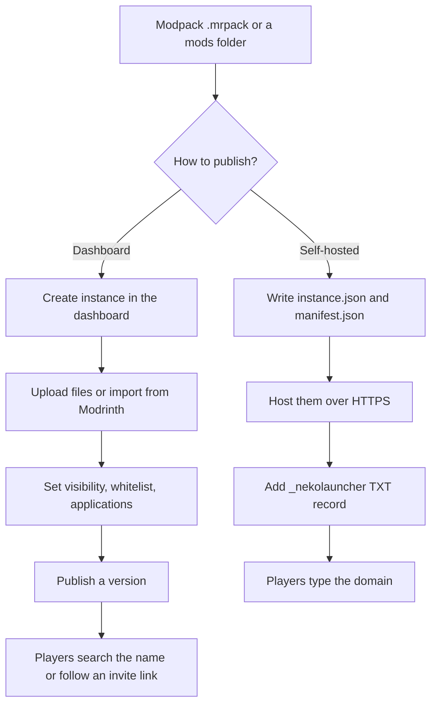

# Create Your Own Instance

An **instance** is your server's modpack as the launcher sees it: a description plus a list of files. There are two ways to publish one.

| Route | Best for | What you need |
|---|---|---|
| **Neko Dashboard** (recommended) | Anyone running a server for other players | A free account at [neko-launcher.com/dashboard](https://neko-launcher.com/dashboard) |
| **Self-hosted with DNS** | Owners who already host files and control a domain | Any HTTPS file host and a DNS TXT record |

Both produce the same result for players: they search your server, press Play, and stay in sync.


```mermaid
flowchart TD
    A[Modpack .mrpack or a mods folder] --> B{How to publish?}
    B -- Dashboard --> C[Create instance in the dashboard]
    C --> D[Upload files or import from Modrinth]
    D --> E[Set visibility, whitelist, applications]
    E --> F[Publish a version]
    B -- Self-hosted --> G[Write instance.json and manifest.json]
    G --> H[Host them over HTTPS]
    H --> I[Add _nekolauncher TXT record]
    F --> J[Players search the name or follow an invite link]
    I --> K[Players type the domain]
```

---

## Route A — Neko Dashboard

### 1. Sign in and pick a workspace

Go to [neko-launcher.com/dashboard](https://neko-launcher.com/dashboard) and sign in with Microsoft. A personal **workspace** on the FREE plan is created for you. Plans decide how many instances, how much storage and how many whitelisted players you get; see [Workspaces and plans](../dashboard/README.md).

### 2. Create the instance

**Instances → New instance.** Give it a display name, a short description, the Minecraft version and the mod loader (Fabric, Forge, Quilt or NeoForge, with a specific build). The instance starts **PRIVATE**: only you can see it until you decide otherwise.

### 3. Add the files

Open the **Files** tab. You can:

- drop a `.mrpack` — the modpack's mods are linked from Modrinth and its overrides are uploaded;
- upload folders and files (mods, config, resource packs, shader packs) with the file manager;
- search Modrinth and install mods directly.

Files uploaded through the dashboard are stored privately; Modrinth mods are downloaded by players from Modrinth's CDN. See [Files and versions](../dashboard/files-and-versions.md).

### 4. Decide what players may change

In **Settings**, the **ignored** list names paths the launcher writes once and never overwrites: `options.txt`, `resourcepacks`, `shaderpacks`, `screenshots`, key-bind and HUD configs. Presets exist for common mods. Everything else follows your published version exactly when **read-only** is on.

### 5. Publish a version

Every change is a draft until you **publish a version** (for example `1.0.0`) with a changelog. Players sync to the active version; you can roll back to an earlier one at any time.

### 6. Choose who gets in

Still in **Settings**:

- **Visibility** — `PRIVATE` (whitelist only), `UNLISTED` (anyone with the name), `PUBLIC` (listed in Discover once approved).
- **Enforce whitelist** — keep a PUBLIC or UNLISTED server visible but lock its files to whitelisted players.
- **Whitelist** — add players by UUID or name, or let them **apply** through a form; see [Whitelist and applications](../dashboard/whitelist-and-applications.md).
- **Entry fee** — charge after approval; see [Entry fee](../dashboard/entry-fee.md).
- **Online mode** — refuse offline accounts.
- **Hide mods** — keep the modpack's mods out of the `mods` folder on players' machines; see [Instances](../dashboard/instances.md).

### 7. Hand it to players

- **Invite link** — **Invites** tab → create a link `https://neko-launcher.com/j/<code>`. It can expire, be limited to a number of uses, or be revoked.
- **Name** — players can type the instance name into the launcher's search.
- **Discover** — request listing; see [Discovery](../dashboard/discovery.md).

---

## Route B — Self-hosted with DNS

Host two files and add one DNS record. The launcher fetches them directly from your server; the Neko API is not involved.

### 1. Write `instance.json`

The instance settings, following [schema v2](../neko-launcher/instance-configuration.md):

```json
{
  "$schema": "https://cdn.neko-launcher.com/schema/neko-launcher.json",
  "name": "my-server",
  "displayName": "My Server",
  "description": "Fabric survival with friends.",
  "icon": "https://cdn.example.com/icon.png",
  "onlineMode": true,
  "minecraft": {
    "version": "1.21.8",
    "loader": { "type": "fabric", "build": "0.17.3", "enable": true }
  },
  "metadata": { "wallpaper": "https://cdn.example.com/wallpaper.webp" },
  "ignored": ["options.txt", "resourcepacks", "screenshots", "logs"],
  "readonly": true,
  "gameArgs": ["--quickPlayMultiplayer=play.example.com"],
  "socials": [{ "type": "discord", "url": "https://discord.gg/example" }]
}
```

### 2. Write `manifest.json`

One entry per file, with a SHA-1 hash, following [manifest schema v2](../neko-launcher/instance-manifest.md):

```json
[
  { "path": "mods/fabric-api.jar", "url": "https://cdn.example.com/mods/fabric-api.jar", "size": 2154321, "hash": "3f786850e387550fdab836ed7e6dc881de23001b" },
  { "path": "config/server.toml", "url": "https://cdn.example.com/config/server.toml", "size": 812, "hash": "89e6c98d92887913cadf06b2adb97f26cde4849b" }
]
```

Generate hashes with `sha1sum` (Linux/macOS) or `Get-FileHash -Algorithm SHA1` (PowerShell).

### 3. Host both files over HTTPS

Any static host works: your own web server, an object store, a CDN. Both URLs must be reachable without cookies. Test them:

```bash
curl -sI https://cdn.example.com/instance.json | head -1
curl -s https://cdn.example.com/manifest.json | head -c 200
```

### 4. Add the DNS TXT record

At `_nekolauncher.<your domain>`:

```
v=2;ip=play.example.com;settings=https://cdn.example.com/instance.json;manifest=https://cdn.example.com/manifest.json
```

Full key list and provider notes: [DNS discovery](../neko-launcher/dns-discovery.md).

### 5. Test in the launcher

Search for `play.example.com`. A green card means both files were fetched and the instance is installable.

### The launcher's Create wizard

The launcher also has a **Create New** wizard (Search → **+ New instance** → **Create New**) that builds `instance.json` and `manifest.json` from a `.mrpack`, uploads them, and can add the TXT record through Cloudflare for you. The steps are the same as above with the files generated for you:


---

## Access control on each route

| | Dashboard | Self-hosted |
|---|---|---|
| Who may install | Visibility + whitelist + workspace membership, enforced by the API | Your server decides, using the `X-UUID`, `X-Username` and `online` headers the launcher sends |
| Applications, invite links, entry fee | Built in | Not available |
| File hosting | Neko storage or Modrinth | Yours |
| Updates | Publish a version | Change the files, players sync on next launch |

## See also

- [Dashboard guide](../dashboard/README.md)
- [Instance configuration](../neko-launcher/instance-configuration.md)
- [HTTP headers](../neko-launcher/http-headers.md)
