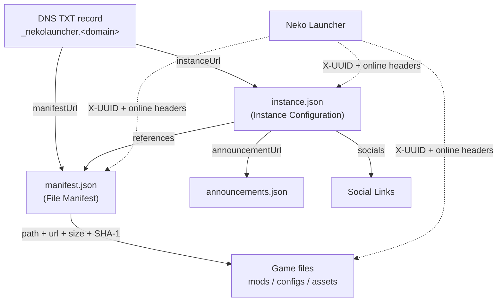

# Neko Launcher Documentation

Welcome to the **Neko Launcher** documentation. This section covers the JSON schemas, DNS discovery, and HTTP verification you need to publish, distribute, and gate your own Minecraft instances with Neko Launcher.

Neko Launcher is a Tauri-based desktop launcher that supports **Fabric, Forge, Quilt, and NeoForge**. Server operators describe an instance with two JSON documents — an **instance config** and a **file manifest** — and players can either add the instance by URL or discover it automatically through a DNS TXT record.

---

## 🧭 How the pieces fit together

At the center is `instance.json`, which describes the instance and points at a `manifest.json`. The manifest lists every downloadable file with a SHA-1 hash for integrity. DNS discovery is an optional front door: a TXT record tells the launcher where to fetch the instance config (and manifest) from.



---

## 📚 Documentation map

### Core schemas & configuration

* **[Instance Configuration](instance-configuration.md)** — the `instance.json` schema: name, Minecraft version, loader, metadata, tags, game arguments, and more.
* **[Instance Manifest](instance-manifest.md)** — the `manifest.json` schema: the file list and SHA-1 integrity verification.
* **[Social Links](social-links.md)** — configure community, development, and store links via the `socials` field.

### Integration & discovery

* **[DNS-based Discovery](dns-discovery.md)** — auto-discovery using DNS TXT records so players only need a domain.
* **[HTTP Header Verification](http-headers.md)** — how the launcher identifies players via `X-UUID` and `online` headers so you can gate access.

---

## 🚀 Quick start

1. Create an `instance.json` using the [Instance Configuration Schema](instance-configuration.md).
2. Create a `manifest.json` listing your files with SHA-1 hashes — see the [Manifest Schema](instance-manifest.md).
3. Host both files somewhere the launcher can reach over HTTPS.
4. *(Optional)* Add [Social Links](social-links.md) for community features.
5. *(Optional)* Configure [DNS Discovery](dns-discovery.md) so players can add your instance with just a domain.

---

## 🔖 Schema reference

The launcher's create/edit-instance UI references this canonical `$schema` URL. Set it at the top of your `instance.json` to get validation and autocompletion in editors:

```json
{
  "$schema": "https://cdn.neko-launcher.com/schema/neko-launcher.json",
  "name": "my-instance",
  "displayName": "My Instance",
  "description": "A short description of the pack.",
  "onlineMode": true,
  "minecraft": {
    "version": "1.21.8",
    "loader": {
      "type": "fabric",
      "build": "0.16.10",
      "enable": true
    }
  }
}
```

> An alias schema is also served at `https://cdn.neko-launcher.com/schema/alice-magic-launcher.json`. Both resolve, but `neko-launcher.json` is the recommended value.

---

## 📄 Manifest at a glance

`manifest.json` is a JSON **array** of file entries. Every entry needs all four fields, and `hash` is a **SHA-1** digest of the file. Paths are relative to the instance directory.

```json
[
  {
    "path": "mods/sodium.jar",
    "url": "https://example.com/files/sodium.jar",
    "size": 1234567,
    "hash": "aabbccddeeff00112233445566778899aabbccdd"
  }
]
```

See [Instance Manifest](instance-manifest.md) for the full schema and hashing details.

---

## 🌐 DNS discovery at a glance

The launcher looks up a TXT record on the domain a player enters — first `_nekolauncher.<domain>`, then `_alicemagiclauncher.<domain>` as a fallback. The recommended **v2** format is a `;`-delimited list of `key=value` pairs:

```text
v=2;instanceUrl=https://example.com/instance.json;manifestUrl=https://example.com/manifest.json
```

The canonical URL keys are **`instanceUrl`** and **`manifestUrl`**. The keys **`settings`** and **`manifest`** are accepted as aliases (`settings` → `instanceUrl`, `manifest` → `manifestUrl`). Keys are matched case-insensitively. See [DNS-based Discovery](dns-discovery.md) for every supported key, the legacy pipe format, and worked examples.

---

## 🔐 Player verification at a glance

On every instance config, manifest, and file request, the launcher sends two headers so operators can gate access:

| Header    | Value                                                                 |
| --------- | --------------------------------------------------------------------- |
| `X-UUID`  | The player's Minecraft UUID (hyphenated). Always sent.                |
| `online`  | `"true"` for a real Xbox/Microsoft account, `"false"` for offline.    |

See [HTTP Header Verification](http-headers.md) for how to validate these server-side.

---

## 📢 Instance announcements

Point the `announcementUrl` field in your `instance.json` at a JSON file to show announcements on your instance page. The file contains an **array** of announcement objects:

```json
{
  "name": "my-instance",
  "announcementUrl": "https://example.com/announcements.json"
}
```

Each announcement item looks like this:

```json
[
  {
    "title": "Maintenance Notice",
    "category": "NOTICE",
    "metadata": {
      "imageUrl": "https://example.com/image.png",
      "th_imageUrl": "https://example.com/image-th.png"
    },
    "link": "https://example.com/details",
    "active": true,
    "date": "2026-01-20T12:00:00Z"
  }
]
```

`category` must be one of `NOTICE`, `NEWS`, or `EVENT`. `active` toggles visibility, and `date` is an ISO 8601 timestamp. The `metadata` block supports localized image variants (e.g. `th_imageUrl` for Thai).

---

## 🔗 Support & resources

* **GitHub:** [github.com/alice-magic](https://github.com/alice-magic)
* **Download:** [neko-launcher.com](https://neko-launcher.com)
* **Discord:** [alice-discord.furi.moe](https://alice-discord.furi.moe)
* **Main website:** [furi.moe](https://furi.moe)

---

## See Also

* [Instance Configuration](instance-configuration.md) — the `instance.json` schema.
* [Instance Manifest](instance-manifest.md) — the file list and SHA-1 verification.
* [Social Links](social-links.md) — community, development, and store links.
* [DNS-based Discovery](dns-discovery.md) — TXT-record auto-discovery.
* [HTTP Header Verification](http-headers.md) — `X-UUID` and `online` player gating.
