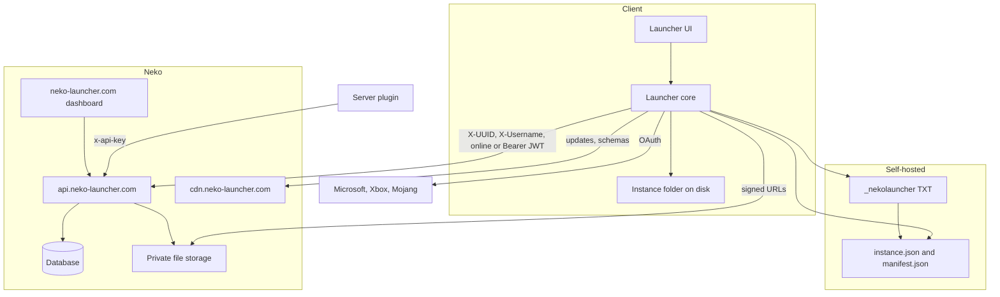

# Technical Reference

For developers who host an instance themselves, integrate a Minecraft server with the whitelist, or want to know exactly what the launcher fetches and sends.

---

## Architecture

```mermaid
graph TD
    subgraph Client
        R[Launcher UI] --> C[Launcher core]
        C --> F[Instance folder on disk]
    end
    subgraph Neko
        API[api.neko-launcher.com] --> DB[(Database)]
        API --> R2[Private file storage]
        WEB[neko-launcher.com dashboard] --> API
        CDN[cdn.neko-launcher.com]
    end
    subgraph Self-hosted
        DNS[_nekolauncher TXT] --> JSON[instance.json and manifest.json]
    end
    C -->|X-UUID, X-Username, online or Bearer JWT| API
    C -->|signed URLs| R2
    C --> DNS
    C --> JSON
    C -->|updates, schemas| CDN
    C -->|OAuth| MS[Microsoft, Xbox, Mojang]
    P[Server plugin] -->|x-api-key| API
```

- The **launcher** is a Tauri 2 desktop app (Rust core, web UI). It talks to the Neko API over HTTPS, resolves DNS TXT records itself, and downloads files from wherever the manifest points.
- The **Neko API** serves instances, files, whitelist, applications, invite links and entry fees. Public routes are under `https://api.neko-launcher.com/api/v1/…`; interactive documentation is at `https://api.neko-launcher.com/docs`.
- The **CDN** hosts launcher updates, the JSON schemas and images.

## Two documents describe an instance

| Document | Schema | Served by the API at |
|---|---|---|
| Instance configuration | [`schema/neko-launcher.json` v2](instance-configuration.md) | `GET /api/v1/instances/<name>` |
| Instance manifest | [`schema/nekolauncher-manifest.json` v2](instance-manifest.md) | `GET /api/v1/instances/<name>/install` |

Both may be self-hosted and discovered through [DNS](dns-discovery.md). The launcher accepts each either as the bare document or wrapped in the API envelope `{ "code": 200, "message": "OK", "data": … }`.

## Pages

- [Instance configuration](instance-configuration.md)
- [Instance manifest](instance-manifest.md)
- [DNS discovery](dns-discovery.md)
- [HTTP headers and authentication](http-headers.md)
- [Announcement feed](announcement-instance.md)
- [Social links](social-links.md)
- [Server API](server-api.md)
- [Deep links](deep-links.md)

## Public API routes used by the launcher

| Route | Purpose |
|---|---|
| `GET /instances` | Official instances for the home screen. |
| `GET /instances/discover?search=` | Discover list and name search, with `access` computed per player. |
| `GET /instances/<name>` | Instance configuration. Locked instances answer **403 with branding only** (name, icon, description, no-access message) so the launcher can still show the page. |
| `GET /instances/<name>/install` | Manifest. Bare JSON array; an empty array when the player has no access. |
| `GET /instances/<name>/versions` | Published versions and changelogs. |
| `GET /instances/<name>/announcements` | Announcement feed. Bare JSON array. |
| `GET /instances/<name>/application-form` | Apply form and, with a Neko JWT, the viewer's state. |
| `POST /auth/minecraft` | Exchanges a Microsoft access token for a Neko JWT (applications, slips). |
| `GET /invites/<code>` | Resolves an invite link. |

All of these are read with the identity headers described in [HTTP headers](http-headers.md).
