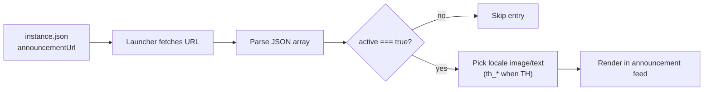

# Instance Announcements

Neko Launcher can show a per-instance announcement feed — news, events, and notices — directly inside the launcher. You wire it up by pointing the `announcementUrl` field in your instance config at a JSON file you host. The launcher fetches it, sorts the entries, and renders the active ones with optional images and localized text.

This is the friendliest way to tell your players "server maintenance tonight" or "new event live now" without them ever leaving the launcher.

---

## 📌 How it works

The `announcementUrl` lives in your instance's `instance.json` and points at a publicly reachable JSON file (an **array** of announcement objects). Whenever the instance loads, the launcher requests that URL, filters to entries with `active: true`, and renders them.



Requests to `announcementUrl` carry the same identity headers as other instance requests — `X-UUID` (the player's Minecraft UUID) and `online` (`"true"` for real Xbox/Microsoft accounts, `"false"` otherwise) — so you can gate or personalize the feed server-side if you want. See [HTTP Headers](http-headers.md) for details.

---

## ⚙️ Configuration

Add `announcementUrl` to your instance configuration file:

```json
{
  "name": "my-instance",
  "displayName": "My Instance",
  "description": "A cozy modded server",
  "onlineMode": true,
  "minecraft": {
    "version": "1.21.8",
    "loader": { "type": "fabric", "build": "latest", "enable": true }
  },
  "announcementUrl": "https://example.com/announcements.json"
}
```

The URL must serve a JSON **array** over HTTPS and be publicly accessible. For the full set of instance fields, see [Instance Configuration](instance-configuration.md).

---

## 📰 Announcement JSON format

`announcementUrl` returns an array of announcement objects. Each object has these fields:

| Field       | Type    | Required | Description                                             |
|-------------|---------|----------|---------------------------------------------------------|
| `title`     | string  | yes      | Announcement headline.                                  |
| `category`  | string  | yes      | One of `NOTICE`, `NEWS`, or `EVENT`.                    |
| `link`      | string  | yes      | URL opened when the player clicks the announcement.     |
| `active`    | boolean | yes      | Only entries set to `true` are shown.                   |
| `date`      | string  | yes      | ISO 8601 date/time (e.g. `2026-01-17T09:30:00.000Z`).   |
| `metadata`  | object  | yes      | Images and localized fields (see below).                |

### The `metadata` object

`metadata` holds optional imagery and localization. Recognized keys:

| Key            | Type   | Description                                              |
|----------------|--------|---------------------------------------------------------|
| `imageUrl`     | string | Banner image shown with the announcement.               |
| `th_imageUrl`  | string | Thai-locale variant of the image (used when UI is TH).  |
| `th_title`     | string | Thai-locale variant of the title.                       |
| *(custom)*     | any    | Any extra keys you add are preserved and ignored safely.|

Localized `th_*` keys follow the same `{locale}_{field}` convention used elsewhere in instance metadata: when the launcher runs in Thai, it prefers `th_imageUrl` / `th_title` and falls back to the base value otherwise.

---

## 🧪 Example

A ready-to-serve `announcements.json`:

```json
[
  {
    "title": "Scheduled Maintenance",
    "category": "NOTICE",
    "link": "https://status.example.com",
    "active": true,
    "date": "2026-02-10T10:00:00.000Z",
    "metadata": {}
  },
  {
    "title": "Winter Event Is Live",
    "category": "EVENT",
    "link": "https://example.com/events/winter",
    "active": true,
    "date": "2026-01-17T09:30:00.000Z",
    "metadata": {
      "th_title": "อีเวนต์ฤดูหนาวเริ่มแล้ว",
      "imageUrl": "https://cdn.example.com/announcements/winter-en.webp",
      "th_imageUrl": "https://cdn.example.com/announcements/winter-th.webp"
    }
  },
  {
    "title": "Server 2.0 Release Notes",
    "category": "NEWS",
    "link": "https://example.com/blog/2-0",
    "active": false,
    "date": "2025-12-25T15:00:00.000Z",
    "metadata": {
      "imageUrl": "https://cdn.example.com/announcements/release.webp"
    }
  }
]
```

The third entry has `active: false`, so it stays hidden until you flip it on — handy for staging announcements ahead of time.

---

## 🧾 Type reference

If you generate the feed programmatically, these TypeScript types describe the shape. Note that `date` is a JSON **string** (ISO 8601) on the wire, even though your app may parse it into a `Date`:

```typescript
export interface AnnouncementMetadata {
  imageUrl?: string;
  th_imageUrl?: string;
  th_title?: string;
  [key: string]: unknown;
}

export interface Announcement {
  title: string;
  category: 'NOTICE' | 'NEWS' | 'EVENT';
  link: string;
  active: boolean;
  date: string; // ISO 8601
  metadata: AnnouncementMetadata;
}
```

---

## ✅ Best practices

- Serve the feed over **HTTPS** from a reliable CDN or web host.
- Always emit a valid JSON **array**, even when you have a single entry.
- Use full ISO 8601 timestamps for `date` so ordering is unambiguous.
- Toggle visibility with `active` rather than deleting entries — it keeps history and lets you pre-stage posts.
- Provide `th_imageUrl` / `th_title` when you want Thai players to see localized content.
- Keep images web-optimized (WebP/AVIF) and reasonably sized — they load inside the launcher UI.

---

## 🔧 Troubleshooting

- **Nothing shows up** — confirm `announcementUrl` resolves publicly and returns a JSON array (not an object), and that at least one entry has `active: true`.
- **Malformed feed** — run the JSON through a validator; a single trailing comma will drop the whole feed.
- **Images missing** — check the `imageUrl` / `th_imageUrl` links load over HTTPS on their own.
- **Locale looks wrong** — verify your `th_*` keys are spelled exactly (`th_imageUrl`, `th_title`).
- **Access is gated unexpectedly** — if your server filters on the `X-UUID` / `online` headers, make sure the feed endpoint allows the accounts you expect.

---

## See Also

- [Instance Configuration](instance-configuration.md)
- [Instance Manifest](instance-manifest.md)
- [Social Links](social-links.md)
- [HTTP Headers](http-headers.md)
- [DNS Discovery](dns-discovery.md)
- [Documentation Index](README.md)
