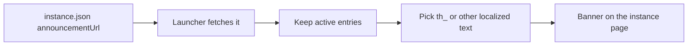

# Announcement Feed

The launcher shows a per-instance announcement banner. Dashboard instances manage it in the **Announcements** tab; self-hosted instances point `metadata.announcementUrl` at a JSON file. This page documents the feed format.

---

## Where it comes from

`metadata.announcementUrl` (also mirrored as top-level `announcementUrl`) is fetched when the instance page opens, with the player's identity headers. The response is a **bare JSON array**; only entries with `active: true` are shown, newest first.


```mermaid
flowchart LR
  A[instance.json announcementUrl] --> B[Launcher fetches it]
  B --> C[Keep active entries]
  C --> D[Pick th_ or other localized text]
  D --> E[Banner on the instance page]
```

Dashboard instances use `https://api.neko-launcher.com/api/v1/instances/<name>/announcements`, which returns nothing for players who lack access to a locked instance.

## Format

```json
[
  {
    "title": "Scheduled maintenance",
    "category": "NOTICE",
    "link": "https://status.example.com",
    "active": true,
    "date": "2026-10-01T10:00:00.000Z",
    "metadata": {}
  },
  {
    "title": "Winter event is live",
    "category": "EVENT",
    "link": "https://example.com/events/winter",
    "active": true,
    "date": "2026-09-20T09:30:00.000Z",
    "metadata": {
      "th_title": "อีเวนต์ฤดูหนาวเริ่มแล้ว",
      "imageUrl": "https://cdn.example.com/winter-en.webp",
      "th_imageUrl": "https://cdn.example.com/winter-th.webp"
    }
  }
]
```

| Field | Type | Required | Notes |
|---|---|---|---|
| `title` | string | yes | Headline. |
| `category` | `NOTICE`, `NEWS`, `EVENT` | yes | Colour of the banner. |
| `link` | URL | no | Opened on click. |
| `active` | boolean | yes | Only `true` entries are shown. |
| `date` | ISO 8601 | yes | Sort key and displayed date. |
| `metadata` | object | no | `imageUrl`, and localized variants `th_title`, `th_imageUrl`, `jp_…`, `ru_…`. Unknown keys are ignored. |

Localized keys follow the `{lang}_{field}` rule used everywhere in instance metadata: the launcher takes the player's language and falls back to the base field.

## See also

- [Announcements in the dashboard](../dashboard/announcements.md)
- [Instance configuration](instance-configuration.md)
