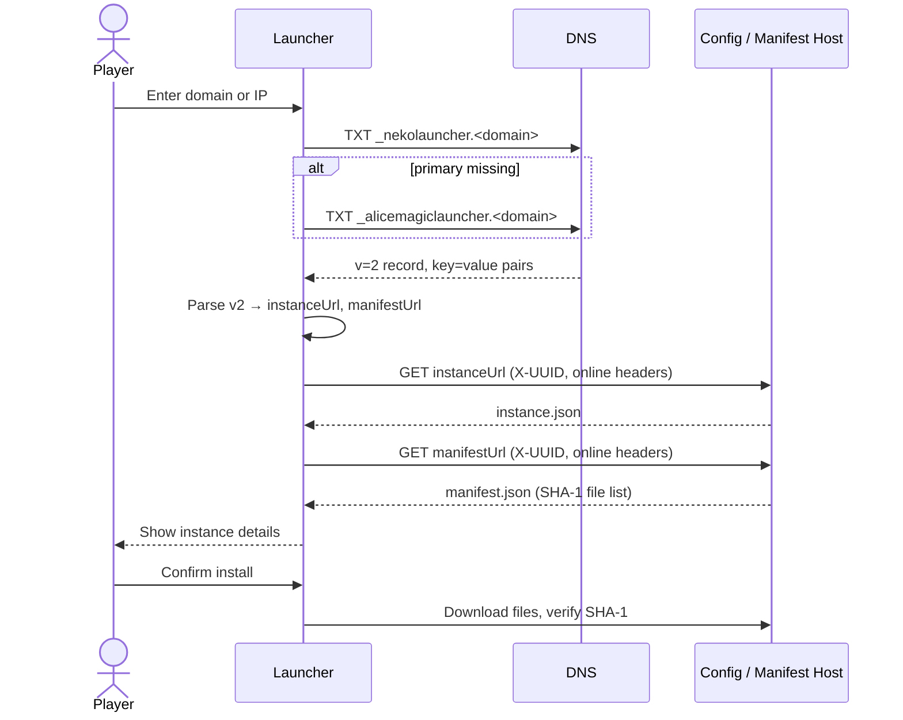

# DNS-based Instance Discovery

Neko Launcher can discover and install an instance from a **DNS TXT record**. Instead of handing players a config URL, you attach the instance details to a domain you control — and players install it just by typing that domain (or IP) into the launcher.

This is the recommended way to distribute a public modpack or server pack: change the underlying URLs any time, and every player picks up the update on their next launch without you re-sharing anything.

---

## Why use it

- 🔎 **Auto-detection** — players discover your instance by domain, no config URL to copy-paste.
- 🔗 **Server integration** — bind a Minecraft server address to its launcher instance in one place.
- ♻️ **Painless updates** — swap the config/manifest URLs behind the record; links you shared never go stale.

---

## How discovery works

When a player enters a domain, the launcher queries DNS for two TXT record names, in order:

1. `_nekolauncher.<domain>` — **primary**
2. `_alicemagiclauncher.<domain>` — **fallback** (queried only if the primary is missing)

The first record that parses wins. Here is the full flow from input to install:



> The launcher sends `X-UUID` (the player's hyphenated Minecraft UUID) and `online` (`"true"` for a real Xbox/Microsoft account, otherwise `"false"`) on the config, manifest, and file requests. Server operators can use these to gate access — see [HTTP Headers](http-headers.md).

---

## TXT record format (v2)

The v2 value is a **semicolon-delimited list of `key=value` pairs**. Keys are matched case-insensitively.

```text
_nekolauncher.<subdomain>  TXT  "v=2;ip=<server>;instanceUrl=<config_url>;manifestUrl=<manifest_url>;update=<timestamp>"
```

### Keys

| Key            | Required | Description                                                        | Example                                   |
| -------------- | :------: | ------------------------------------------------------------------ | ----------------------------------------- |
| `v`            |    ✅     | Format version — must be `2`                                       | `2`                                       |
| `ip`           |    ✅     | Minecraft server address                                           | `play.furi.moe`                           |
| `instanceUrl`  |    ✅     | URL to the instance config JSON (`instance.json`)                  | `https://files.catbox.moe/9y5o9r.json`    |
| `manifestUrl`  |    ✅     | URL to the manifest JSON (`manifest.json`)                         | `https://files.catbox.moe/esias3.json`    |
| `update`       |    ➖     | Unix timestamp in **milliseconds** — bump it to signal an update   | `1768293879377`                           |
| `name`         |    ➖     | Display name shown before the config loads                         | `Alice Magic`                             |
| `version`      |    ➖     | Instance version label                                             | `1.4.0`                                   |
| `minecraftVersion` | ➖  | Minecraft version hint                                             | `1.21.8`                                  |
| `loaderType`   |    ➖     | `fabric` / `forge` / `quilt` / `neoforge`                          | `fabric`                                  |
| `loaderBuild`  |    ➖     | Loader build/version                                               | `0.17.2`                                  |
| `iconUrl`      |    ➖     | Instance icon URL                                                  | `https://cdn.example.com/icon.png`        |
| `backgroundUrl`|    ➖     | Background image URL                                               | `https://cdn.example.com/bg.png`          |
| `discordUrl`   |    ➖     | Discord invite                                                     | `https://discord.gg/…`                    |
| `readonly`     |    ➖     | `true`/`false` — lock the instance from local edits               | `false`                                   |
| `hideIp`       |    ➖     | `true`/`false` — hide the server IP in the UI                     | `false`                                   |

> **Key aliases:** `settings` is accepted as an alias for `instanceUrl`, and `manifest` for `manifestUrl`. Older records using `settings=`/`manifest=` still work — but `instanceUrl`/`manifestUrl` are the canonical names, so prefer them for new records.

### Legacy pipe format

An older **pipe-delimited** format is still parsed for backward compatibility:

```text
ip|instanceUrl|manifestUrl|iconUrl|backgroundUrl|discordUrl|version|name|loaderType|loaderBuild|readonly|hideIp|minecraftVersion
```

Use the `v=2` key/value format for anything new — it's readable, order-independent, and lets you omit optional fields.

---

## Setup examples

### Root domain

**Domain:** `furi.moe` · **Server:** `play.furi.moe`

```text
Name:  _nekolauncher
Type:  TXT
Value: "v=2;ip=play.furi.moe;instanceUrl=https://files.catbox.moe/9y5o9r.json;manifestUrl=https://files.catbox.moe/esias3.json;update=1768293879377"
```

Players discover it by entering `furi.moe`.

### Subdomain

**Domain:** `minecraft.example.com` · **Server:** `mc.example.com`

```text
Name:  _nekolauncher.minecraft
Type:  TXT
Value: "v=2;ip=mc.example.com;instanceUrl=https://cdn.example.com/mc/instance.json;manifestUrl=https://cdn.example.com/mc/manifest.json;update=1768293879377"
```

Players discover it by entering `minecraft.example.com`.

---

## The files behind the URLs

`instanceUrl` and `manifestUrl` must point at valid, publicly reachable JSON over **HTTPS**.

### Instance config (`instanceUrl`)

A minimal `instance.json`. See [Instance Configuration](instance-configuration.md) for every field.

```json
{
  "$schema": "https://cdn.neko-launcher.com/schema/neko-launcher.json",
  "name": "alice-magic",
  "displayName": "Alice Magic: Furiora's World",
  "description": "A modded Minecraft experience",
  "onlineMode": true,
  "minecraft": {
    "version": "1.21.8",
    "loader": {
      "type": "fabric",
      "build": "0.17.2",
      "enable": true
    }
  }
}
```

### Instance manifest (`manifestUrl`)

A JSON **array** of files. Each entry needs `path`, `url`, `size`, and a **SHA-1** `hash`. See [Instance Manifest](instance-manifest.md).

```json
[
  {
    "path": "mods/example-mod.jar",
    "url": "https://cdn.example.com/mods/example.jar",
    "size": 1234567,
    "hash": "2ef7bde608ce5404e97d5f042f95f89f1c232871"
  }
]
```

---

## DNS provider setup

The steps are identical everywhere — a `TXT` record named `_nekolauncher` (or `_nekolauncher.<subdomain>`) whose content is the quoted v2 string.

| Provider          | Where                    | Record name to enter                          |
| ----------------- | ------------------------ | --------------------------------------------- |
| **Cloudflare**    | DNS → Add record → `TXT` | `_nekolauncher` or `_nekolauncher.<subdomain>`|
| **Route 53 (AWS)**| Hosted zone → Create record → `TXT` | `_nekolauncher`                    |
| **Google Cloud DNS** | Zone → Add record set → `TXT` | `_nekolauncher`                       |

**Content / value** (same for all):

```text
"v=2;ip=play.furi.moe;instanceUrl=https://files.catbox.moe/9y5o9r.json;manifestUrl=https://files.catbox.moe/esias3.json;update=1768293879377"
```

---

## Testing & validation

### Read the TXT record

```bash
# Linux / macOS
dig +short _nekolauncher.furi.moe TXT
```

```text
:: Windows
nslookup -type=TXT _nekolauncher.furi.moe
```

Expected:

```text
_nekolauncher.furi.moe. 300 IN TXT "v=2;ip=play.furi.moe;instanceUrl=https://files.catbox.moe/9y5o9r.json;manifestUrl=https://files.catbox.moe/esias3.json;update=1768293879377"
```

### Confirm the URLs resolve

```bash
curl -I https://files.catbox.moe/9y5o9r.json
curl -I https://files.catbox.moe/esias3.json
```

Both should return `200 OK` with a JSON content type.

---

## Best practices

**DNS**
- Use a low TTL (300–600s) while setting up so changes propagate quickly; raise it (3600s+) once stable.
- Serve every URL over **HTTPS** — HTTP is not accepted.
- Bump `update` (ms timestamp) whenever the config or manifest changes so clients know to refresh.

**URL management**
- Put config and manifest behind a CDN for reliability and speed.
- Keep both files on the same domain where practical.
- Send correct CORS and content-type headers.

**Security**
- HTTPS only.
- Gate access with [HTTP header verification](http-headers.md) using `X-UUID` / `online`.
- Rate-limit and monitor your config/manifest endpoints.

---

## Troubleshooting

**Record not found**
- Confirm the name is exactly `_nekolauncher` (or `_nekolauncher.<subdomain>`), including the leading underscore.
- Remember the launcher also tries `_alicemagiclauncher.<domain>` — either name works.
- Allow time for DNS propagation and test against multiple resolvers.

**Invalid format**
- Use `key=value` pairs separated by `;`, with no spaces around the semicolons.
- Wrap the whole value in quotes.
- Include the required keys: `v`, `ip`, and `instanceUrl` + `manifestUrl` (or their `settings`/`manifest` aliases).

**URLs won't load**
- Verify HTTPS and that the files open in a browser.
- Check CORS and content-type headers.
- Confirm the config `$schema` and manifest structure are valid (see the linked reference pages).

---

## See Also

- [Instance Configuration](instance-configuration.md) — the `instance.json` schema
- [Instance Manifest](instance-manifest.md) — the `manifest.json` file list and SHA-1 hashing
- [HTTP Headers](http-headers.md) — `X-UUID` / `online` access control
- [Announcements](announcement-instance.md) — publishing in-launcher announcements
- [Social Links](social-links.md) — attaching community links to an instance
- [Back to Documentation Index](README.md)
