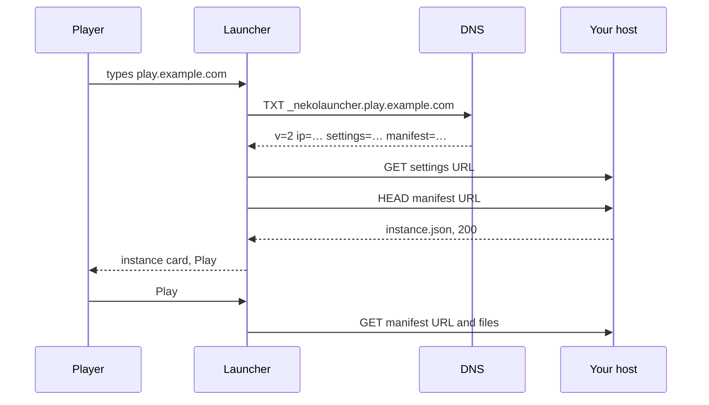

# DNS Discovery

A self-hosted instance is found through a **DNS TXT record**. Players type your domain into the launcher; the launcher reads the record, fetches your configuration and manifest, and installs the modpack. Change the files or the URLs at any time and every player picks it up on their next launch.

---

## How it works


```mermaid
sequenceDiagram
    participant P as Player
    participant L as Launcher
    participant D as DNS
    participant H as Your host
    P->>L: types play.example.com
    L->>D: TXT _nekolauncher.play.example.com
    D-->>L: v=2 ip=… settings=… manifest=…
    L->>H: GET settings URL
    L->>H: HEAD manifest URL
    H-->>L: instance.json, 200
    L-->>P: instance card, Play
    P->>L: Play
    L->>H: GET manifest URL and files
```

The launcher tries `_nekolauncher.<domain>` first and the legacy `_alicemagiclauncher.<domain>` second. Results are cached for 60 seconds inside the launcher.

## The TXT record (v2)

One string of `key=value` pairs separated by `;`:

```
v=2;ip=play.example.com;settings=https://cdn.example.com/instance.json;manifest=https://cdn.example.com/manifest.json
```

| Key | Required | Meaning |
|---|---|---|
| `v` | yes | `2`. |
| `ip` | yes | Address the game connects to (`host` or `host:port`). Also pinged for the MOTD and player count. |
| `settings` (alias `instanceUrl`) | yes | URL of the instance configuration, [schema v2](instance-configuration.md). |
| `manifest` (alias `manifestUrl`) | yes | URL of the manifest, [schema v2](instance-manifest.md). |
| `name` | no | Display name override. |
| `iconUrl`, `backgroundUrl`, `discordUrl` | no | Presentation overrides. |
| `minecraftVersion`, `loaderType`, `loaderBuild`, `version` | no | Overrides; normally taken from the configuration. |
| `readonly`, `hideIp` | no | `true`/`false`. `hideIp` hides the address in the launcher UI. |
| `update` | no | Any value you change to bust caches (for example a timestamp). |

Keys are case-insensitive. Unknown keys are ignored.

### Legacy pipe format

Older records are still read:

```
ip|settingsUrl|manifestUrl|iconUrl|backgroundUrl|discordUrl|version|name|loaderType|loaderBuild|readonly|hideIp|minecraftVersion
```

Prefer v2; it is easier to extend and to read.

## Examples

Root domain `example.com` with the game on `play.example.com`:

```
_nekolauncher.example.com   TXT   "v=2;ip=play.example.com;settings=https://cdn.example.com/instance.json;manifest=https://cdn.example.com/manifest.json"
```

Players type `example.com`. If they should type `play.example.com`, put the record at `_nekolauncher.play.example.com` instead.

## The files behind the URLs

Both URLs must be reachable over HTTPS without cookies. Each may be the bare document or the API envelope `{ "code": 200, "message": "OK", "data": … }`. The launcher sends the player's identity headers with every request, so your host can gate access; see [HTTP headers](http-headers.md).

## Provider notes

- **TTL**: 300 seconds or less while you are setting up.
- **Quoting**: most providers want the value in double quotes; keep it under 255 characters or let the provider split it (the launcher joins the parts).
- **Cloudflare**: type `TXT`, name `_nekolauncher.play` (for `play.example.com`), content the record above, proxy status is irrelevant for TXT.
- The launcher's Create wizard can add the record through the Cloudflare API when you paste an API token.

## Testing

```bash
# Linux / macOS
dig +short TXT _nekolauncher.play.example.com

# Windows
nslookup -type=TXT _nekolauncher.play.example.com
```

Then check both URLs:

```bash
curl -s https://cdn.example.com/instance.json | head -c 300
curl -sI https://cdn.example.com/manifest.json | head -1
```

## Troubleshooting

| Symptom | Cause |
|---|---|
| Launcher shows only a server ping | No TXT record found at either prefix, or the record does not contain `ip=` / `v=2`. |
| Card appears, Play fails with *Failed to resolve instance DNS records* | `settings` or `manifest` missing from the record. |
| Card appears, download fails | A URL returned a non-200 status or invalid JSON. |
| Old files keep coming back | Manifest still lists them; update the manifest, or add the paths to `ignored`. |
| Changes not visible | Resolver TTL and the launcher's 60-second cache; change `update=` to force a refresh. |

## See also

- [Create your own instance](../how-to/make-your-own-instance.md)
- [Join with an IP address](../how-to/join-with-ip-address.md)
