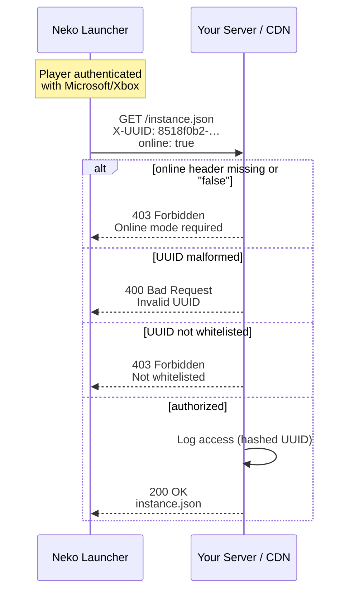

# HTTP Header Verification

Neko Launcher attaches identity headers to every request it makes to your instance server — the config, the manifest, and each file download. Server operators can read these headers to gate access, run analytics, and discourage unauthorized redistribution.

---

## 🔎 Overview

Two headers travel with every request the launcher sends:

* **`X-UUID`** — the player's Minecraft UUID (hyphenated).
* **`online`** — `"true"` for a real Microsoft/Xbox account, `"false"` for an offline/cracked account.

Because these arrive on the config, manifest, **and** file requests, you can enforce policy at any layer — CDN edge, reverse proxy, or application code. Common uses:

* **Access control** — restrict downloads to whitelisted players.
* **Online-mode enforcement** — serve only authenticated accounts.
* **Analytics** — track which instances and players pull files.
* **Anti-leech** — make plain hotlinking useless without the headers.

> **Trust boundary:** headers are client-supplied and can be spoofed. Treat them as a soft gate, not authentication. See [Security Considerations](#-security-considerations) before relying on them for anything sensitive.

### Request flow

The launcher attaches identity headers to every request; your server reads them to decide whether to serve the file.



---

## 📋 Header Reference

| Header    | Type            | Always sent | Description                                             | Example                                |
| --------- | --------------- | ----------- | ------------------------------------------------------ | -------------------------------------- |
| `X-UUID`  | string          | Yes         | Player's Minecraft UUID (hyphenated)                   | `8518f0b2-d106-4c39-88d5-c7da11c91bbe` |
| `online`  | boolean string  | Yes         | Whether the account is a real Microsoft/Xbox account   | `true` or `false`                      |

> HTTP header names are case-insensitive. The launcher sends `X-UUID` and `online`; frameworks may normalize them to `x-uuid` / lowercase, so match case-insensitively when reading.

### `X-UUID`

* **Format:** hyphenated Minecraft UUID (`8-4-4-4-12` hex).
* **Source:** the signed-in player's account. Unique per account, stable across sessions.
* **Note:** offline/cracked accounts still carry a UUID (derived from the username), so presence of `X-UUID` alone does not prove authenticity — pair it with `online`.

### `online`

* **Format:** the literal string `"true"` or `"false"`.
* **`true`** — the account was authenticated through Microsoft/Xbox.
* **`false`** — an offline/cracked account.

Internally the launcher sets this to `"true"` only when the account is a verified Xbox/Microsoft login, and `"false"` otherwise.

---

## 📨 Example Request

```http
GET /instance.json HTTP/1.1
Host: cdn.neko-launcher.com
X-UUID: 8518f0b2-d106-4c39-88d5-c7da11c91bbe
online: true
```

---

## 🛠️ Implementation Examples

The pattern is the same everywhere: read the two headers, require `online === "true"`, validate the UUID shape, then apply your own whitelist / rate-limit logic before serving.

### Node.js (Express)

```javascript
const UUID_RE = /^[0-9a-f]{8}-[0-9a-f]{4}-[0-9a-f]{4}-[0-9a-f]{4}-[0-9a-f]{12}$/i;

app.get('/instance.json', (req, res) => {
  const playerUUID = req.headers['x-uuid'];
  const isOnline = req.headers['online'] === 'true';

  if (!playerUUID || !UUID_RE.test(playerUUID)) {
    return res.status(400).json({ error: 'Invalid UUID' });
  }
  if (!isOnline) {
    return res.status(403).json({ error: 'Online mode required' });
  }
  if (!isPlayerAllowed(playerUUID)) {
    return res.status(403).json({ error: 'Not whitelisted' });
  }

  logPlayerAccess(playerUUID, 'instance.json');
  res.json(instanceConfig);
});
```

### PHP

```php
<?php
$playerUUID = $_SERVER['HTTP_X_UUID'] ?? null;
$isOnline = ($_SERVER['HTTP_ONLINE'] ?? 'false') === 'true';

if (!$playerUUID || !preg_match('/^[0-9a-f]{8}-[0-9a-f]{4}-[0-9a-f]{4}-[0-9a-f]{4}-[0-9a-f]{12}$/i', $playerUUID)) {
    http_response_code(400);
    die(json_encode(['error' => 'Invalid UUID']));
}

if (!$isOnline) {
    http_response_code(403);
    die(json_encode(['error' => 'Online mode required']));
}

if (!isPlayerWhitelisted($playerUUID)) {
    http_response_code(403);
    die(json_encode(['error' => 'Not whitelisted']));
}

logAccess($playerUUID);
header('Content-Type: application/json');
echo file_get_contents('instance.json');
```

### Python (Flask)

```python
import re
from flask import Flask, request, jsonify, send_file

app = Flask(__name__)

UUID_PATTERN = re.compile(
    r'^[0-9a-f]{8}-[0-9a-f]{4}-[0-9a-f]{4}-[0-9a-f]{4}-[0-9a-f]{12}$', re.I
)

@app.route('/instance.json')
def instance_config():
    player_uuid = request.headers.get('X-UUID')
    is_online = request.headers.get('online') == 'true'

    if not player_uuid or not UUID_PATTERN.match(player_uuid):
        return jsonify({'error': 'Invalid UUID'}), 400
    if not is_online:
        return jsonify({'error': 'Online mode required'}), 403
    if not is_player_whitelisted(player_uuid):
        return jsonify({'error': 'Not whitelisted'}), 403

    log_player_access(player_uuid, 'instance.json')
    return send_file('instance.json')
```

### Nginx (reverse proxy)

Enforce a fast first check at the edge, then pass the headers to your backend for finer-grained logic:

```nginx
server {
    listen 443 ssl;
    server_name cdn.neko-launcher.com;

    location = /instance.json {
        # Require both headers up front
        if ($http_x_uuid = "") {
            return 403;
        }
        if ($http_online != "true") {
            return 403;
        }

        proxy_pass http://backend:3000;
        proxy_set_header X-UUID $http_x_uuid;
        proxy_set_header Online $http_online;
    }
}
```

---

## 🎯 Use Cases

### Whitelist by UUID

```javascript
const WHITELIST = new Set([
  '8518f0b2-d106-4c39-88d5-c7da11c91bbe',
  'a1b2c3d4-e5f6-7890-abcd-ef1234567890',
]);

const isAllowed = (uuid) => WHITELIST.has(uuid);
```

### Online-mode enforcement

```javascript
if (req.headers['online'] !== 'true') {
  return res.status(403).json({
    error: 'This instance requires a legitimate Minecraft account',
  });
}
```

### Rate limiting per player

```javascript
const rateLimit = new Map();

function checkRateLimit(uuid) {
  const count = rateLimit.get(uuid) || 0;
  if (count > 10) return false; // too many requests

  rateLimit.set(uuid, count + 1);
  setTimeout(() => rateLimit.delete(uuid), 3600000); // reset after 1 hour
  return true;
}
```

### Analytics

```javascript
function logDownload(req, file) {
  analytics.track({
    event: 'file_download',
    uuid: req.headers['x-uuid'],
    file,
    online: req.headers['online'] === 'true',
    timestamp: new Date(),
  });
}
```

### Anti-leech

Reject anything missing the header pair or carrying a malformed UUID, so a bare hotlink returns nothing useful:

```javascript
const UUID_RE = /^[0-9a-f]{8}-[0-9a-f]{4}-[0-9a-f]{4}-[0-9a-f]{4}-[0-9a-f]{12}$/i;

function validateRequest(req) {
  const uuid = req.headers['x-uuid'];
  const online = req.headers['online'];
  if (!uuid || !online) return false;
  return UUID_RE.test(uuid);
}
```

---

## 🔒 Security Considerations

### Headers can be spoofed

Any HTTP client can set `X-UUID` and `online` to whatever it likes. Use them as a convenience gate, not as proof of identity.

* Layer real verification on top — signed URLs, API tokens, or per-instance secrets — for anything that must be protected.
* Serve everything over HTTPS to prevent header tampering in transit.
* Combine with IP-based rate limiting and anomaly monitoring.

### UUID privacy

Minecraft UUIDs are semi-public, but you still own how you handle them.

* Don't expose raw UUIDs in public logs or responses.
* Hash UUIDs before sending them to third-party analytics.
* Follow applicable privacy regulations (GDPR and similar), and document your retention policy.

### Suggested response codes

| Code | Meaning                            |
| ---- | ---------------------------------- |
| 200  | Authorized — file served           |
| 400  | Missing or malformed `X-UUID`      |
| 403  | Offline account or not whitelisted |
| 429  | Rate limit exceeded                |
| 500  | Server-side error                  |

---

## ✅ Testing with curl

```bash
# Authorized request
curl -H "X-UUID: 8518f0b2-d106-4c39-88d5-c7da11c91bbe" \
     -H "online: true" \
     https://cdn.neko-launcher.com/instance.json

# No headers — should be rejected
curl https://cdn.neko-launcher.com/instance.json

# Offline account — should be rejected if online mode is required
curl -H "X-UUID: 8518f0b2-d106-4c39-88d5-c7da11c91bbe" \
     -H "online: false" \
     https://cdn.neko-launcher.com/instance.json
```

---

## See Also

* [DNS Discovery](dns-discovery.md) — point a domain at your instance so players can join by IP.
* [Instance Configuration](instance-configuration.md) — the `instance.json` schema.
* [Instance Manifest](instance-manifest.md) — the file manifest the launcher downloads.
* [Announcement Instance](announcement-instance.md) — in-launcher announcements feed.
* [Back to Documentation Index](README.md)
