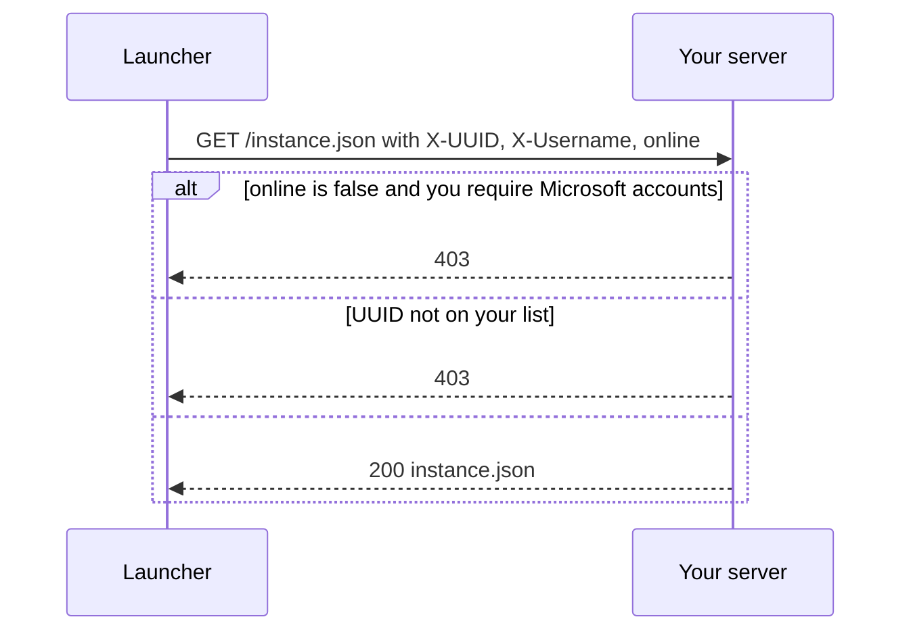

# HTTP Headers and Authentication

What the launcher sends with each request, and how a self-hosted server or the Neko API decides what to answer.

---

## Identity headers

Every read the launcher makes for an instance (configuration, manifest, announcements, and each file from a self-hosted manifest) carries:

| Header | Value | Example |
|---|---|---|
| `X-UUID` | The selected account's Minecraft UUID, undashed lowercase | `8518f0b2d1064c3988d5c7da11c91bbe` |
| `X-Username` | The account's Minecraft name | `Aomkoyo` |
| `online` | `true` for a Microsoft/Xbox account, `false` for an offline account | `true` |

Header names are case-insensitive. The Neko API normalises the UUID (dashes or not) and the username (case) before matching the whitelist.

> These headers are supplied by the client and can be forged. The Neko API treats them as identity for **reading** a whitelisted instance; anything that acts on a player's behalf (applications, slips) requires a signed token instead. A self-hosted server should treat them as a soft gate.

### Request flow on a self-hosted host


```mermaid
sequenceDiagram
    participant L as Launcher
    participant S as Your server
    L->>S: GET /instance.json with X-UUID, X-Username, online
    alt online is false and you require Microsoft accounts
        S-->>L: 403
    else UUID not on your list
        S-->>L: 403
    else
        S-->>L: 200 instance.json
    end
```

A `403` on the manifest URL makes the launcher show the instance as **locked** (yellow card) rather than broken.

### Example check (Node.js)

```javascript
app.get('/instance.json', (req, res) => {
  const uuid = String(req.headers['x-uuid'] ?? '').replace(/-/g, '').toLowerCase();
  const online = req.headers['online'] === 'true';
  if (!/^[0-9a-f]{32}$/.test(uuid)) return res.status(400).end();
  if (!online) return res.status(403).json({ error: 'Online mode required' });
  if (!whitelist.has(uuid)) return res.status(403).json({ error: 'Not whitelisted' });
  res.json(instanceConfig);
});
```

## Neko JWT (signed identity)

For applications, slip uploads and the viewer's own state, the launcher signs in to the Neko API:

1. It refreshes the Microsoft token itself and sends the short-lived **Microsoft access token** to `POST /api/v1/auth/minecraft` (`{ "accessToken": "…" }`). Older launchers send the refresh token instead; the API accepts both.
2. The API verifies Minecraft ownership through Xbox and returns a Neko JWT pair.
3. Requests carry `Authorization: Bearer <accessToken>`.

The same identity is used when the player signs in on the website, so a dashboard user and a launcher user with the same Minecraft account are one account. Workspace members are recognised through this token, never through `X-UUID`.

## API key (server plugins)

Server plugins use the workspace API key in the `x-api-key` header against `/api/v1/server/…`. See [Server API](server-api.md).

## Response envelope

The Neko API wraps responses as:

```json
{ "code": 200, "message": "OK", "data": { … } }
```

Two routes answer a **bare JSON array** for compatibility with older launchers: `GET /instances/<name>/install` and `GET /instances/<name>/announcements`. When the launcher reads a self-hosted configuration or manifest it accepts either the bare document or the envelope.

Locked instances answer `GET /instances/<name>` with **403** and a branding-only `data` object (name, display name, description, icon, Minecraft version, tags, `access: false`, `applicationMode`, and the owner's no-access message) so the launcher can still render the page.

## See also

- [Server API](server-api.md)
- [DNS discovery](dns-discovery.md)
