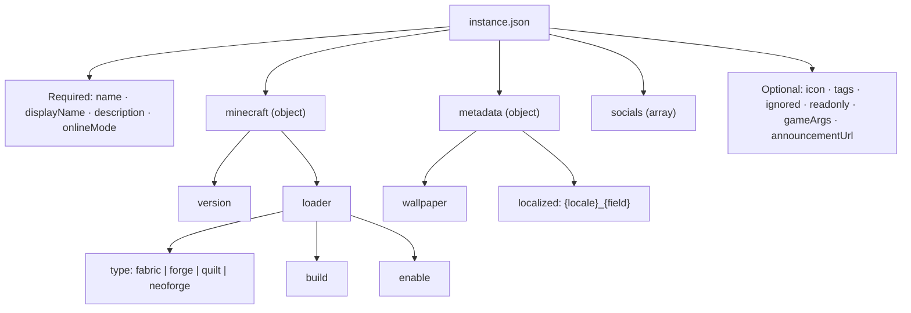

# Instance Configuration (`instance.json`)

Every Neko Launcher instance is described by a single JSON file, usually named `instance.json` and served from your instance URL. It defines the display name, the Minecraft version and mod loader, plus optional metadata, tags, sync rules, and social links.

The launcher's create/edit-instance UI validates against a JSON Schema, so you get autocompletion and inline errors in any editor that supports `$schema`.

```json
{
  "$schema": "https://cdn.neko-launcher.com/schema/neko-launcher.json",
  "name": "neko-smp",
  "displayName": "Neko SMP",
  "description": "A cozy modded survival server.",
  "onlineMode": true,
  "minecraft": {
    "version": "1.21.8",
    "loader": { "type": "fabric", "build": "0.17.2", "enable": true }
  }
}
```

> The canonical schema URL is `https://cdn.neko-launcher.com/schema/neko-launcher.json`. `https://cdn.neko-launcher.com/schema/alice-magic-launcher.json` is also served and works as an alias.

---

## 🧩 Config structure

The config is a tree: a small set of top-level fields, a nested `minecraft` object that in turn holds a `loader`, and optional `metadata` / `socials` blocks.



---

## Required fields

| Field         | Type    | Description                                                                            |
| ------------- | ------- | -------------------------------------------------------------------------------------- |
| `name`        | string  | Unique identifier for the instance (lowercase letters, numbers, hyphens, underscores). |
| `displayName` | string  | Human-friendly name shown in the launcher.                                             |
| `description` | string  | Short description of the instance.                                                     |
| `onlineMode`  | boolean | Whether the instance requires online (Xbox/Microsoft) authentication.                  |
| `minecraft`   | object  | Minecraft version and loader configuration (see below).                                |

---

## Optional fields

| Field             | Type          | Description                                                                 |
| ----------------- | ------------- | --------------------------------------------------------------------------- |
| `icon`            | string (URI)  | URL to the instance icon image.                                             |
| `metadata`        | object        | Wallpaper, localized strings, and arbitrary custom fields.                  |
| `tags`            | string[]      | Free-form tags categorizing the instance (type, features, community).      |
| `ignored`         | string[]      | Paths or globs excluded from manifest sync (see below).                    |
| `readonly`        | boolean       | If `true`, the instance files are managed by the server and not user-editable. |
| `gameArgs`        | string[]      | Extra JVM and game arguments passed at launch.                             |
| `socials`         | array         | Community / store / social links. See [Social Links](social-links.md).     |
| `announcementUrl` | string (URI)  | URL to an announcements JSON feed. See [Announcements](announcement-instance.md). |

---

## ⛏️ Minecraft & loader

The `minecraft` object holds the target version and an optional `loader`.

```json
"minecraft": {
  "version": "1.21.8",
  "loader": {
    "type": "fabric",
    "build": "0.17.2",
    "enable": true
  }
}
```

### `version`

* A specific release such as `1.21.8` or `1.20.1`.
* Or the literal `latest` to always track the newest release.

### `loader`

| Field    | Type    | Description                                        |
| -------- | ------- | -------------------------------------------------- |
| `type`   | string  | One of `fabric`, `forge`, `quilt`, `neoforge`.     |
| `build`  | string  | Loader build/version to install.                   |
| `enable` | boolean | Set `false` to run vanilla without the loader.     |

**Supported loaders:** Fabric, Forge, Quilt, NeoForge.

---

## 🎨 Metadata & localization

`metadata` is a flexible object. It carries the wallpaper, localized overrides, and any custom fields your server wants to expose.

```json
"metadata": {
  "wallpaper": "https://cdn.example.com/wallpaper.webp",
  "th_displayName": "เนโกะ เอสเอ็มพี",
  "th_description": "เซิร์ฟเวอร์เอาชีวิตรอดแบบมอด",
  "customField": "Anything you like"
}
```

Localized fields follow the pattern `{locale}_{field}` — for example `th_displayName`, `th_description`, or `ja_description`. When the launcher is set to that locale, these override the base `displayName` / `description`.

---

## 🏷️ Tags

Tags are free-form strings the launcher uses to categorize and filter instances.

```json
"tags": ["Survival", "Modded", "RPG", "Community"]
```

---

## 🚫 Ignored files

`ignored` lists paths and glob patterns that are excluded from manifest sync — useful for local-only data you never want overwritten or packaged.

```json
"ignored": [
  "logs",
  "crash-reports",
  "screenshots",
  "*.log",
  "saves/*/playerdata"
]
```

Exact paths, glob patterns, and nested paths are all supported. See [Instance Manifest](instance-manifest.md) for how sync uses these rules.

---

## ⚙️ Game arguments

`gameArgs` are appended at launch — mix game arguments and JVM flags as needed.

```json
"gameArgs": [
  "--quickPlayMultiplayer=play.furi.moe",
  "-Xmx4G",
  "-XX:+UseG1GC"
]
```

---

## 📦 Complete example

```json
{
  "$schema": "https://cdn.neko-launcher.com/schema/neko-launcher.json",
  "name": "neko-smp",
  "displayName": "Neko SMP",
  "description": "A cozy modded survival server.",
  "onlineMode": true,
  "icon": "https://cdn.example.com/icon.png",
  "minecraft": {
    "version": "1.21.8",
    "loader": { "type": "fabric", "build": "0.17.2", "enable": true }
  },
  "metadata": {
    "wallpaper": "https://cdn.example.com/wallpaper.webp",
    "th_displayName": "เนโกะ เอสเอ็มพี",
    "th_description": "เซิร์ฟเวอร์เอาชีวิตรอดแบบมอด"
  },
  "tags": ["Survival", "Modded", "Community"],
  "ignored": ["logs", "crash-reports", "screenshots", "*.log"],
  "readonly": false,
  "gameArgs": ["-Xmx4G", "-XX:+UseG1GC"],
  "announcementUrl": "https://cdn.example.com/announcements.json",
  "socials": [
    { "type": "discord", "url": "https://alice-discord.furi.moe" }
  ]
}
```

---

## 🔐 Access control note

When the launcher fetches your `instance.json` (and the manifest and files), it sends two headers so server operators can gate access:

* `X-UUID` — the player's hyphenated Minecraft UUID.
* `online` — `"true"` for a real Xbox/Microsoft account, `"false"` for offline/cracked.

See [HTTP Headers](http-headers.md) for the full request contract.

---

## See Also

* [Instance Manifest](instance-manifest.md) — declare the files the launcher downloads and verifies
* [Social Links](social-links.md) — configure community and store links
* [Announcements](announcement-instance.md) — publish in-launcher notices, news, and events
* [DNS Discovery](dns-discovery.md) — auto-configure instances from a domain's DNS records
* [HTTP Headers](http-headers.md) — headers sent with instance requests
* [Back to Documentation Index](README.md)
