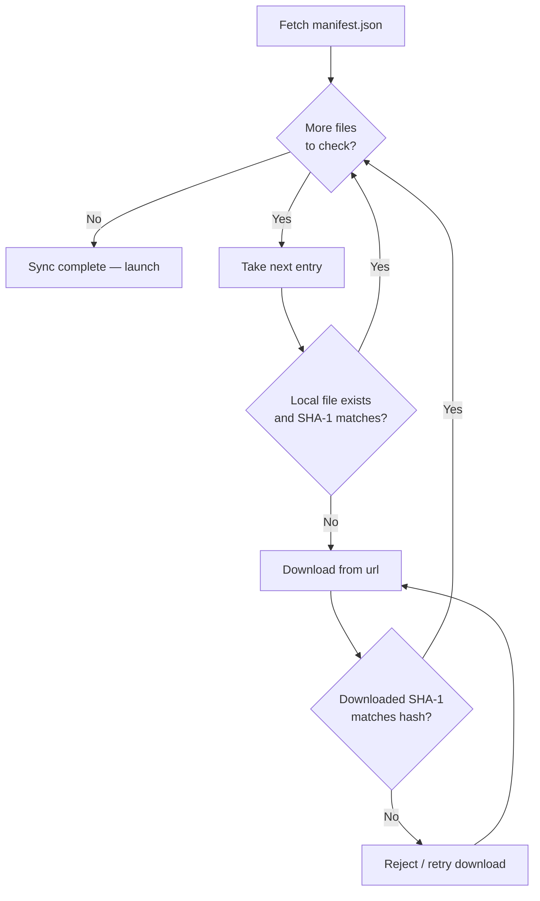

# Instance Manifest Schema

The **manifest** is the file-integrity contract for a Neko Launcher instance. It's a flat JSON **array** listing every file the launcher should download to run your instance — mods, resource packs, shader packs, configs, scripts, and any other asset. Each entry carries a URL, an expected size, and a **SHA-1 hash** so the launcher can verify what it downloads and skip files that are already up to date.

Your instance config points at the manifest via its `manifestUrl`, and DNS discovery can advertise it directly with a `manifestUrl=` key (alias: `manifest=`). See [Instance Configuration](instance-configuration.md) and [DNS Discovery](dns-discovery.md).

* **Type**: `array`
* **`$schema`** (for editor validation): `https://cdn.neko-launcher.com/schema/neko-launcher.json`
* **Purpose**: A list of downloadable files with integrity data.

---

## 🧩 Manifest Structure

The manifest is a JSON array of file objects — nothing else at the top level:

```json
[
  {
    "path": "mods/example-mod.jar",
    "url": "https://cdn.example.com/mods/example-mod.jar",
    "size": 1234567,
    "hash": "4964121fd2d75eebec77dd8b723bc381952fe43a"
  }
]
```

### Item Fields

| Field  | Type         | Required | Description                                        |
| ------ | ------------ | -------- | -------------------------------------------------- |
| `path` | string       | ✓        | Destination path, relative to the instance root    |
| `url`  | string (URI) | ✓        | Publicly reachable download URL                     |
| `size` | integer      | ✓        | Expected file size in bytes                         |
| `hash` | string       | ✓        | **SHA-1** hash (hex) for integrity verification     |

All four fields are **required** on every entry.

---

## 🔄 How the Launcher Uses the Manifest

When an instance syncs, the launcher fetches the manifest and reconciles it against what's already on disk. It only downloads what's missing or changed, so repeat launches stay fast.



Download requests carry the player's identity headers so server operators can gate access — see [HTTP Headers](http-headers.md):

* `X-UUID` — the player's hyphenated Minecraft UUID (always sent).
* `online` — `"true"` for a real Xbox/Microsoft account, `"false"` for offline/cracked.

---

## 📁 Path Guidelines

The `path` field decides where each file lands inside the instance directory.

### Common Directories

| Directory         | Contents                                   |
| ----------------- | ------------------------------------------ |
| `mods/`           | Mod JAR files                              |
| `resourcepacks/`  | Resource packs                             |
| `shaderpacks/`    | Shader packs                               |
| `config/`         | Mod configuration files                    |
| `defaultconfigs/` | Default mod configurations                 |
| `kubejs/`         | KubeJS scripts                             |
| `scripts/`        | CraftTweaker or other scripting            |

### Path Rules

* Use forward slashes `/` — never backslashes, even on Windows.
* Paths are **relative to the instance root**; no leading slash.
* Preserve original filenames where possible (loaders often match by name).

> **Tip:** Files a player may edit or generate locally (options, saves, custom configs) usually shouldn't live in the manifest. Use the `ignored` list in [Instance Configuration](instance-configuration.md) to keep the launcher from touching them.

---

## 🔐 Hash Verification

The `hash` field is a **SHA-1** hex digest. The launcher uses it to:

* Confirm a downloaded file matches the expected content (authenticity).
* Detect corruption during download.
* Skip re-downloading files that already match on disk.

### Generating a SHA-1 Hash

**Linux / macOS:**

```bash
sha1sum file.jar
```

**Windows (PowerShell):**

```powershell
Get-FileHash -Algorithm SHA1 file.jar
```

**Node.js:**

```javascript
const crypto = require('crypto');
const fs = require('fs');

const hash = crypto.createHash('sha1');
hash.update(fs.readFileSync('file.jar'));
console.log(hash.digest('hex'));
```

The `size` field should also match the real byte count — it's a fast pre-check before the launcher bothers hashing.

---

## 📦 Complete Example

```json
[
  {
    "path": "mods/iris-fabric-1.9.2+mc1.21.8.jar",
    "url": "https://cdn.modrinth.com/data/YL57xq9U/versions/x2f4KxP0/iris-fabric-1.9.2%2Bmc1.21.8.jar",
    "size": 2741900,
    "hash": "4964121fd2d75eebec77dd8b723bc381952fe43a"
  },
  {
    "path": "mods/sodium-fabric-0.6.5+mc1.21.8.jar",
    "url": "https://cdn.modrinth.com/data/AANobbMI/versions/b2fzXn3C/sodium-fabric-0.6.5%2Bmc1.21.8.jar",
    "size": 891234,
    "hash": "9876543210abcdef9876543210abcdef98765432"
  },
  {
    "path": "resourcepacks/Faithful 64x - Release 10.zip",
    "url": "https://cdn.modrinth.com/data/r4GILswZ/versions/5T6GekBK/Faithful%2064x%20-%20Release%2010.zip",
    "size": 18001871,
    "hash": "00413cf363e708c93a11f87dd425f0a164f3c1fb"
  },
  {
    "path": "config/iris.properties",
    "url": "https://cdn.example.com/config/iris.properties",
    "size": 2048,
    "hash": "abcdef1234567890abcdef1234567890abcdef12"
  }
]
```

---

## ✅ Best Practices

**File organization**

* Group related files (all mods together, configs together).
* Keep filenames descriptive and consistent — many loaders match mods by name.

**URL management**

* Serve files from a CDN for better download speeds.
* URL-encode special characters (`+`, spaces) so links resolve correctly.
* Make sure every URL is publicly reachable, and honor the `X-UUID` / `online` headers if you gate access.

**Keeping the manifest current**

* Update the manifest whenever you add or remove a file, and bump `size`/`hash` on every change.
* Track manifest changes in version control alongside your instance config.

**Performance**

* Minimize total file count where practical — each entry is a hash check plus a possible request.
* Prefer compressed formats (ZIP, JAR) already used by the ecosystem.

---

## 🧪 Validation Checklist

Before you publish a manifest, verify:

1. **JSON syntax** — the file parses as a valid array of objects.
2. **URLs** — every `url` downloads successfully (including through any auth gating).
3. **Hashes** — each `hash` matches the actual file's SHA-1.
4. **Sizes** — each `size` matches the real byte count.
5. **Paths** — forward slashes, no leading slash, correct target directories.

---

## See Also

* [Instance Configuration](instance-configuration.md) — the main instance schema that references this manifest
* [DNS Discovery](dns-discovery.md) — advertising `manifestUrl` via TXT records
* [HTTP Headers](http-headers.md) — `X-UUID` and `online` headers sent with download requests
* [Announcement Instance](announcement-instance.md) — the announcements feed format
* [Back to Documentation Index](README.md)
