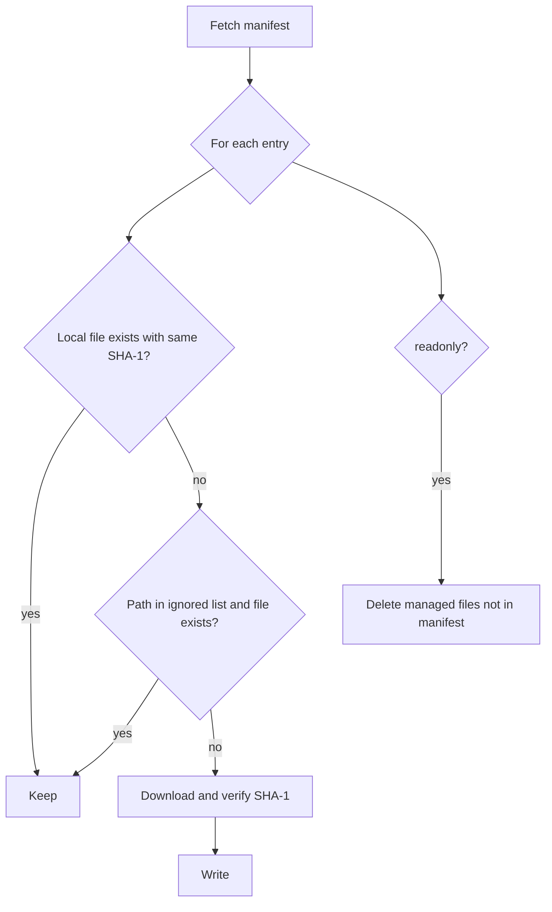

# Instance Manifest (schema v2)

The manifest lists every file the launcher keeps in sync inside the instance folder: where to download it and how to verify it. The Neko API serves it at `GET /api/v1/instances/<name>/install`; self-hosted owners write `manifest.json` and point the DNS record's `manifest=` key at it.

- Schema: `https://cdn.neko-launcher.com/schema/nekolauncher-manifest.json` (version 2, 2026-09-21)
- Previous schema (out of date): `https://cdn.neko-launcher.com/schema/alice-magic-manifest.json`

---

## Shape

A JSON **array** of file entries, or the API envelope with the array in `data`.

```json
[
  {
    "path": "mods/fabric-api-0.100.0.jar",
    "url": "https://cdn.modrinth.com/data/P7dR8mSH/versions/abc123/fabric-api-0.100.0.jar",
    "size": 2154321,
    "hash": "3f786850e387550fdab836ed7e6dc881de23001b",
    "storageType": "MODRINTH"
  },
  {
    "path": "config/server.toml",
    "url": "https://cdn.example.com/config/server.toml",
    "size": 812,
    "hash": "89e6c98d92887913cadf06b2adb97f26cde4849b"
  }
]
```

## Fields

| Field | Type | Required | Notes |
|---|---|---|---|
| `path` | string | yes | Relative to the instance folder, forward slashes, no leading `/`, no `..`. |
| `url` | URL | yes | Direct download. Signed URLs are fine; the launcher fetches the manifest fresh on every launch. |
| `size` | integer | yes | Bytes. Used to skip unchanged files and to bound the download deadline. |
| `hash` | string | yes | SHA-1 of the contents, 40 hex characters. |
| `storageType` | `S3`, `MODRINTH`, `CURSEFORGE` | no | Where the URL points. Informational. |

## How the launcher uses it


```mermaid
flowchart TD
    A[Fetch manifest] --> B{For each entry}
    B --> C{Local file exists with same SHA-1?}
    C -- yes --> D[Keep]
    C -- no --> E{Path in ignored list and file exists?}
    E -- yes --> D
    E -- no --> F[Download and verify SHA-1]
    F --> G[Write]
    B --> H{readonly?}
    H -- yes --> I[Delete managed files not in manifest]
```

- Files under an **ignored** path are downloaded once (when missing) and never overwritten.
- With `readonly` on, files inside managed folders that are not in the manifest are removed; `mods/.connector` and the launcher's own markers are never touched.
- With **hidden mods** on, entries under `mods/` are stored outside the instance folder and injected at launch.
- Each download has a deadline scaled to `size`; a stalled download fails the launch with a message rather than hanging.

## Generating hashes

```bash
# Linux / macOS
sha1sum mods/*.jar

# PowerShell
Get-FileHash -Algorithm SHA1 mods\*.jar
```

A small script that walks a folder and prints entries:

```bash
find . -type f | sort | while read -r f; do
  p="${f#./}"
  printf '{"path":"%s","url":"https://cdn.example.com/%s","size":%s,"hash":"%s"},\n' \
    "$p" "$p" "$(stat -c %s "$f")" "$(sha1sum "$f" | cut -d" " -f1)"
done
```

## Guidelines

- Keep `path` stable; renaming a file re-downloads it for everyone.
- Serve files over HTTPS with correct sizes; a size mismatch is treated as a changed file.
- Put player settings (`options.txt`, key binds, resource packs) in the instance's `ignored` list rather than leaving them out of the manifest, so first-time players get your defaults.
- Do not list `mods/.connector` or other per-machine caches.

## Differences from v1

- `storageType` added (optional).
- `hash` must be SHA-1 hex; `path` may not traverse upward.
- The API envelope is accepted at the top level.
- v1 manifests remain valid v2 documents.

## See also

- [Instance configuration](instance-configuration.md)
- [Files and versions in the dashboard](../dashboard/files-and-versions.md)
