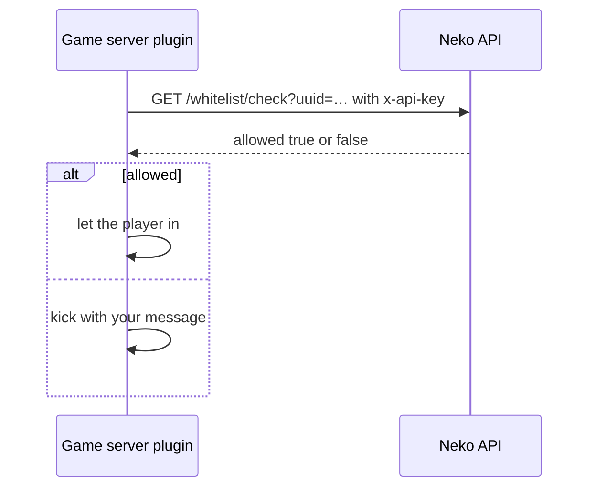

# Server API

A read-only API for your **Minecraft server** (a plugin or mod) to enforce the same whitelist the launcher uses, so a player who was never let into the launcher instance cannot join the game server either.

---

## Authentication

Create the workspace's **API key** in the dashboard (**Settings → API key**) and send it as:

```
x-api-key: <key>
```

The key is scoped to the workspace; it can read every instance the workspace owns. Keep it on the server only.

Base URL: `https://api.neko-launcher.com/api/v1/server`. Responses use the envelope `{ code, message, data }`.

## Routes

### List instances

```
GET /server/instances
```

`data` is the list of instances this key may read (`name`, `displayName`, `visibility`, `enforceWhitelist`).

### Check one player

```
GET /server/instances/<name>/whitelist/check?uuid=<uuid>
GET /server/instances/<name>/whitelist/check?username=<name>
```

Either query parameter; UUID with or without dashes, username case-insensitive.

```json
{ "code": 200, "message": "OK", "data": { "allowed": true, "matchType": "uuid" } }
```

`allowed` follows the launcher's own rule: `true` for an open instance (OFFICIAL, or PUBLIC/UNLISTED without *Enforce whitelist*), otherwise `true` only for a whitelist entry.

### Read the whitelist

```
GET /server/instances/<name>/whitelist?limit=500&cursor=<nextCursor>
```

Pages of entries (`matchType`, `minecraftUuid`, `username`, `createdAt`). `limit` defaults to 500, maximum 2000; pass `nextCursor` from the previous page to continue.

## Example: a login check



Cache positive answers for a minute or two and fail **closed** (deny) if the API cannot be reached, or fail open according to your own policy; the API is not on the game's hot path otherwise.

## See also

- [Whitelist and applications](../dashboard/whitelist-and-applications.md)
- [HTTP headers and authentication](http-headers.md)
