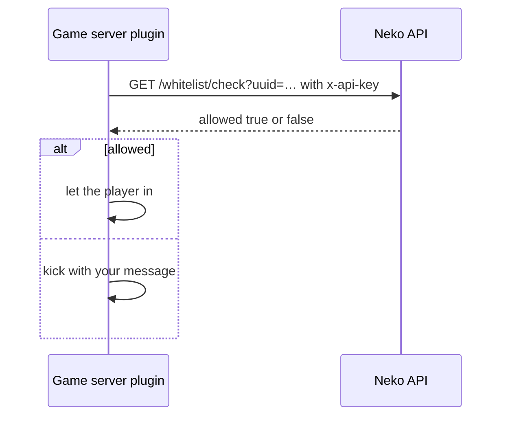

# Server API

An API for your **Minecraft server** (a plugin or mod), a bot or your own backend: enforce the same whitelist the launcher uses, manage it, and report how many players are online.

---

## API keys

Create keys in the dashboard under **Developer → API keys**. Each key has:

- a **name**, so you know which server uses it;
- **permissions** — give it only what it needs;
- optionally, a list of **instances** it may touch (all by default);
- optionally, an **expiry**.

| Permission | Allows |
|---|---|
| `instances:read` | List instances. |
| `whitelist:read` | Check a player, read the whitelist. |
| `whitelist:write` | Add and remove players, change expiries. |
| `status:write` | Report the online player count. |

Two presets cover the usual cases: **Server plugin** (`instances:read`, `whitelist:read`, `status:write`) and **Whitelist manager** (`instances:read`, `whitelist:read`, `whitelist:write`).

The key (`nk_…`) is shown **once**; only a hash is stored. Send it as:

```
x-api-key: nk_…
```

Keep it on the server only, never in a player's client. Revoke a key from the same page; it stops working at once. A workspace can have up to 25 keys.

> The original single workspace key (**Settings → API key**) still works. It acts as a key with `instances:read`, `whitelist:read` and `status:write` on every instance.

Base URL: `https://api.neko-launcher.com/api/v1/server`. Responses use the envelope `{ code, message, data }`.

## Routes

| Method | Path | Permission |
|---|---|---|
| `GET` | `/server/instances` | `instances:read` |
| `GET` | `/server/instances/<name>/whitelist/check` | `whitelist:read` |
| `GET` | `/server/instances/<name>/whitelist` | `whitelist:read` |
| `POST` | `/server/instances/<name>/whitelist` | `whitelist:write` |
| `PATCH` | `/server/instances/<name>/whitelist/<id>` | `whitelist:write` |
| `PATCH` | `/server/instances/<name>/whitelist/bulk` | `whitelist:write` |
| `DELETE` | `/server/instances/<name>/whitelist/<id>` | `whitelist:write` |
| `POST` | `/server/instances/<name>/whitelist/bulk-remove` | `whitelist:write` |
| `POST` | `https://api.neko-launcher.com/mcstatus/report` | `status:write` |

An instance outside the key's instance list answers `404`, as if it did not exist.

### List instances

```
GET /server/instances
```

`data` is the list of instances this key may read (`name`, `displayName`, `visibility`, `enforceWhitelist`, `whitelistCount`).

### Check one player

```
GET /server/instances/<name>/whitelist/check?uuid=<uuid>
GET /server/instances/<name>/whitelist/check?username=<name>
```

Either query parameter; UUID with or without dashes, username case-insensitive.

```json
{ "code": 200, "message": "OK", "data": { "allowed": true, "matchType": "uuid" } }
```

`allowed` follows the launcher's own rule: `true` for an open instance (OFFICIAL, or PUBLIC/UNLISTED without *Enforce whitelist*), otherwise `true` only for an active whitelist entry.

### Read the whitelist

```
GET /server/instances/<name>/whitelist?limit=500&cursor=<nextCursor>
```

Pages of active entries (`id`, `matchType`, `minecraftUuid`, `username`, `addedAt`, `expiresAt`). `limit` defaults to 500, maximum 2000; pass `nextCursor` from the previous page to continue until it is `null`.

### Change the whitelist

The write routes take the same bodies as the [Whitelist API](whitelist-api.md#routes): add with `{ value, matchType?, username?, expiresAt? }`, set an expiry with `{ expiresAt }` (`null` clears it), bulk routes with up to 1000 `ids`.

```bash
curl -X POST https://api.neko-launcher.com/api/v1/server/instances/my-smp/whitelist \
  -H "x-api-key: nk_..." -H "content-type: application/json" \
  -d '{"value":"Notch","expiresAt":"2026-12-31T23:59:00+07:00"}'
```

Changes made here send the same [webhooks](whitelist-api.md#webhooks) as changes made in the dashboard.

### Report online players

```
POST https://api.neko-launcher.com/mcstatus/report
{ "instanceId": "<name>", "online": 12 }
```

The launcher shows this number on the instance card.

## Errors

| HTTP | Meaning |
|---|---|
| `400` | Invalid input: a bad UUID, an expiry in the past, more than 1000 ids. |
| `401` | Missing, unknown, revoked or expired key. |
| `403` | The key lacks the permission, or the plan's whitelist limit is reached. |
| `404` | The instance does not exist or is not in the key's instance list. |

## SDK

The official Node.js SDK wraps every route and verifies webhooks. It has no dependencies and works on Node 18+.

```bash
npm install @neko-launcher/sdk
```

```js
import { NekoClient, constructEvent } from '@neko-launcher/sdk';

const neko = new NekoClient({ apiKey: process.env.NEKO_API_KEY });

const { allowed } = await neko.checkPlayer('my-smp', { uuid: player.uuid });

for await (const entry of neko.whitelistEntries('my-smp')) {
  // full sync, page by page
}

const entry = await neko.addPlayer('my-smp', { value: 'Notch', expiresAt: new Date(Date.now() + 30 * 864e5) });
await neko.setExpiry('my-smp', entry.id, null);
await neko.removePlayer('my-smp', entry.id);
await neko.reportOnline('my-smp', 12);

// In your webhook endpoint (raw body!)
const event = constructEvent({ body: rawBody, headers: req.headers, secret: process.env.NEKO_WEBHOOK_SECRET });
```

Failed calls throw `NekoApiError` with the HTTP `status` and the API's `message`. See the [package README](https://www.npmjs.com/package/@neko-launcher/sdk) for every method.

## Example: a login check


```mermaid
sequenceDiagram
    participant G as Game server plugin
    participant API as Neko API
    G->>API: GET /whitelist/check?uuid=… with x-api-key
    API-->>G: allowed true or false
    alt allowed
        G->>G: let the player in
    else
        G->>G: kick with your message
    end
```

Cache positive answers for a minute or two and fail **closed** (deny) if the API cannot be reached, or fail open according to your own policy; the API is not on the game's hot path otherwise. For large servers, sync the full list with `whitelistEntries()` on start-up and keep it current with [webhooks](whitelist-api.md#webhooks).

## See also

- [Whitelist API and webhooks](whitelist-api.md)
- [Whitelist and applications](../dashboard/whitelist-and-applications.md)
- [HTTP headers and authentication](http-headers.md)
