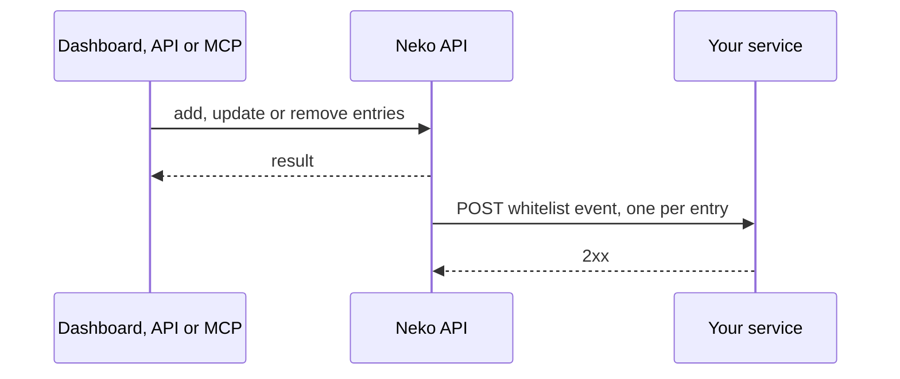

# Whitelist API and Webhook

Manage an instance's whitelist from your own tools: add players with an expiry, change or clear expiries in bulk, remove players, and get a webhook call whenever the list changes.

There are three ways in:

| Way in | Authentication | Can do |
|---|---|---|
| **Dashboard API** (this page) | Bearer token of a signed-in workspace member with the *instance settings* permission | Everything below |
| **MCP** (AI assistants) | OAuth, through **Settings → Connected apps** | The same actions as tools; see [MCP tools](#mcp-tools) |
| **[Server API](server-api.md)** | Workspace `x-api-key` | Read-only: list and check players |

Base URL: `https://api.neko-launcher.com/api/v1`. Responses use the envelope `{ code, message, data }`. Interactive documentation is at `https://api.neko-launcher.com/docs`.

---

## Routes

All routes take the instance name (its URL id) as `<name>`.

### List entries

```
GET /instances/<name>/whitelist
```

`data` is every entry, including expired ones: `id`, `matchType` (`uuid` or `username`), `minecraftUuid`, `username`, `createdAt`, `expiresAt`.

### Add a player

```
POST /instances/<name>/whitelist
```

```json
{ "value": "069a79f4-44e9-4726-a5be-fca90e38aaf5", "expiresAt": "2026-12-31T23:59:00+07:00" }
```

| Field | Required | Meaning |
|---|---|---|
| `value` | yes | A UUID (with or without dashes) or a username. |
| `matchType` | no | `uuid` or `username`. Omit it and the API decides: a UUID matches by UUID, anything else by username. |
| `username` | no | Display name stored next to a UUID entry. |
| `expiresAt` | no | Future ISO 8601 date-time with a time zone. Access ends at that moment. Omit or `null` for no expiry. |

Answers `201` with the entry, `409` for a duplicate, `403` when the plan's whitelist limit is reached. Expired entries do not count toward the limit.

### Set or clear one expiry

```
PATCH /instances/<name>/whitelist/<id>
{ "expiresAt": "2026-12-31T23:59:00Z" }
```

`null` makes the entry permanent. Giving an expired entry a new expiry brings it back, so it counts toward the limit again.

### Set or clear many expiries

```
PATCH /instances/<name>/whitelist/bulk
{ "ids": ["<id>", "<id>"], "expiresAt": "2026-12-31T23:59:00Z" }
```

Up to **1000** ids per request; ids from other instances are ignored. `data` is `{ "updated": <count>, "expiresAt": … }`. When the change would bring back more expired entries than the limit has room for, nothing changes and the API answers `403`.

### Remove players

```
DELETE /instances/<name>/whitelist/<id>
POST   /instances/<name>/whitelist/bulk-remove   { "ids": ["<id>", …] }
```

Bulk remove takes up to 1000 ids and answers `{ "removed": <count>, "ids": [...] }`.

## Webhook

Send whitelist changes to your own service, for example to sync a game server or post to a bot.

Set it in the dashboard (**Whitelist** → *Webhook on whitelist changes*) or through the API:

```
GET   /instances/<name>/whitelist/webhook          → { "configured": true }
PATCH /instances/<name>/whitelist/webhook          { "url": "https://example.com/neko" }
PATCH /instances/<name>/whitelist/webhook          { "url": null }   (disable)
```

The URL must be public HTTPS without credentials. It is stored as a secret: no route ever returns it.

### Events

| Event | When |
|---|---|
| `whitelist.added` | A player is added by hand, by import, or by an approved application (including after an entry fee is paid). Not sent for duplicates. |
| `whitelist.updated` | An expiry is set or cleared, for one entry or in bulk. |
| `whitelist.removed` | An entry is removed, one or in bulk. |

Each event is an HTTPS `POST` with `content-type: application/json` and the header `x-neko-event: <event>`. A bulk change sends one request per entry, one after another.

```json
{
  "event": "whitelist.updated",
  "occurredAt": "2026-10-02T10:00:00.000Z",
  "instance": { "name": "koyo-7f3a", "displayName": "KoyoSMP" },
  "player": { "matchType": "uuid", "username": "Notch", "uuid": "069a79f444e94726a5befca90e38aaf5" },
  "whitelist": { "createdAt": "2026-09-01T08:00:00.000Z", "expiresAt": "2026-12-31T16:59:00.000Z" }
}
```

Delivery is best-effort: a request times out after 5 seconds and is not retried. Answer with any `2xx` quickly and do the work afterwards. If you must never miss a change, also read the list periodically with `GET /whitelist` or the [Server API](server-api.md).



## MCP tools

AI assistants connected through MCP (`https://api.neko-launcher.com/api/v1/mcp`) get the same actions:

| Tool | Does |
|---|---|
| `whitelist_list` | List entries. |
| `whitelist_add` | Add by `value`, optional `matchType` and `expiresAt`. |
| `whitelist_set_expiry` | Set or clear the expiry of up to 1000 entries (`ids`, `expiresAt`). |
| `whitelist_remove` | Remove one entry. |
| `whitelist_remove_many` | Remove up to 1000 entries; asks you to confirm first. |

They need the *players* permission on the connection and the workspace plan's web MCP.

## See also

- [Whitelist, applications and invite links](../dashboard/whitelist-and-applications.md)
- [Server API](server-api.md)
