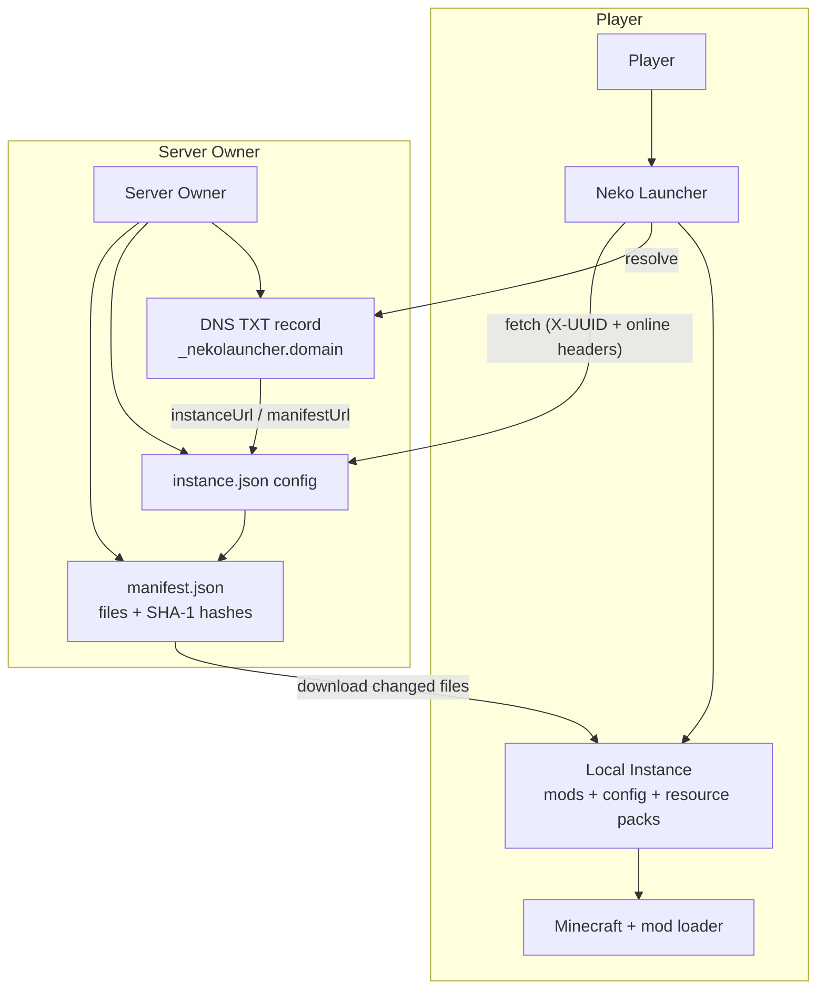

# Neko Launcher Wiki

ยินดีต้อนรับสู่ศูนย์กลางเอกสารอย่างเป็นทางการของ **Neko Launcher** — ตัวเปิด Minecraft ที่สร้างด้วย Tauri 2 ซึ่งช่วยให้ผู้เล่นเข้าร่วมเซิร์ฟเวอร์ที่คัดสรรมาแล้วได้ในไม่กี่คลิก และช่วยให้เจ้าของเซิร์ฟเวอร์เผยแพร่อินสแตนซ์ของตัวเอง (มอด, config, รีซอร์สแพ็ก) ผ่าน HTTP ธรรมดาพร้อมการอัปเดตอัตโนมัติ

วิกินี้แบ่งออกเป็นสองกลุ่มผู้อ่าน: **ผู้เล่น** ที่แค่ต้องการเปิดเกมและเล่น และ **เจ้าของเซิร์ฟเวอร์ / นักพัฒนา** ที่ต้องการแจกจ่ายอินสแตนซ์แบบกำหนดเองและควบคุมการเข้าถึงอินสแตนซ์นั้น

---

## 🗺️ ระบบนิเวศทำงานร่วมกันอย่างไร

ในภาพรวม **เจ้าของเซิร์ฟเวอร์** จะเผยแพร่คำอธิบายอินสแตนซ์ (config, ไฟล์ manifest) และอาจเผยแพร่ DNS record เพื่อให้ตัวเปิดค้นพบอินสแตนซ์ได้โดยอัตโนมัติ ส่วน **ผู้เล่น** จะชี้ตัวเปิดไปยังเซิร์ฟเวอร์นั้น (หรือให้ตัวเปิดสแกนหาโดยอัตโนมัติ) แล้วตัวเปิดจะดาวน์โหลดเฉพาะไฟล์ที่มีการเปลี่ยนแปลง ตรวจสอบความถูกต้อง และเปิด Minecraft ด้วยมอดโหลดเดอร์ที่ถูกต้อง

ทุกคำขอที่ตัวเปิดส่งไปยัง endpoint ของเจ้าของเซิร์ฟเวอร์จะแนบ header `X-UUID` (Minecraft UUID ของผู้เล่น) และ header `online` (`"true"` สำหรับบัญชี Microsoft/Xbox จริง และ `"false"` สำหรับบัญชี offline) มาด้วยเสมอ เพื่อให้ผู้ดูแลระบบสามารถควบคุมการเข้าถึงได้หากต้องการ

---

## 🚀 เริ่มต้นอย่างรวดเร็ว

### สำหรับผู้เล่น

* **[ดาวน์โหลด Neko Launcher](https://neko-launcher.com)** — ดาวน์โหลดตัวติดตั้งสำหรับแพลตฟอร์มของคุณ
* **[เข้าร่วมเซิร์ฟเวอร์ด้วยที่อยู่ IP](./how-to/join-with-ip-address)** — เชื่อมต่อกับเซิร์ฟเวอร์ใน 5 ขั้นตอน
* **[สร้างอินสแตนซ์ของคุณเอง](./how-to/make-your-own-instance)** — ตั้งค่าอินสแตนซ์ส่วนตัวตั้งแต่ต้น

### สำหรับเจ้าของเซิร์ฟเวอร์และนักพัฒนา

* **[คู่มือการผสานรวม Neko Launcher](./neko-launcher/)** — ภาพรวมการผสานรวมกับเซิร์ฟเวอร์แบบครบถ้วน
* **[การกำหนดค่าอินสแตนซ์](./neko-launcher/instance-configuration)** — schema ของ `instance.json` และทุกตัวเลือก
* **[Instance manifest](./neko-launcher/instance-manifest)** — วิธีแจกจ่ายและตรวจสอบไฟล์
* **[DNS discovery](./neko-launcher/dns-discovery)** — เผยแพร่ TXT record เพื่อให้ตัวเปิดค้นพบเซิร์ฟเวอร์ของคุณโดยอัตโนมัติ
* **[HTTP headers](./neko-launcher/http-headers)** — header `X-UUID` / `online` และวิธีควบคุมการเข้าถึง
* **[ลิงก์โซเชียล](./neko-launcher/social-links)** — แสดง Discord, เว็บไซต์ และลิงก์อื่นๆ ของคุณในตัวเปิด
* **[ประกาศ](./neko-launcher/announcement-instance)** — ส่งประกาศ ข่าวสาร และกิจกรรมเข้าไปในอินสแตนซ์

---

## 📚 หมวดหมู่เอกสาร

### การผสานรวม Neko Launcher

ทุกสิ่งที่เจ้าของเซิร์ฟเวอร์ต้องรู้เพื่อเผยแพร่และดูแลอินสแตนซ์

| หน้า | ครอบคลุมเรื่อง |
| --- | --- |
| **[ภาพรวม](./neko-launcher/)** | แนะนำการผสานรวมกับเซิร์ฟเวอร์ |
| **[การกำหนดค่าอินสแตนซ์](./neko-launcher/instance-configuration)** | ฟิลด์ของ `instance.json`, การตั้งค่าโหลดเดอร์, เมทาดาทา |
| **[Instance manifest](./neko-launcher/instance-manifest)** | อาร์เรย์ไฟล์ใน `manifest.json` + การตรวจสอบด้วย SHA-1 |
| **[DNS discovery](./neko-launcher/dns-discovery)** | การค้นพบอัตโนมัติผ่าน TXT record |
| **[HTTP headers](./neko-launcher/http-headers)** | การควบคุมการเข้าถึงด้วย `X-UUID` และ `online` |
| **[ลิงก์โซเชียล](./neko-launcher/social-links)** | ลิงก์ชุมชนและแพลตฟอร์ม |
| **[ประกาศ](./neko-launcher/announcement-instance)** | ประกาศ ข่าวสาร และกิจกรรม |

### คู่มือแบบทำตามทีละขั้น

คู่มือสั้นๆ พร้อมภาพประกอบ

* **[เข้าร่วมด้วยที่อยู่ IP](./how-to/join-with-ip-address)**
* **[สร้างอินสแตนซ์ของคุณเอง](./how-to/make-your-own-instance)**

---

## 🔧 ตัวเปิดทำอะไรได้บ้าง

* ✅ การจัดการอินสแตนซ์สำหรับ **Fabric, Forge, Quilt และ NeoForge**
* ✅ การอัปเดตมอด, config และรีซอร์สแพ็กอัตโนมัติผ่านการเปรียบเทียบ manifest
* ✅ การตรวจสอบทุกไฟล์ที่ดาวน์โหลดด้วย SHA-1
* ✅ การค้นพบเซิร์ฟเวอร์อัตโนมัติผ่าน DNS
* ✅ การควบคุมการเข้าถึงผ่าน auth header ในแต่ละคำขอ
* ✅ รองรับบัญชี Microsoft/Xbox และบัญชี offline
* ✅ UI หลายภาษา (EN / TH และอื่นๆ)
* ✅ ธีมสว่างและมืด

### Mod loader ที่รองรับ

| โหลดเดอร์ | หมายเหตุ |
| --- | --- |
| **Fabric** | เบาและทันสมัย |
| **Forge** | แบบดั้งเดิมและครอบคลุม |
| **Quilt** | Fork ของ Fabric ที่ขับเคลื่อนโดยชุมชน |
| **NeoForge** | ทางเลือกสมัยใหม่ของ Forge |

---

## 🌐 แหล่งข้อมูล

* **[เว็บไซต์ดาวน์โหลด / ตัวเปิด](https://neko-launcher.com)** — ดาวน์โหลดแอป
* **[Furimoe](https://furi.moe)** — เว็บไซต์หลักของโปรเจกต์
* **[ชุมชน Discord](https://alice-discord.furi.moe)** — พูดคุย ขอความช่วยเหลือ และรับประกาศ
* **[องค์กร GitHub](https://github.com/alice-magic)** — ซอร์สโค้ดและการติดตามปัญหา
* **[Wiki repository](https://github.com/alice-magic/wiki)** — ที่มาของเอกสารเหล่านี้

---

## 📖 การมีส่วนร่วม

พบข้อผิดพลาดหรืออยากเพิ่มหน้าใหม่? เอกสารเหล่านี้อยู่บน GitHub:

1. เปิด **[wiki repository](https://github.com/alice-magic/wiki)**
2. ส่ง issue หรือ pull request
3. ให้ตัวอย่างเป็นของจริงและใช้งานได้จริง — ทุก config, DNS record และ header ที่แสดงไว้ตรงกับสิ่งที่ตัวเปิดอ่านจริง

---

## ดูเพิ่มเติม

* [ภาพรวมการผสานรวม Neko Launcher](./neko-launcher/)
* [การกำหนดค่าอินสแตนซ์](./neko-launcher/instance-configuration)
* [DNS discovery](./neko-launcher/dns-discovery)
* [วิธีเข้าร่วมด้วยที่อยู่ IP](./how-to/join-with-ip-address)
* [วิธีสร้างอินสแตนซ์ของคุณเอง](./how-to/make-your-own-instance)
