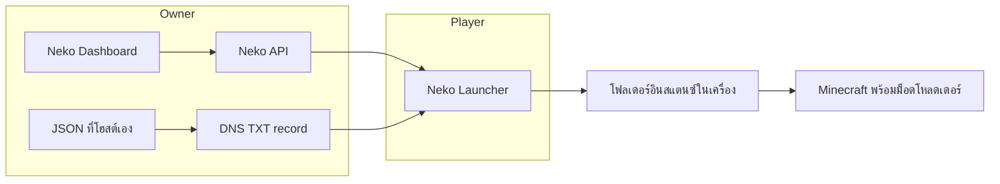

# Neko Launcher Wiki

**Neko Launcher** คือตัวเปิด Minecraft สำหรับเซิร์ฟเวอร์ที่คัดสรรมาแล้ว ผู้เล่นติดตั้งม็อดแพ็กของเซิร์ฟเวอร์ได้ในคลิกเดียวและได้รับอัปเดตอัตโนมัติ ส่วนเจ้าของเซิร์ฟเวอร์เผยแพร่และจัดการม็อดแพ็กจากแดชบอร์ดบนเว็บ กำหนดว่าใครเข้าได้ และเก็บค่าเข้าเซิร์ฟเวอร์ได้ด้วย

วิกินี้แบ่งเป็นสามกลุ่มผู้อ่าน:

| คุณคือ… | เริ่มที่ |
|---|---|
| **ผู้เล่น** ที่อยากเข้าเซิร์ฟเวอร์ | [คู่มือผู้เล่น](players/README.md) |
| **เจ้าของเซิร์ฟเวอร์** ที่อยากเผยแพร่ม็อดแพ็กและจัดการผู้เล่น | [คู่มือแดชบอร์ด](dashboard/README.md) |
| **นักพัฒนา** ที่ต้องการเชื่อมต่อกับตัวเปิดหรือโฮสต์อินสแตนซ์เอง | [เอกสารอ้างอิงทางเทคนิค](neko-launcher/README.md) |

---

## ภาพรวมการทำงาน

**อินสแตนซ์** คือม็อดแพ็กของเซิร์ฟเวอร์หนึ่ง ประกอบด้วยคำอธิบาย (ชื่อ เวอร์ชัน Minecraft ม็อดโหลดเดอร์ วอลเปเปอร์ ลิงก์) และ **manifest** ที่ระบุทุกไฟล์พร้อมค่า SHA-1 ตัวเปิดจะดาวน์โหลดเฉพาะไฟล์ที่เปลี่ยน ตรวจสอบทุกไฟล์ ติดตั้งโหลดเดอร์ที่ถูกต้อง แล้วเปิดเกม

เผยแพร่อินสแตนซ์ได้สองทาง:

- **Neko Dashboard** (แนะนำ) — อัปโหลดไฟล์ที่ [neko-launcher.com/dashboard](https://neko-launcher.com/dashboard) API จะเป็นผู้ให้บริการอินสแตนซ์ โฮสต์ไฟล์ จัดการไวต์ลิสต์ ใบสมัคร ลิงก์เชิญ และค่าเข้าเซิร์ฟเวอร์
- **โฮสต์เอง** — วางไฟล์ JSON สองไฟล์ที่ไหนก็ได้ แล้วชี้ DNS TXT record ไปที่ไฟล์นั้น ผู้เล่นพิมพ์โดเมนของคุณในตัวเปิด

```mermaid
graph LR
  subgraph Owner
    D[Neko Dashboard] --> API[Neko API]
    H[JSON ที่โฮสต์เอง] --> DNS[DNS TXT record]
  end
  subgraph Player
    L[Neko Launcher]
  end
  API --> L
  DNS --> L
  L --> I[โฟลเดอร์อินสแตนซ์ในเครื่อง]
  I --> MC[Minecraft พร้อมม็อดโหลดเดอร์]
```

---

## คู่มือผู้เล่น

- [เริ่มต้นใช้งาน](players/README.md) — ติดตั้ง เข้าสู่ระบบ หาเซิร์ฟเวอร์ เล่น
- [เข้าเซิร์ฟเวอร์ด้วย IP address](how-to/join-with-ip-address.md)
- [สมัครเข้าเซิร์ฟเวอร์และชำระค่าเข้า](how-to/apply-to-a-server.md)

## คู่มือแดชบอร์ด

- [เวิร์กสเปซ แพ็กเกจ และสมาชิก](dashboard/README.md)
- [อินสแตนซ์และการตั้งค่า](dashboard/instances.md) — การมองเห็น ไวต์ลิสต์ อ่านอย่างเดียว ซ่อนม็อด
- [ไฟล์และเวอร์ชัน](dashboard/files-and-versions.md)
- [ไวต์ลิสต์ ใบสมัคร และลิงก์เชิญ](dashboard/whitelist-and-applications.md)
- [ค่าเข้าเซิร์ฟเวอร์](dashboard/entry-fee.md) — PromptPay QR ลิงก์ชำระเงิน หรือโอนธนาคาร ยืนยันด้วยสลิป
- [ประกาศ](dashboard/announcements.md)
- [Discovery](dashboard/discovery.md) — ขึ้นรายชื่อในตัวเปิด

## เอกสารอ้างอิงทางเทคนิค

- [ภาพรวมและสถาปัตยกรรม](neko-launcher/README.md)
- [การตั้งค่าอินสแตนซ์](neko-launcher/instance-configuration.md) — schema v2
- [Manifest ของอินสแตนซ์](neko-launcher/instance-manifest.md) — schema v2
- [DNS discovery](neko-launcher/dns-discovery.md) — โฮสต์เองด้วย TXT record
- [HTTP header และการยืนยันตัวตน](neko-launcher/http-headers.md)
- [ฟีดประกาศ](neko-launcher/announcement-instance.md)
- [ลิงก์โซเชียล](neko-launcher/social-links.md)
- [Server API](neko-launcher/server-api.md) — ตรวจไวต์ลิสต์จากปลั๊กอินเซิร์ฟเวอร์
- [Deep link](neko-launcher/deep-links.md) — `nekolauncher://` และ `neko-launcher.com/j/…`
- [สร้างอินสแตนซ์ของคุณเอง](how-to/make-your-own-instance.md) — ทั้งสองทาง ทีละขั้น

---

## ดาวน์โหลดและการสนับสนุน

- ดาวน์โหลด: [neko-launcher.com](https://neko-launcher.com)
- แดชบอร์ด: [neko-launcher.com/dashboard](https://neko-launcher.com/dashboard)
- ซัพพอร์ต: [neko-launcher.com/support](https://neko-launcher.com/support)
- วิกินี้เป็นโอเพนซอร์ส: [github.com/alice-magic/wiki](https://github.com/alice-magic/wiki)
