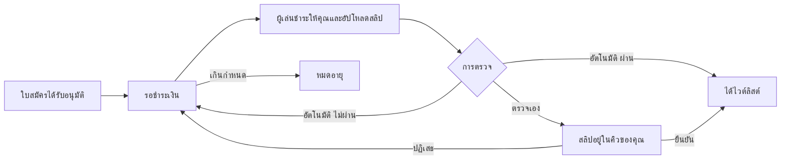

# ค่าเข้าเซิร์ฟเวอร์

เก็บค่าเข้าครั้งเดียวเมื่อใบสมัครของผู้เล่นได้รับอนุมัติ ผู้เล่นชำระให้ **คุณ** โดยตรง Neko Launcher ตรวจแค่หลักฐานการชำระแล้วเขียนรายการไวต์ลิสต์ให้

---

## การทำงาน

- Neko Launcher ไม่ถือเงินและคืนเงินไม่ได้
- ค่าเข้าใช้กับทุกการอนุมัติบนอินสแตนซ์ รวมโหมด OPEN และ AUTO
- ผู้เล่นเห็นค่าเข้าตั้งแต่ก่อนสมัคร (*มีค่าเข้า 150 บาท ชำระหลังอนุมัติ*)

## การตั้งค่า

**Applications → Form settings → Entry fee**

| การตั้งค่า | ความหมาย |
|---|---|
| **Amount** | เป็นบาท |
| **วิธีชำระ** | **PromptPay QR** — สร้าง QR ที่ฝังยอดจาก PromptPay ID ของคุณ (เบอร์โทร เลขบัตรประชาชน หรือ e-wallet ID) **ลิงก์ชำระเงิน** — หน้า HTTPS ใดๆ ที่คุณให้ (Stripe, LINE Pay, …) **โอนธนาคาร** — ธนาคาร เลขบัญชี ชื่อบัญชี แสดงให้ผู้เล่น |
| **ชื่อบัญชีผู้รับ** | ไม่บังคับ เมื่อตรวจอัตโนมัติ สลิปที่โอนไปคนละชื่อจะถูกปฏิเสธ |
| **การตรวจสลิป** | **ตรวจเอง** — คุณดูสลิปทีละใบ **อัตโนมัติ** — ตรวจกับธนาคารตอนอัปโหลด (แพ็กเกจ PRO ขึ้นไป) |
| **ชั่วโมงที่ให้ชำระ** | กำหนดเวลาหลังอนุมัติ `0` = ไม่กำหนด ใบสมัครที่ไม่ชำระหมดอายุและคืนที่ว่าง |
| **จำนวนครั้งส่งสลิป** | ส่งสลิปที่ถูกปฏิเสธใหม่ได้กี่ครั้งก่อนใบสมัครถูกปฏิเสธ |
| **ข้อความถึงผู้จ่าย** | แยกภาษา แสดงเหนือ QR หรือเลขบัญชี: ค่าเข้าครอบคลุมอะไร คืนเงินได้ไหม |

## การตรวจอัตโนมัติ

บนแพ็กเกจ PRO ขึ้นไป สลิปถูกตรวจผ่าน **EasySlip** ด้วยบัญชีของ Neko คุณไม่ต้องมี key เอง สลิปที่อัปโหลดแต่ละใบถูกตรวจ:

- **ยอด** ตรงกับค่าเข้า
- สลิปไม่เคย **ถูกใช้มาก่อน** (รวมทั้งใบสมัครอื่นบนอินสแตนซ์ของคุณ)
- **ชื่อบัญชีผู้รับ** ถ้าคุณกรอกไว้

ผ่าน = ได้ไวต์ลิสต์ทันที ไม่ผ่านจะบอกผู้เล่นว่าเพราะอะไร (*ยอดไม่ตรง*, *เคยใช้แล้ว*, *คนละบัญชี*, *ไม่พบ QR สลิป*) และให้ส่งใหม่ ถ้าบริการตรวจล่ม สลิปจะตกไปที่คิวตรวจเองของคุณแทนการปฏิเสธ

ลิงก์ชำระเงินตรวจอัตโนมัติไม่ได้ ผู้เล่นอัปโหลดภาพหน้าจอให้คุณยืนยัน

## การตรวจการชำระ

**Applications → Responses** กับตัวกรอง **รอตรวจสลิป** และ **รอชำระเงิน**:

- **ดูสลิป** เปิดรูป (ลิงก์ส่วนตัวใช้ได้สิบนาที)
- **ยืนยันการชำระ** ให้ไวต์ลิสต์
- **ปฏิเสธสลิป** (พร้อมโน้ต) ส่งกลับให้ลองใหม่
- **ทำเครื่องหมายว่าจ่ายแล้ว** บนใบสมัครที่ยังรอชำระ สำหรับเงินที่ได้รับทางอื่น
- **ปฏิเสธ** จบใบสมัคร

แต่ละใบสมัครบันทึกเลขอ้างอิงธุรกรรม เวลาชำระ และจำนวนครั้ง CSV รวมข้อมูลเหล่านี้

## กติกาและความรับผิดชอบ

- ค่าเข้าที่เก็บ ภาษี การคืนเงิน และข้อพิพาท เป็นเรื่องระหว่างคุณกับผู้เล่น ระบุนโยบายคืนเงินในข้อความถึงผู้จ่าย
- คำตอบและสลิปของผู้สมัครเป็นข้อมูลส่วนบุคคลที่คุณได้รับ จัดการให้เหมาะสม
- Neko อาจปิดการรับสมัครหรือค่าเข้าบนอินสแตนซ์ที่ใช้หลอกลวงผู้เล่น

## ดูเพิ่มเติม

- [ไวต์ลิสต์และใบสมัคร](whitelist-and-applications.md)
- [สมัครเข้าเซิร์ฟเวอร์ (ฝั่งผู้เล่น)](../how-to/apply-to-a-server.md)
- [เวิร์กสเปซและแพ็กเกจ](README.md)
