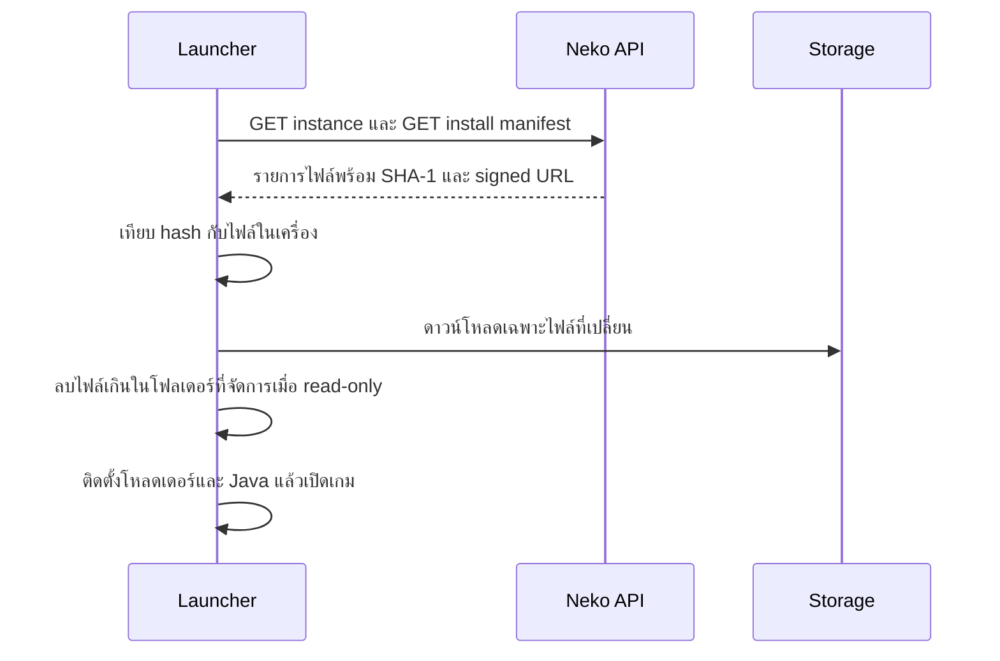

# ไฟล์และเวอร์ชัน

แท็บ **Files** เก็บเนื้อหาของอินสแตนซ์ แท็บ **Versions** เผยแพร่มัน ผู้เล่นไม่เห็นฉบับร่าง พวกเขาซิงก์ตามเวอร์ชันที่ active

---

## ตัวจัดการไฟล์

เรียกดูโฟลเดอร์อินสแตนซ์ตามที่ผู้เล่นจะได้รับ ทำได้:

- **อัปโหลด** ไฟล์หรือทั้งโฟลเดอร์ด้วยการลากวาง มีความคืบหน้าต่อไฟล์
- **สร้างโฟลเดอร์**, **เปลี่ยนชื่อ**, **ย้าย** (ไฟล์เดียวหรือหลายรายการ), **ลบ** ไฟล์และโฟลเดอร์
- **แก้ไข** ไฟล์ข้อความ (config, properties, TOML, JSON) ในที่
- **นำเข้า `.mrpack`**: ม็อดในแพ็กถูกลิงก์ไป Modrinth ส่วน overrides ถูกอัปโหลด
- **Modrinth**: ค้นหาและติดตั้งม็อดสำหรับเวอร์ชันและโหลดเดอร์ของอินสแตนซ์ หรืออัปเดต
- **Archive**: ดาวน์โหลดทั้งอินสแตนซ์เป็น zip หรือกู้คืนจาก zip

### ไฟล์เก็บที่ไหน

| แหล่ง | เก็บที่ | ผู้เล่นดาวน์โหลดจาก |
|---|---|---|
| อัปโหลดเอง | ที่เก็บส่วนตัวใน Neko cloud | ลิงก์ลงนามอายุสั้นที่ออกให้ต่อการเปิดเกม |
| ม็อด Modrinth | ไม่ได้เก็บ ลิงก์ไฟล์ของ Modrinth | CDN ของ Modrinth |

เฉพาะไฟล์ที่อัปโหลดนับพื้นที่ของแพ็กเกจ เวิร์กสเปซแพ็กเกจสูงเชื่อม Cloudflare R2 ของตัวเองได้ในการตั้งค่าเวิร์กสเปซ

### พาธที่จัดการและที่ ignored

ทุกอย่างในตัวจัดการไฟล์คือ **ที่จัดการ**: เมื่อเปิด *read-only* ผู้เล่นได้รับตรงเป๊ะและเก็บการแก้ไขไม่ได้ พาธในรายการ **ignored** ของอินสแตนซ์ถูกเขียนครั้งเดียวแล้วปล่อย ใส่ค่าเริ่มต้นสำหรับผู้เล่นไว้ตรงนั้น (`options.txt` ที่ตั้งปุ่มลัดไว้แล้ว รีซอร์สแพ็กเริ่มต้น) ผู้เล่นจะเก็บการแก้ของตัวเองได้ ดู [อินสแตนซ์](instances.md)

## เวอร์ชัน

เวอร์ชันหนึ่งคือการตรึงรายการไฟล์ปัจจุบัน พร้อมข้อความเวอร์ชัน (`1.2.0`) และ changelog ผู้เล่นซิงก์ตามเวอร์ชัน **active**

- **Publish** เวอร์ชันใหม่หลังแก้ไฟล์
- **Activate** เวอร์ชันเก่าเพื่อย้อนกลับทันที ไม่ต้องอัปโหลดใหม่
- **Restore files** จากเวอร์ชันมาที่ฉบับร่างเพื่อแก้ต่อ
- **Delete** เวอร์ชันที่ไม่ใช้แล้ว (ลบเวอร์ชัน active ไม่ได้)

ตัวเปิดแสดงเวอร์ชัน active และ changelog บนหน้าอินสแตนซ์ พร้อมประวัติเวอร์ชัน

## การซิงก์บนเครื่องผู้เล่น

แต่ละไฟล์มีกำหนดเวลาดาวน์โหลดตามขนาด ดาวน์โหลดที่ค้างจะทำให้การเปิดเกมล้มเหลวพร้อมข้อความแทนที่จะแขวน และการกดเริ่มเกมครั้งถัดไปทำต่อจากที่โหลดไว้แล้ว

## ดูเพิ่มเติม

- [อินสแตนซ์](instances.md)
- [Manifest ของอินสแตนซ์](../neko-launcher/instance-manifest.md)
