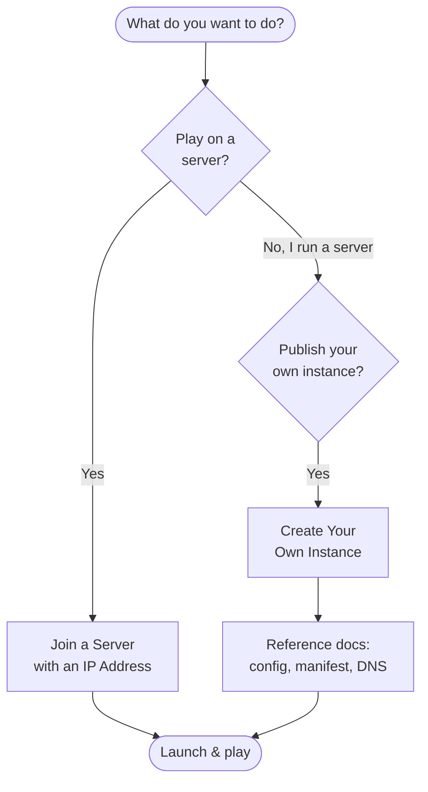

# คู่มือการใช้งาน (How-To Guides)

คู่มือทีละขั้นตอนสำหรับ **Neko Launcher** — ทั้งการเชื่อมต่อเข้าเซิร์ฟเวอร์ในฐานะผู้เล่น และการสร้าง instance ของคุณเองในฐานะผู้ดูแลเซิร์ฟเวอร์

ไม่ว่าคุณจะแค่อยากเข้าเซิร์ฟเวอร์ของเพื่อนด้วย IP หรือกำลังจะตั้งค่า modpack แบบจัดการเต็มรูปแบบให้ชุมชนของคุณ ก็เริ่มต้นได้ที่นี่

---

## 🎮 สำหรับผู้เล่น

คู่มือสำหรับการเข้าเล่นเกมได้อย่างรวดเร็ว

- **[เข้าร่วมเซิร์ฟเวอร์ด้วย IP Address](./join-with-ip-address.md)**
  เชื่อมต่อตรงไปยังเซิร์ฟเวอร์โดยใช้ IP หรือโดเมนของเซิร์ฟเวอร์นั้น เมื่อคุณหาเซิร์ฟเวอร์ผ่านการค้นหาปกติไม่เจอ Neko Launcher จะค้นหา instance ของเซิร์ฟเวอร์ให้โดยอัตโนมัติผ่าน DNS แล้วติดตั้ง loader และไฟล์ที่ถูกต้องให้คุณ

เพิ่งเริ่มใช้ launcher ใช่ไหม? เริ่มจาก [ภาพรวม Neko Launcher](../neko-launcher/README.md) เพื่อดูวิธีติดตั้งและการใช้งานพื้นฐาน แล้วค่อยทำตามคู่มือการเข้าร่วมด้านบน

---

## 🛠️ สำหรับผู้ดูแลเซิร์ฟเวอร์

คู่มือสำหรับการเผยแพร่ instance ของคุณเอง เพื่อให้ผู้เล่นติดตั้งได้ในคลิกเดียว

- **[สร้าง Instance ของคุณเอง](./make-your-own-instance.md)**
  สร้างและโฮสต์ instance แบบกำหนดเอง — เลือกเวอร์ชัน Minecraft และ loader (Fabric, Forge, Quilt หรือ NeoForge) กำหนด file manifest ของคุณ แล้วเชื่อมต่อทุกอย่างเข้าด้วยกันเพื่อให้ผู้เล่นเข้าร่วมได้โดยอัตโนมัติ

เมื่อคุณพร้อมจะเจาะลึกมากขึ้น เอกสารอ้างอิงครอบคลุมทุกฟิลด์และทุกรูปแบบ:

| หัวข้อ | ครอบคลุมอะไรบ้าง |
|-------|----------------|
| [Instance Configuration](../neko-launcher/instance-configuration.md) | ทุกฟิลด์ใน `instance.json` (name, loader, tags, metadata และอื่น ๆ) |
| [Instance Manifest](../neko-launcher/instance-manifest.md) | อาร์เรย์ของไฟล์ในไฟล์ `manifest.json` และการทำ SHA-1 hashing |
| [DNS Discovery](../neko-launcher/dns-discovery.md) | TXT records ที่ให้ผู้เล่นเข้าร่วมด้วยโดเมนได้ (`instanceUrl` / `manifestUrl`) |
| [HTTP Headers](../neko-launcher/http-headers.md) | Header `X-UUID` และ `online` สำหรับควบคุมการเข้าถึง |
| [Announcements](../neko-launcher/announcement-instance.md) | การเผยแพร่ประกาศ ข่าวสาร และกิจกรรมภายใน instance |
| [Social Links](../neko-launcher/social-links.md) | การเพิ่มลิงก์ Discord เว็บไซต์ และลิงก์อื่น ๆ |

---

## 🧭 ฉันต้องใช้คู่มือไหน?

---

## 🩹 การแก้ปัญหา

หากมีบางอย่างทำงานไม่ถูกต้อง:

- ✅ ตรวจสอบการเชื่อมต่ออินเทอร์เน็ตของคุณ
- ✅ อัปเดต Neko Launcher เป็นเวอร์ชันล่าสุด — ระบบอัปเดตอัตโนมัติจะทำงานตอนเปิดโปรแกรมในบิลด์ production
- ✅ หากเซิร์ฟเวอร์อยู่ในภูมิภาคอื่น ความหน่วง (latency) หรือการล็อกภูมิภาคอาจกั้นคุณไว้ การใช้ VPN อาจช่วยได้
- ✅ ตรวจสอบ IP หรือโดเมนของเซิร์ฟเวอร์อีกครั้งว่าพิมพ์ถูกต้องหรือไม่
- ✅ ยังติดขัดอยู่? สอบถามได้ที่ [ชุมชน Discord](https://alice-discord.furi.moe)

---

## ดูเพิ่มเติม

- [เข้าร่วมเซิร์ฟเวอร์ด้วย IP Address](./join-with-ip-address.md)
- [สร้าง Instance ของคุณเอง](./make-your-own-instance.md)
- [ภาพรวม Neko Launcher](../neko-launcher/README.md)
- [Instance Configuration](../neko-launcher/instance-configuration.md)
- [DNS Discovery](../neko-launcher/dns-discovery.md)

---

📌 **อยากมีส่วนร่วมเขียนคู่มือใช่ไหม?** ติดต่อผู้ดูแลได้ที่ [Discord](https://alice-discord.furi.moe)
