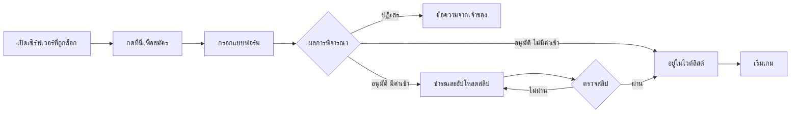

# สมัครเข้าเซิร์ฟเวอร์และชำระค่าเข้า

เซิร์ฟเวอร์ที่ถูกล็อกสามารถเปิด **รับสมัคร** ได้ คุณกรอกแบบฟอร์มของเจ้าของ เจ้าของ (หรือระบบ) ตัดสิน และบางเซิร์ฟเวอร์ต้องชำระ **ค่าเข้า** ครั้งเดียวก่อนได้เข้า ขั้นตอนเหมือนกันทั้งในตัวเปิดและบนเว็บไซต์

---

## ลำดับขั้น

## 1. หาช่องทางสมัคร

- **ในตัวเปิด:** เปิดเซิร์ฟเวอร์ (จาก Discover ค้นหา หรือลิงก์เชิญ) แถบด้านล่างบอกว่าคุณไม่มีสิทธิ์ ถ้าลงท้ายด้วย **กดที่นี่เพื่อสมัคร** แสดงว่าเปิดรับ
- **บนเว็บ:** เจ้าของอาจให้ `https://neko-launcher.com/apply/<server>` หรือลิงก์เชิญ `https://neko-launcher.com/j/<code>` เข้าสู่ระบบด้วยบัญชี Microsoft ที่ใช้เล่น

ต้องใช้บัญชี Microsoft ที่มี Minecraft บัญชีออฟไลน์สมัครไม่ได้

## 2. กรอกแบบฟอร์ม

แบบฟอร์มอาจมีหลายหน้า คำถามบังคับมี `*` และปุ่ม **ถัดไป** กดไม่ได้จนกว่าจะกรอกครบ บางคำตอบพาไปคนละหน้า (เช่น *Builder* ถูกถามต่างจาก *Developer*) ชื่อและ UUID ของคุณอาจถูกกรอกให้อัตโนมัติ

เซิร์ฟเวอร์ตั้ง **อายุขั้นต่ำ** ได้ ถ้าคำตอบต่ำกว่านั้นใบสมัครถูกปฏิเสธทันที

ส่งได้ครั้งเดียว มีใบสมัครค้างสองใบบนเซิร์ฟเวอร์เดียวกันไม่ได้

## 3. รอผล

| โหมดของเซิร์ฟเวอร์ | สิ่งที่เกิดขึ้น |
|---|---|
| เปิด | ไม่มีแบบฟอร์ม ได้ไวต์ลิสต์ทันที |
| อัตโนมัติ | ตรวจแบบฟอร์มแล้วได้ไวต์ลิสต์ทันที |
| ตรวจเอง | ทีมของเจ้าของพิจารณา แจ้งผลในตัวเปิด บนเว็บ และทางอีเมลถ้าสมัครจากเว็บ |

ใบสมัครที่ถูกปฏิเสธอาจมีโน้ตจากเจ้าของและระยะเวลารอก่อนสมัครใหม่

## 4. ชำระค่าเข้า (บางเซิร์ฟเวอร์)

ถ้าเซิร์ฟเวอร์เก็บค่าเข้า คุณจะเห็นตั้งแต่ก่อนสมัคร (*มีค่าเข้า 150 บาท ชำระหลังอนุมัติ*) เมื่ออนุมัติแล้ว ใบสมัครจะแสดง **ขั้นชำระเงิน** แทนแบบฟอร์ม:

- **PromptPay QR** — สแกนด้วยแอปธนาคาร ยอดถูกใส่ไว้ให้แล้ว
- **ลิงก์ชำระเงิน** — ปุ่มเปิดหน้าชำระเงินของเจ้าของ
- **โอนธนาคาร** — ธนาคาร เลขบัญชี ชื่อบัญชี ให้คัดลอก

โน้ตของเจ้าของเหนือ QR อธิบายว่าค่าเข้าครอบคลุมอะไร ชำระยอดให้ตรง แล้ว **อัปโหลดสลิป** (JPEG, PNG หรือ WebP ไม่เกิน 4 MB)

- เซิร์ฟเวอร์ที่มี **การตรวจอัตโนมัติ** จะตรวจสลิปกับธนาคารทันที: ยอด สลิปเคยใช้หรือไม่ และบัญชีผู้รับ ถ้าไม่ตรงจะบอกเหตุผลและให้ส่งสลิปใหม่ได้ตามจำนวนครั้งที่เจ้าของกำหนด
- ไม่เช่นนั้นสลิปไปที่ทีมของเจ้าของเพื่อยืนยันด้วยมือ

มักมี **กำหนดเวลา** ใบสมัครที่ไม่ชำระจะหมดอายุแล้วสมัครใหม่ได้

> เงินเข้าบัญชีเจ้าของเซิร์ฟเวอร์โดยตรง Neko Launcher ไม่ถือเงินและคืนเงินไม่ได้ การคืนเงินเป็นเรื่องระหว่างคุณกับเจ้าของ

## 5. เล่น

เมื่อยืนยันการชำระแล้ว คุณอยู่ในไวต์ลิสต์ กด **เริ่มเกม** ในตัวเปิด

---

## ข้อความที่อาจเจอ

| ข้อความ | ความหมาย |
|---|---|
| *ไม่มีบัญชี Minecraft เชื่อมอยู่* | เข้าสู่ระบบใหม่ด้วยบัญชี Microsoft ที่มีเกม |
| *คุณมีสิทธิ์เข้าอยู่แล้ว* | คุณอยู่ในไวต์ลิสต์หรือเป็นสมาชิกทีมเจ้าของ เล่นได้เลย |
| *คุณส่งใบสมัครไปแล้ว* | รอผล |
| *อนุมัติแล้ว รอชำระเงิน* | ชำระและอัปโหลดสลิป |
| *ได้รับสลิปแล้ว* | เจ้าของกำลังตรวจ |
| *สลิปล่าสุดยอดไม่ตรง* / *เคยถูกใช้แล้ว* / *โอนไปคนละบัญชี* | การตรวจอัตโนมัติปฏิเสธ ตรวจสอบแล้วส่งสลิปที่ถูกต้อง |
| *สมัครใหม่ได้หลัง …* | ระยะเวลารอหลังถูกปฏิเสธ |

## ดูเพิ่มเติม

- [คู่มือผู้เล่น](../players/README.md)
- [ไวต์ลิสต์และใบสมัคร (ฝั่งเจ้าของ)](../dashboard/whitelist-and-applications.md)
- [ค่าเข้าเซิร์ฟเวอร์ (ฝั่งเจ้าของ)](../dashboard/entry-fee.md)
