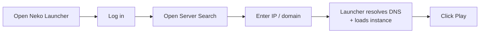

# วิธีเข้าร่วมเซิร์ฟเวอร์ด้วย IP Address

ค้นหาเซิร์ฟเวอร์ผ่านรายการเบราว์ปกติไม่เจอใช่ไหม? คุณสามารถเชื่อมต่อโดยตรงได้ด้วยการพิมพ์ **IP address** (หรือโดเมน) ลงในช่องค้นหา จากนั้น Neko Launcher จะจัดการที่เหลือให้เอง ทั้งการค้นหา DNS records ของเซิร์ฟเวอร์ ดึงค่า config ของ instance ลงมา และพาคุณเข้าเกมได้ทันที

## 🔎 การเข้าร่วมโดยตรงทำงานอย่างไร

เมื่อคุณป้อนที่อยู่เข้าไป ตัว Launcher จะค้นหา DNS **TXT records** พิเศษบนโดเมนนั้นเพื่อดูว่าจะตั้งค่า instance อย่างไร โดยจะสอบถามชื่อสองรายการตามลำดับ:

1. `_nekolauncher.<domain>` (หลัก)
2. `_alicemagiclauncher.<domain>` (สำรอง)

หากพบ record ตัว Launcher จะอ่านค่า `instanceUrl` และ `manifestUrl` ที่ชี้ไป ดาวน์โหลดคำนิยามของ instance และเตรียมทุกอย่างให้อัตโนมัติ โดยไม่ต้องตั้งค่าเองเลย (สำหรับผู้ดูแลเซิร์ฟเวอร์: ดูวิธีเผยแพร่ records เหล่านี้ได้ที่ [Make Your Own Instance](make-your-own-instance.md))

## 🕹️ ขั้นตอนการเข้าร่วม



## ขั้นตอนการเข้าร่วม

### ขั้นตอนที่ 1 — เปิด Neko Launcher

เปิดแอปพลิเคชัน Neko Launcher บนคอมพิวเตอร์ของคุณ


### ขั้นตอนที่ 2 — เข้าสู่ระบบ

คลิก **Login** แล้วลงชื่อเข้าใช้ด้วยบัญชีของคุณ สำหรับเซิร์ฟเวอร์ออนไลน์ คุณควรใช้บัญชี Microsoft/Xbox จริง เนื่องจากตัว Launcher จะส่งสถานะบัญชีของคุณไปพร้อมกับทุกคำขอ เพื่อให้ผู้ดูแลสามารถจำกัดการเข้าถึงเฉพาะผู้เล่นที่ยืนยันตัวตนแล้วได้


### ขั้นตอนที่ 3 — เปิดหน้าค้นหาเซิร์ฟเวอร์

หาจุดเข้าสู่การค้นหาได้ที่มุมขวาบนของหน้าต่างหลัก


### ขั้นตอนที่ 4 — ป้อน IP Address

พิมพ์ที่อยู่ของเซิร์ฟเวอร์ (เช่น `play.furi.moe`) ลงในช่องค้นหา ตัว Launcher จะค้นหา DNS records ของที่อยู่นั้นและโหลด instance ที่ตรงกันขึ้นมา


### ขั้นตอนที่ 5 — คลิกเล่น

กด **Play** (หรือ **Join**) เพื่อเปิดเกมและเชื่อมต่อกับเซิร์ฟเวอร์


## ตัวอย่างที่อยู่

```text
play.furi.moe
```

ใช้ได้ทั้ง IP แบบล้วนและโดเมน ตราบใดที่โดเมนนั้นเผยแพร่ TXT records ของ Neko Launcher ตามที่อธิบายไว้ข้างต้น

## 🛠️ การแก้ไขปัญหา

หากเซิร์ฟเวอร์โหลดไม่ขึ้นหรือคุณพบข้อผิดพลาด:

- **ตรวจสอบให้แน่ใจว่าคุณเข้าสู่ระบบแล้ว** เซิร์ฟเวอร์ออนไลน์อาจปฏิเสธคำขอจากบัญชีที่ไม่ได้ยืนยันตัวตน (offline)
- **ตรวจสอบที่อยู่ให้ถี่ถ้วน** การพิมพ์ผิดหมายความว่าจะหา DNS records ไม่เจอ
- **ยืนยันว่าเซิร์ฟเวอร์กำลังทำงานอยู่** และเข้าถึงได้จากเครือข่ายของคุณ
- **ตรวจสอบการเชื่อมต่ออินเทอร์เน็ตของคุณ** ทั้งการค้นหา DNS และการดาวน์โหลด config ต่างก็ต้องใช้การเชื่อมต่อเครือข่าย
- **ลองใหม่จากเครือข่ายอื่นหรือใช้ VPN** หากเซิร์ฟเวอร์ถูกจำกัดตามภูมิภาค
- **สอบถามผู้ดูแลเซิร์ฟเวอร์** ว่าได้เผยแพร่ DNS records ของ Neko Launcher อย่างถูกต้องหรือไม่ หากไม่มีอะไรโหลดขึ้นมาเลย โดเมนนั้นจำเป็นต้องมี TXT record `_nekolauncher` (หรือ `_alicemagiclauncher`) ที่ชี้ไปยัง `instanceUrl` ที่ถูกต้อง

> 📌 **เคล็ดลับ:** หากโดเมนไม่ตั้งค่าให้อัตโนมัติ มีความเป็นไปได้ว่าโดเมนนั้นยังไม่ได้ตั้งค่าสำหรับ Neko Launcher เจ้าของเซิร์ฟเวอร์สามารถเพิ่มการรองรับได้โดยทำตาม [Make Your Own Instance](make-your-own-instance.md)

## ดูเพิ่มเติม

- [Make Your Own Instance](make-your-own-instance.md) — เผยแพร่ DNS records และโฮสต์ instance เซิร์ฟเวอร์ของคุณเอง
- [How-To Guides](README.md) — กลับไปยังดัชนีคู่มือการใช้งาน
