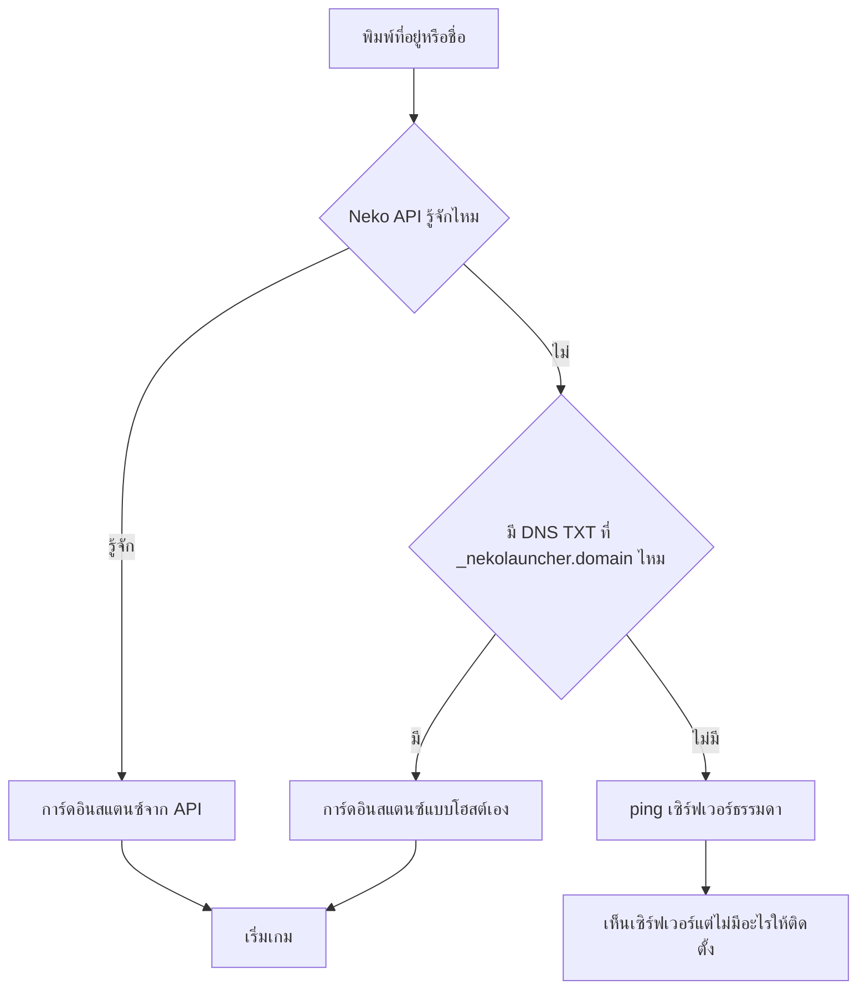

# วิธีเข้าเซิร์ฟเวอร์ด้วย IP address

Neko Launcher เพิ่มเซิร์ฟเวอร์ได้จากแค่ที่อยู่ พิมพ์ `play.example.com` ในช่องค้นหา ตัวเปิดจะหาเองว่ามันคืออะไร

---

## เกิดอะไรขึ้นตอนค้นหา


```mermaid
flowchart TD
    A[พิมพ์ที่อยู่หรือชื่อ] --> B{Neko API รู้จักไหม}
    B -- รู้จัก --> C[การ์ดอินสแตนซ์จาก API]
    B -- ไม่ --> D{มี DNS TXT ที่ _nekolauncher.domain ไหม}
    D -- มี --> E[การ์ดอินสแตนซ์แบบโฮสต์เอง]
    D -- ไม่มี --> F[ping เซิร์ฟเวอร์ธรรมดา]
    C --> G[เริ่มเกม]
    E --> G
    F --> H[เห็นเซิร์ฟเวอร์แต่ไม่มีอะไรให้ติดตั้ง]
```

1. **ถาม Neko API ก่อน** — ถ้าข้อความตรงกับชื่ออินสแตนซ์หรือรหัสเชิญ ตัวเปิดแสดงอินสแตนซ์นั้นพร้อมบอกว่าบัญชีคุณติดตั้งได้ไหม
2. **DNS TXT record** — ไม่เจอก็ค้น `_nekolauncher.<domain>` (และ `_alicemagiclauncher.<domain>` แบบเก่า) record นั้นชี้ไปที่ settings และ manifest ของอินสแตนซ์ ดู [DNS discovery](../neko-launcher/dns-discovery.md)
3. **ping ธรรมดา** — ไม่มีทั้งคู่ ตัวเปิดจะ ping เซิร์ฟเวอร์ Minecraft แสดง MOTD และจำนวนผู้เล่น แต่ไม่มีม็อดแพ็กให้ติดตั้ง

ที่อยู่ที่หน้าตาเป็น IP (`203.0.113.7:25565`) ข้ามขั้น API ไปเลย

---

## ขั้นตอน

### ขั้นที่ 1 — เปิด Neko Launcher


### ขั้นที่ 2 — เข้าสู่ระบบ

ใช้บัญชี Microsoft ที่มี Minecraft บางเซิร์ฟเวอร์บังคับ (online mode) บัญชีออฟไลน์จะเห็นเซิร์ฟเวอร์แต่เล่นไม่ได้


### ขั้นที่ 3 — เปิดช่องค้นหา

กด **ค้นหาเซิร์ฟเวอร์** ด้านบนของหน้าต่าง


### ขั้นที่ 4 — พิมพ์ที่อยู่

พิมพ์โดเมนหรือ IP ที่เจ้าของให้มาแล้วรอให้การ์ดขึ้น ขอบเขียว = เจออินสแตนซ์และติดตั้งได้ เหลือง = เจอแต่ล็อกสำหรับบัญชีคุณ แดง = ถูกบล็อกหรือต้องใช้บัญชีแท้


### ขั้นที่ 5 — เริ่มเกม

กดที่การ์ดหรือปุ่มเล่น อินสแตนซ์ถูกเพิ่มในแถบด้านข้างและเริ่มดาวน์โหลด


---

## ตัวอย่าง

`play.furi.moe` มี TXT record ที่ `_nekolauncher.play.furi.moe`:

```
v=2;ip=play.furi.moe;settings=https://example.com/instance.json;manifest=https://example.com/manifest.json
```

พิมพ์ `play.furi.moe` แล้วตัวเปิดจะติดตั้งม็อดแพ็กตามสองไฟล์นั้นและเชื่อมต่อไปที่ `play.furi.moe`

---

## แก้ปัญหา

| ปัญหา | สาเหตุและวิธีแก้ |
|---|---|
| การ์ดบอก *ไม่พบอินสแตนซ์* มีแค่ ping | โดเมนนั้นไม่มี TXT record ขอที่อยู่ที่ถูกต้อง ลิงก์เชิญ หรือชื่ออินสแตนซ์จากเจ้าของ |
| การ์ดสีเหลือง | อินสแตนซ์มีอยู่แต่บัญชีคุณไม่อยู่ในไวต์ลิสต์ สมัครถ้าเจ้าของเปิดรับ |
| การ์ดสีแดง | ถูกแพลตฟอร์มบล็อก หรือเซิร์ฟเวอร์ต้องใช้บัญชี Microsoft แต่คุณอยู่บนบัญชีออฟไลน์ |
| ดาวน์โหลดล้มเหลวหลังการ์ดขึ้น | URL ของ settings หรือ manifest ใน TXT record เข้าไม่ถึง เจ้าของควรทดสอบทั้งคู่ด้วย `curl` |
| โดเมนของคุณเองยังได้ม็อดแพ็กเก่า | ตัวเปิด cache DNS 60 วินาที และ resolver cache ตาม TTL ของ record รอแล้วค้นหาใหม่ |

## ดูเพิ่มเติม

- [DNS discovery](../neko-launcher/dns-discovery.md)
- [Deep link](../neko-launcher/deep-links.md)
- [สมัครเข้าเซิร์ฟเวอร์](apply-to-a-server.md)
