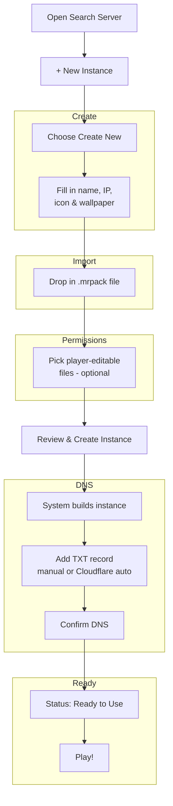

# สร้าง Instance ของคุณเอง

Neko Launcher ให้คุณเปลี่ยน Minecraft modpack ใดก็ได้ให้กลายเป็น **instance** ที่แชร์ได้และผูกกับเซิร์ฟเวอร์ของคุณ ผู้เล่นค้นพบมันได้ผ่าน IP ดาวน์โหลดไฟล์ที่คุณส่งมอบให้ตรงเป๊ะ และถูกซิงค์ให้อัปเดตอยู่เสมอโดยอัตโนมัติ คู่มือนี้จะพาคุณผ่านตัวช่วย **Create New** ที่มีในตัวตั้งแต่ต้นจนจบ

ขั้นตอนทั้งหมดมีประมาณ 12 ขั้นตอน และแบ่งออกเป็นห้าช่วง ได้แก่ สร้าง instance, นำเข้า `.mrpack` ของคุณ, กำหนดสิทธิ์การแก้ไข, ตั้งค่าการค้นพบผ่าน DNS และเปิดใช้งานจริง

## 🗺️ ภาพรวมของขั้นตอน



## 📦 ช่วงที่ 1 — สร้าง instance

### 1. เปิดหน้าค้นหาเซิร์ฟเวอร์

คลิกปุ่ม **Search Server** ที่มุมขวาบนของ Launcher


### 2. เริ่มสร้าง instance ใหม่

ในหน้าต่างค้นหา ให้คลิกปุ่ม **`+ New Instance`** ที่มุมล่างขวา


### 3. เลือกประเภทการสร้าง

เลือก **Create New** (หากคุณมีข้อมูล instance โฮสต์ไว้ที่ไหนสักแห่งแล้ว ให้เลือก **Connect to Existing Instance** แทน)


### 4. กรอกรายละเอียดของ instance


- **Instance Name** — ชื่อที่จะแสดงให้ผู้เล่นเห็น
- **IP Address** — โดเมนที่ผู้เล่นใช้เชื่อมต่อ (เช่น `play.furi.moe`) ซึ่งเป็นที่เดียวกับที่การค้นพบผ่าน DNS ผูกอยู่ด้วย ดังนั้นให้ใช้โดเมนที่คุณควบคุมได้
- **Icon และ Wallpaper** — รูปภาพเสริม (ไม่บังคับ) เพื่อสร้างแบรนด์ให้ instance ของคุณ

> **เคล็ดลับ:** ตรวจสอบทุกอย่างให้ถี่ถ้วนอีกครั้ง แล้วคลิก **Next**

## 🎒 ช่วงที่ 2 — นำเข้า modpack ของคุณ

### 5. วางไฟล์ `.mrpack` ของคุณ

ลากและวางไฟล์ `.mrpack` ที่คุณต้องการส่งมอบลงในช่องวางไฟล์

> คุณสามารถสร้างไฟล์ `.mrpack` ได้โดยการ export modpack จาก [Modrinth App](https://modrinth.com/app) Neko Launcher จะอ่านแพ็กและเปลี่ยนให้เป็น manifest ของไฟล์ (แต่ละไฟล์มี URL, ขนาด และค่าแฮช **SHA-1**) ที่ผู้เล่นจะดาวน์โหลดและตรวจสอบความถูกต้อง


## 🔓 ช่วงที่ 3 — กำหนดสิทธิ์การแก้ไข

### 6. เลือกไฟล์ที่ผู้เล่นแก้ไขได้ (ไม่บังคับ)

ทำเครื่องหมายว่าผู้เล่นได้รับอนุญาตให้เปลี่ยนแปลงไฟล์ใดได้เองในเครื่อง — เช่น resource pack, การตั้งค่าปุ่มลัด หรือ options ส่วนไฟล์อื่นทั้งหมดจะยังคงถูกจัดการและถูกกู้คืนให้ตรงกับ manifest ของคุณในการซิงค์ครั้งถัดไป ข้ามขั้นตอนนี้ได้หากคุณไม่ต้องการใช้


> เบื้องหลังนั้น สิ่งเหล่านี้จะกลายเป็น path ที่ `ignored` ของ instance เพื่อไม่ให้ไฟล์ที่ถูกจัดการถูกเขียนทับโดยไคลเอนต์แบบเงียบ ๆ

## 🚀 ช่วงที่ 4 — สร้างและตั้งค่า DNS

### 7. ตรวจสอบและสร้าง

คลิก **Next** ตรวจสอบสรุปข้อมูล จากนั้นคลิก **Create Instance**


### 8. รอการประมวลผล

Launcher จะสร้าง instance และอัปโหลด config กับ manifest ของมัน โปรดรอสักครู่


### 9. เพิ่ม DNS TXT record

Neko Launcher ค้นพบ instance ผ่าน **TXT record** บนโดเมนของคุณ เมื่อการสร้างเสร็จสิ้น ตัวช่วยจะแสดง record ที่คุณต้องเพิ่ม

คุณมีสองทางเลือก:

- **Manual** — คัดลอก record แล้วเพิ่มที่ผู้ให้บริการ DNS ของคุณ
- **Auto Configure (Cloudflare)** — หากโดเมนของคุณอยู่บน Cloudflare ให้คลิก **Auto Configure** แล้ว Launcher จะเขียน record ให้คุณเอง


Launcher จะค้นหา `_nekolauncher.<your-domain>` (และถอยไปใช้ `_alicemagiclauncher.<your-domain>` เป็นตัวสำรอง) record แบบ **v2** สมัยใหม่คือคู่ `key=value` ที่คั่นด้วย `;` โดยสองตัวที่สำคัญที่สุดคือ `instanceUrl` และ `manifestUrl`:

```text
_nekolauncher.play.furi.moe.  IN  TXT  "v=2;instanceUrl=https://cdn.example.com/play/instance.json;manifestUrl=https://cdn.example.com/play/manifest.json"
```

> `settings=` และ `manifest=` ถูกรองรับให้ใช้เป็นชื่อแทนของ `instanceUrl=` และ `manifestUrl=` ได้ แต่แนะนำให้ใช้ชื่อมาตรฐานข้างต้น ดู [DNS Discovery](../neko-launcher/dns-discovery.md) สำหรับทุกคีย์ที่รองรับและรูปแบบ pipe แบบเดิม

> **หมายเหตุ:** การเปลี่ยนแปลง DNS อาจใช้เวลา 5–10 นาทีในการแพร่กระจาย ขึ้นอยู่กับผู้ให้บริการของคุณ

### 10. ยืนยัน record ของ Cloudflare

หากคุณใช้ **Auto Configure** ตัวช่วยจะขอให้คุณยืนยัน record ที่มันสร้างขึ้นก่อนดำเนินการต่อ


## ✅ ช่วงที่ 5 — เปิดใช้งานจริง

### 11. รอสถานะ "Ready to Use"

เมื่อ TXT record ถูก resolve ได้แล้ว สถานะจะเปลี่ยนเป็น **Ready to Use** หากยังอยู่ในสถานะรออยู่ ให้เวลา DNS แพร่กระจายอีกสักครู่


### 12. เริ่มเล่นได้เลย

กด **Play** บน instance ที่คุณเพิ่งสร้างขึ้น แล้วลุยได้เลย!


---

เท่านี้ก็เสร็จแล้ว — ขอให้สนุกกับ instance ที่คุณปรับแต่งเอง และหากเจอปัญหาใด ๆ ติดต่อเราได้ที่ [Discord](https://alice-discord.furi.moe) ขอบคุณที่ใช้ Neko Launcher!

## ดูเพิ่มเติม

- [Join with an IP Address](./join-with-ip-address.md) — วิธีที่ผู้เล่นเชื่อมต่อกับ instance ของคุณ
- [DNS Discovery](../neko-launcher/dns-discovery.md) — เอกสารอ้างอิง TXT record ฉบับเต็ม (คีย์, ชื่อแทน, รูปแบบเดิม)
- [Instance Configuration](../neko-launcher/instance-configuration.md) — สคีมาของ `instance.json`
- [Instance Manifest](../neko-launcher/instance-manifest.md) — file manifest และการแฮชแบบ SHA-1
- [HTTP Headers](../neko-launcher/http-headers.md) — เฮดเดอร์ `X-UUID` / `online` สำหรับควบคุมการเข้าถึง
- [Announcements](../neko-launcher/announcement-instance.md) — ส่งประกาศถึงผู้เล่นใน instance ของคุณ
