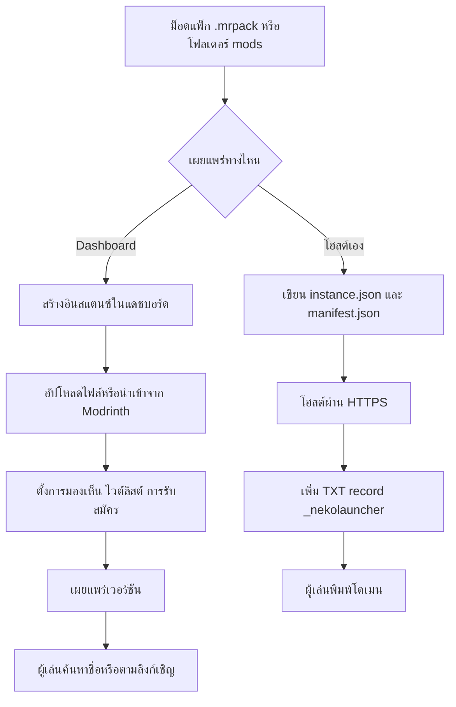

# สร้างอินสแตนซ์ของคุณเอง

**อินสแตนซ์** คือม็อดแพ็กของเซิร์ฟเวอร์ในสายตาของตัวเปิด: คำอธิบายบวกรายการไฟล์ เผยแพร่ได้สองทาง

| ทาง | เหมาะกับ | ต้องมี |
|---|---|---|
| **Neko Dashboard** (แนะนำ) | ทุกคนที่รันเซิร์ฟเวอร์ให้ผู้เล่นคนอื่น | บัญชีฟรีที่ [neko-launcher.com/dashboard](https://neko-launcher.com/dashboard) |
| **โฮสต์เองด้วย DNS** | เจ้าของที่โฮสต์ไฟล์อยู่แล้วและมีโดเมนของตัวเอง | ที่เก็บไฟล์ HTTPS อะไรก็ได้ และ DNS TXT record |

ทั้งสองทางให้ผลเหมือนกันสำหรับผู้เล่น: ค้นหาเซิร์ฟเวอร์ กดเริ่มเกม และได้อัปเดตเสมอ


```mermaid
flowchart TD
    A[ม็อดแพ็ก .mrpack หรือโฟลเดอร์ mods] --> B{เผยแพร่ทางไหน}
    B -- Dashboard --> C[สร้างอินสแตนซ์ในแดชบอร์ด]
    C --> D[อัปโหลดไฟล์หรือนำเข้าจาก Modrinth]
    D --> E[ตั้งการมองเห็น ไวต์ลิสต์ การรับสมัคร]
    E --> F[เผยแพร่เวอร์ชัน]
    B -- โฮสต์เอง --> G[เขียน instance.json และ manifest.json]
    G --> H[โฮสต์ผ่าน HTTPS]
    H --> I[เพิ่ม TXT record _nekolauncher]
    F --> J[ผู้เล่นค้นหาชื่อหรือตามลิงก์เชิญ]
    I --> K[ผู้เล่นพิมพ์โดเมน]
```

---

## ทาง A — Neko Dashboard

### 1. เข้าสู่ระบบและเลือกเวิร์กสเปซ

ไปที่ [neko-launcher.com/dashboard](https://neko-launcher.com/dashboard) แล้วเข้าสู่ระบบด้วย Microsoft ระบบสร้าง **เวิร์กสเปซ** ส่วนตัวบนแพ็กเกจ FREE ให้ แพ็กเกจกำหนดจำนวนอินสแตนซ์ พื้นที่เก็บ และจำนวนผู้เล่นในไวต์ลิสต์ ดู [เวิร์กสเปซและแพ็กเกจ](../dashboard/README.md)

### 2. สร้างอินสแตนซ์

**Instances → New instance** ใส่ชื่อที่แสดง คำอธิบายสั้นๆ เวอร์ชัน Minecraft และม็อดโหลดเดอร์ (Fabric, Forge, Quilt หรือ NeoForge พร้อม build) อินสแตนซ์เริ่มเป็น **PRIVATE** มีแค่คุณเห็นจนกว่าจะเปลี่ยน

### 3. เพิ่มไฟล์

เปิดแท็บ **Files** ทำได้:

- ลาก `.mrpack` มาวาง — ม็อดในแพ็กจะถูกลิงก์จาก Modrinth ส่วน overrides ถูกอัปโหลด
- อัปโหลดโฟลเดอร์และไฟล์ (mods, config, รีซอร์สแพ็ก, เชดเดอร์) ด้วยตัวจัดการไฟล์
- ค้นหา Modrinth แล้วติดตั้งม็อดตรงๆ

ไฟล์ที่อัปโหลดผ่านแดชบอร์ดเก็บแบบส่วนตัว ม็อดจาก Modrinth ผู้เล่นดาวน์โหลดจาก CDN ของ Modrinth ดู [ไฟล์และเวอร์ชัน](../dashboard/files-and-versions.md)

### 4. กำหนดว่าผู้เล่นแก้อะไรได้

ใน **Settings** รายการ **ignored** คือพาธที่ตัวเปิดเขียนครั้งเดียวและไม่เขียนทับอีก: `options.txt`, `resourcepacks`, `shaderpacks`, `screenshots`, config ปุ่มลัดและ HUD มี preset สำหรับม็อดยอดนิยม ที่เหลือจะตรงกับเวอร์ชันที่เผยแพร่เป๊ะเมื่อเปิด **read-only**

### 5. เผยแพร่เวอร์ชัน

ทุกการเปลี่ยนแปลงเป็นฉบับร่างจนกว่าจะ **เผยแพร่เวอร์ชัน** (เช่น `1.0.0`) พร้อม changelog ผู้เล่นซิงก์ตามเวอร์ชันที่ active ย้อนกลับไปเวอร์ชันก่อนได้ทุกเมื่อ

### 6. เลือกว่าใครเข้าได้

ใน **Settings** เช่นกัน:

- **Visibility** — `PRIVATE` (ไวต์ลิสต์เท่านั้น), `UNLISTED` (ใครรู้ชื่อก็เข้าได้), `PUBLIC` (ขึ้น Discover เมื่อผ่านอนุมัติ)
- **Enforce whitelist** — ให้เซิร์ฟเวอร์ PUBLIC หรือ UNLISTED ยังมองเห็นได้แต่ล็อกไฟล์ไว้กับไวต์ลิสต์
- **Whitelist** — เพิ่มผู้เล่นด้วย UUID หรือชื่อ หรือให้ **สมัคร** ผ่านแบบฟอร์ม ดู [ไวต์ลิสต์และใบสมัคร](../dashboard/whitelist-and-applications.md)
- **Entry fee** — เก็บค่าเข้าหลังอนุมัติ ดู [ค่าเข้าเซิร์ฟเวอร์](../dashboard/entry-fee.md)
- **Online mode** — ปฏิเสธบัญชีออฟไลน์
- **Hide mods** — เก็บม็อดของแพ็กไว้นอกโฟลเดอร์ `mods` บนเครื่องผู้เล่น ดู [อินสแตนซ์](../dashboard/instances.md)

### 7. ส่งให้ผู้เล่น

- **ลิงก์เชิญ** — แท็บ **Invites** → สร้างลิงก์ `https://neko-launcher.com/j/<code>` ตั้งวันหมดอายุ จำกัดจำนวนครั้ง หรือเพิกถอนได้
- **ชื่อ** — ผู้เล่นพิมพ์ชื่ออินสแตนซ์ในช่องค้นหาของตัวเปิด
- **Discover** — ขอขึ้นรายชื่อ ดู [Discovery](../dashboard/discovery.md)

---

## ทาง B — โฮสต์เองด้วย DNS

โฮสต์ไฟล์สองไฟล์และเพิ่ม DNS record หนึ่งรายการ ตัวเปิดดึงไฟล์จากเซิร์ฟเวอร์ของคุณโดยตรง ไม่ผ่าน Neko API

### 1. เขียน `instance.json`

การตั้งค่าอินสแตนซ์ตาม [schema v2](../neko-launcher/instance-configuration.md):

```json
{
  "$schema": "https://cdn.neko-launcher.com/schema/neko-launcher.json",
  "name": "my-server",
  "displayName": "My Server",
  "description": "Fabric survival กับเพื่อน",
  "icon": "https://cdn.example.com/icon.png",
  "onlineMode": true,
  "minecraft": {
    "version": "1.21.8",
    "loader": { "type": "fabric", "build": "0.17.3", "enable": true }
  },
  "metadata": { "wallpaper": "https://cdn.example.com/wallpaper.webp" },
  "ignored": ["options.txt", "resourcepacks", "screenshots", "logs"],
  "readonly": true,
  "gameArgs": ["--quickPlayMultiplayer=play.example.com"],
  "socials": [{ "type": "discord", "url": "https://discord.gg/example" }]
}
```

### 2. เขียน `manifest.json`

หนึ่งรายการต่อไฟล์ พร้อม SHA-1 ตาม [manifest schema v2](../neko-launcher/instance-manifest.md):

```json
[
  { "path": "mods/fabric-api.jar", "url": "https://cdn.example.com/mods/fabric-api.jar", "size": 2154321, "hash": "3f786850e387550fdab836ed7e6dc881de23001b" },
  { "path": "config/server.toml", "url": "https://cdn.example.com/config/server.toml", "size": 812, "hash": "89e6c98d92887913cadf06b2adb97f26cde4849b" }
]
```

สร้าง hash ด้วย `sha1sum` (Linux/macOS) หรือ `Get-FileHash -Algorithm SHA1` (PowerShell)

### 3. โฮสต์ทั้งสองไฟล์ผ่าน HTTPS

ใช้ static host อะไรก็ได้: เว็บเซิร์ฟเวอร์ของคุณ object storage หรือ CDN ทั้งสอง URL ต้องเข้าถึงได้โดยไม่ต้องใช้คุกกี้ ทดสอบ:

```bash
curl -sI https://cdn.example.com/instance.json | head -1
curl -s https://cdn.example.com/manifest.json | head -c 200
```

### 4. เพิ่ม DNS TXT record

ที่ `_nekolauncher.<โดเมนของคุณ>`:

```
v=2;ip=play.example.com;settings=https://cdn.example.com/instance.json;manifest=https://cdn.example.com/manifest.json
```

รายการ key ทั้งหมดและหมายเหตุตามผู้ให้บริการ: [DNS discovery](../neko-launcher/dns-discovery.md)

### 5. ทดสอบในตัวเปิด

ค้นหา `play.example.com` การ์ดสีเขียวหมายความว่าดึงทั้งสองไฟล์ได้และติดตั้งได้

### ตัวช่วยสร้างในตัวเปิด

ตัวเปิดมี **Create New** wizard (ค้นหา → **+ New instance** → **Create New**) ที่สร้าง `instance.json` และ `manifest.json` จาก `.mrpack` อัปโหลดให้ และเพิ่ม TXT record ผ่าน Cloudflare ให้ได้ ขั้นตอนเหมือนด้านบนแต่ไฟล์ถูกสร้างให้:


---

## การควบคุมสิทธิ์ในแต่ละทาง

| | Dashboard | โฮสต์เอง |
|---|---|---|
| ใครติดตั้งได้ | Visibility + ไวต์ลิสต์ + สมาชิกเวิร์กสเปซ บังคับโดย API | เซิร์ฟเวอร์ของคุณตัดสิน จาก header `X-UUID`, `X-Username`, `online` ที่ตัวเปิดส่ง |
| ใบสมัคร ลิงก์เชิญ ค่าเข้า | มีในตัว | ไม่มี |
| โฮสต์ไฟล์ | Neko storage หรือ Modrinth | ของคุณ |
| อัปเดต | เผยแพร่เวอร์ชัน | แก้ไฟล์ ผู้เล่นซิงก์ตอนเปิดเกมครั้งถัดไป |

## ดูเพิ่มเติม

- [คู่มือแดชบอร์ด](../dashboard/README.md)
- [การตั้งค่าอินสแตนซ์](../neko-launcher/instance-configuration.md)
- [HTTP header](../neko-launcher/http-headers.md)
