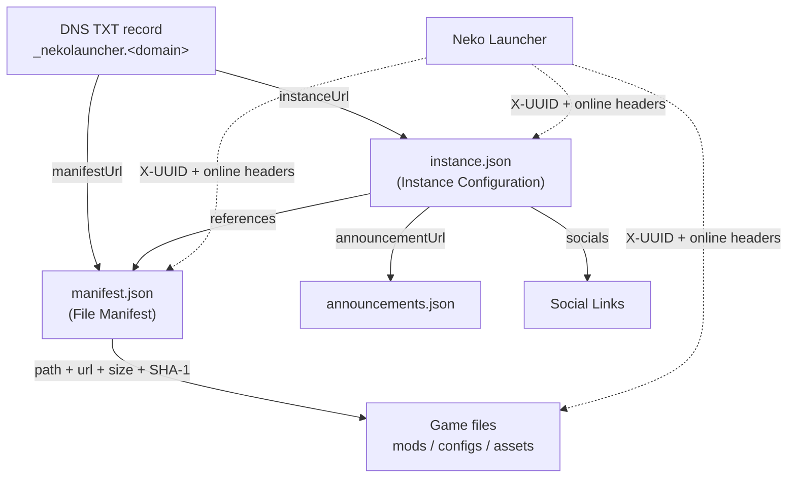

# เอกสาร Neko Launcher

ยินดีต้อนรับสู่เอกสาร **Neko Launcher** ส่วนนี้ครอบคลุมโครงสร้าง JSON, การค้นหาผ่าน DNS และการตรวจสอบผ่าน HTTP ที่คุณจำเป็นต้องใช้ในการเผยแพร่ แจกจ่าย และควบคุมการเข้าถึง Minecraft instance ของคุณเองด้วย Neko Launcher

Neko Launcher เป็นเดสก์ท็อปลันเชอร์ที่สร้างบน Tauri ซึ่งรองรับ **Fabric, Forge, Quilt และ NeoForge** ผู้ดูแลเซิร์ฟเวอร์อธิบาย instance ด้วยเอกสาร JSON สองไฟล์ ได้แก่ **instance config** และ **file manifest** จากนั้นผู้เล่นสามารถเพิ่ม instance ได้ทั้งผ่าน URL หรือค้นหาโดยอัตโนมัติผ่าน DNS TXT record

---

## 🧭 ชิ้นส่วนต่าง ๆ ประกอบกันอย่างไร

จุดศูนย์กลางคือ `instance.json` ซึ่งอธิบาย instance และชี้ไปยัง `manifest.json` โดย manifest จะแสดงรายการไฟล์ที่ดาวน์โหลดได้ทุกไฟล์พร้อมค่าแฮช SHA-1 เพื่อความถูกต้องของข้อมูล ส่วนการค้นหาผ่าน DNS เป็นทางเข้าเสริม (ไม่บังคับ) โดย TXT record จะบอกลันเชอร์ว่าจะดึง instance config (และ manifest) มาจากที่ใด



---

## 📚 แผนผังเอกสาร

### สคีมาหลักและการตั้งค่า

* **[การตั้งค่า Instance](instance-configuration.md)** — สคีมาของ `instance.json`: ชื่อ, เวอร์ชัน Minecraft, loader, เมทาดาทา, แท็ก, อาร์กิวเมนต์เกม และอื่น ๆ
* **[Instance Manifest](instance-manifest.md)** — สคีมาของ `manifest.json`: รายการไฟล์และการตรวจสอบความถูกต้องด้วย SHA-1
* **[ลิงก์โซเชียล](social-links.md)** — ตั้งค่าลิงก์ชุมชน, การพัฒนา และร้านค้าผ่านฟิลด์ `socials`

### การเชื่อมต่อและการค้นหา

* **[ค้นหาอัตโนมัติผ่าน DNS](dns-discovery.md)** — การค้นหาอัตโนมัติโดยใช้ DNS TXT record เพื่อให้ผู้เล่นใช้เพียงแค่โดเมน
* **[การตรวจสอบ HTTP Header](http-headers.md)** — ลันเชอร์ระบุตัวตนผู้เล่นผ่าน header `X-UUID` และ `online` อย่างไร เพื่อให้คุณควบคุมการเข้าถึงได้

---

## 🚀 เริ่มต้นอย่างรวดเร็ว

1. สร้างไฟล์ `instance.json` โดยใช้ [สคีมาการตั้งค่า Instance](instance-configuration.md)
2. สร้างไฟล์ `manifest.json` ที่แสดงรายการไฟล์ของคุณพร้อมค่าแฮช SHA-1 — ดูที่ [สคีมา Manifest](instance-manifest.md)
3. โฮสต์ไฟล์ทั้งสองไว้ในที่ที่ลันเชอร์เข้าถึงได้ผ่าน HTTPS
4. *(ไม่บังคับ)* เพิ่ม [ลิงก์โซเชียล](social-links.md) สำหรับฟีเจอร์ชุมชน
5. *(ไม่บังคับ)* ตั้งค่า [การค้นหาผ่าน DNS](dns-discovery.md) เพื่อให้ผู้เล่นเพิ่ม instance ของคุณได้ด้วยแค่โดเมน

---

## 🔖 การอ้างอิงสคีมา

UI สำหรับสร้าง/แก้ไข instance ของลันเชอร์อ้างอิง URL ของ `$schema` มาตรฐานนี้ ตั้งค่าไว้ที่ด้านบนของ `instance.json` ของคุณเพื่อให้ได้การตรวจสอบความถูกต้องและการเติมข้อความอัตโนมัติในเอดิเตอร์:

```json
{
  "$schema": "https://cdn.neko-launcher.com/schema/neko-launcher.json",
  "name": "my-instance",
  "displayName": "My Instance",
  "description": "A short description of the pack.",
  "onlineMode": true,
  "minecraft": {
    "version": "1.21.8",
    "loader": {
      "type": "fabric",
      "build": "0.16.10",
      "enable": true
    }
  }
}
```

> มีสคีมาที่เป็นชื่ออื่น (alias) ให้บริการที่ `https://cdn.neko-launcher.com/schema/alice-magic-launcher.json` ด้วยเช่นกัน ทั้งสองใช้งานได้ แต่ `neko-launcher.json` คือค่าที่แนะนำให้ใช้

---

## 📄 ภาพรวมของ Manifest

`manifest.json` เป็น JSON **อาร์เรย์** ของรายการไฟล์ ทุกรายการต้องมีครบทั้งสี่ฟิลด์ และ `hash` คือค่าไดเจสต์แบบ **SHA-1** ของไฟล์ พาธจะอ้างอิงแบบสัมพัทธ์กับไดเรกทอรีของ instance

```json
[
  {
    "path": "mods/sodium.jar",
    "url": "https://example.com/files/sodium.jar",
    "size": 1234567,
    "hash": "aabbccddeeff00112233445566778899aabbccdd"
  }
]
```

ดู [Instance Manifest](instance-manifest.md) สำหรับสคีมาฉบับเต็มและรายละเอียดการแฮช

---

## 🌐 ภาพรวมของการค้นหาผ่าน DNS

ลันเชอร์จะค้นหา TXT record บนโดเมนที่ผู้เล่นป้อนเข้ามา — โดยจะดู `_nekolauncher.<domain>` ก่อน แล้วจึงใช้ `_alicemagiclauncher.<domain>` เป็นตัวสำรอง รูปแบบ **v2** ที่แนะนำคือรายการของคู่ `key=value` ที่คั่นด้วย `;`:

```text
v=2;instanceUrl=https://example.com/instance.json;manifestUrl=https://example.com/manifest.json
```

คีย์ URL มาตรฐานคือ **`instanceUrl`** และ **`manifestUrl`** ส่วนคีย์ **`settings`** และ **`manifest`** จะถูกยอมรับเป็นชื่อพ้อง (`settings` → `instanceUrl`, `manifest` → `manifestUrl`) การจับคู่คีย์ไม่คำนึงถึงตัวพิมพ์เล็ก-ใหญ่ ดู [ค้นหาอัตโนมัติผ่าน DNS](dns-discovery.md) สำหรับคีย์ที่รองรับทั้งหมด รูปแบบ pipe แบบเดิม และตัวอย่างการใช้งานจริง

---

## 🔐 ภาพรวมของการยืนยันตัวตนผู้เล่น

ในทุกคำขอ instance config, manifest และไฟล์ ลันเชอร์จะส่ง header สองตัวเพื่อให้ผู้ดูแลควบคุมการเข้าถึงได้:

| Header    | ค่า                                                                    |
| --------- | --------------------------------------------------------------------- |
| `X-UUID`  | UUID ของ Minecraft ของผู้เล่น (มีขีดคั่น) ส่งเสมอ                       |
| `online`  | `"true"` สำหรับบัญชี Xbox/Microsoft จริง, `"false"` สำหรับแบบออฟไลน์   |

ดู [การตรวจสอบ HTTP Header](http-headers.md) สำหรับวิธีตรวจสอบค่าเหล่านี้ที่ฝั่งเซิร์ฟเวอร์

---

## 📢 ประกาศของ Instance

ตั้งค่าฟิลด์ `announcementUrl` ใน `instance.json` ของคุณให้ชี้ไปยังไฟล์ JSON เพื่อแสดงประกาศบนหน้า instance ของคุณ ไฟล์นี้ประกอบด้วย **อาร์เรย์** ของออบเจกต์ประกาศ:

```json
{
  "name": "my-instance",
  "announcementUrl": "https://example.com/announcements.json"
}
```

แต่ละรายการประกาศมีหน้าตาแบบนี้:

```json
[
  {
    "title": "Maintenance Notice",
    "category": "NOTICE",
    "metadata": {
      "imageUrl": "https://example.com/image.png",
      "th_imageUrl": "https://example.com/image-th.png"
    },
    "link": "https://example.com/details",
    "active": true,
    "date": "2026-01-20T12:00:00Z"
  }
]
```

`category` ต้องเป็นค่าใดค่าหนึ่งใน `NOTICE`, `NEWS` หรือ `EVENT` ส่วน `active` ใช้เปิด/ปิดการแสดงผล และ `date` เป็นค่าเวลาแบบ ISO 8601 บล็อก `metadata` รองรับรูปภาพแบบแยกตามภาษา (เช่น `th_imageUrl` สำหรับภาษาไทย)

---

## 🔗 การสนับสนุนและแหล่งข้อมูล

* **GitHub:** [github.com/alice-magic](https://github.com/alice-magic)
* **ดาวน์โหลด:** [neko-launcher.com](https://neko-launcher.com)
* **Discord:** [alice-discord.furi.moe](https://alice-discord.furi.moe)
* **เว็บไซต์หลัก:** [furi.moe](https://furi.moe)

---

## ดูเพิ่มเติม

* [การตั้งค่า Instance](instance-configuration.md) — สคีมาของ `instance.json`
* [Instance Manifest](instance-manifest.md) — รายการไฟล์และการตรวจสอบด้วย SHA-1
* [ลิงก์โซเชียล](social-links.md) — ลิงก์ชุมชน, การพัฒนา และร้านค้า
* [ค้นหาอัตโนมัติผ่าน DNS](dns-discovery.md) — การค้นหาอัตโนมัติผ่าน TXT record
* [การตรวจสอบ HTTP Header](http-headers.md) — การควบคุมการเข้าถึงผู้เล่นด้วย `X-UUID` และ `online`
