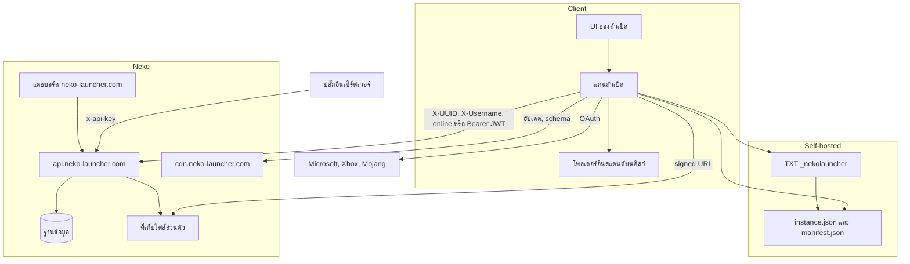

# เอกสารอ้างอิงทางเทคนิค

สำหรับนักพัฒนาที่โฮสต์อินสแตนซ์เอง เชื่อมเซิร์ฟเวอร์ Minecraft กับไวต์ลิสต์ หรืออยากรู้ว่าตัวเปิดดึงและส่งอะไรบ้าง

---

## สถาปัตยกรรม

```mermaid
graph TD
    subgraph Client
        R[UI ของตัวเปิด] --> C[แกนตัวเปิด]
        C --> F[โฟลเดอร์อินสแตนซ์บนดิสก์]
    end
    subgraph Neko
        API[api.neko-launcher.com] --> DB[(ฐานข้อมูล)]
        API --> R2[ที่เก็บไฟล์ส่วนตัว]
        WEB[แดชบอร์ด neko-launcher.com] --> API
        CDN[cdn.neko-launcher.com]
    end
    subgraph Self-hosted
        DNS[TXT _nekolauncher] --> JSON[instance.json และ manifest.json]
    end
    C -->|X-UUID, X-Username, online หรือ Bearer JWT| API
    C -->|signed URL| R2
    C --> DNS
    C --> JSON
    C -->|อัปเดต, schema| CDN
    C -->|OAuth| MS[Microsoft, Xbox, Mojang]
    P[ปลั๊กอินเซิร์ฟเวอร์] -->|x-api-key| API
```

- **ตัวเปิด** เป็นแอปเดสก์ท็อป Tauri 2 (แกน Rust, UI เว็บ) คุยกับ Neko API ผ่าน HTTPS แก้ DNS TXT record เอง และดาวน์โหลดไฟล์จากที่ manifest ชี้
- **Neko API** ให้บริการอินสแตนซ์ ไฟล์ ไวต์ลิสต์ ใบสมัคร ลิงก์เชิญ และค่าเข้า route สาธารณะอยู่ใต้ `https://api.neko-launcher.com/api/v1/…` เอกสารแบบโต้ตอบที่ `https://api.neko-launcher.com/docs`
- **CDN** โฮสต์อัปเดตของตัวเปิด JSON schema และรูปภาพ

## เอกสารสองชิ้นที่อธิบายอินสแตนซ์

| เอกสาร | Schema | API ให้บริการที่ |
|---|---|---|
| การตั้งค่าอินสแตนซ์ | [`schema/neko-launcher.json` v2](instance-configuration.md) | `GET /api/v1/instances/<name>` |
| Manifest ของอินสแตนซ์ | [`schema/nekolauncher-manifest.json` v2](instance-manifest.md) | `GET /api/v1/instances/<name>/install` |

ทั้งสองโฮสต์เองและค้นพบผ่าน [DNS](dns-discovery.md) ได้ ตัวเปิดรับได้ทั้งเอกสารเปล่าและแบบห่อด้วย envelope ของ API `{ "code": 200, "message": "OK", "data": … }`

## หน้าต่างๆ

- [การตั้งค่าอินสแตนซ์](instance-configuration.md)
- [Manifest ของอินสแตนซ์](instance-manifest.md)
- [DNS discovery](dns-discovery.md)
- [HTTP header และการยืนยันตัวตน](http-headers.md)
- [ฟีดประกาศ](announcement-instance.md)
- [ลิงก์โซเชียล](social-links.md)
- [Server API](server-api.md)
- [Deep link](deep-links.md)
- [MCP server](mcp-server.md)

## Route สาธารณะที่ตัวเปิดใช้

| Route | หน้าที่ |
|---|---|
| `GET /instances` | อินสแตนซ์ทางการสำหรับหน้าแรก |
| `GET /instances/discover?search=` | รายการ Discover และค้นหาชื่อ พร้อม `access` คำนวณต่อผู้เล่น |
| `GET /instances/<name>` | การตั้งค่าอินสแตนซ์ อินสแตนซ์ที่ถูกล็อกตอบ **403 พร้อม branding เท่านั้น** (ชื่อ ไอคอน คำอธิบาย ข้อความ no-access) เพื่อให้ตัวเปิดยังแสดงหน้าได้ |
| `GET /instances/<name>/install` | Manifest เป็น JSON array เปล่า ตอบ array ว่างเมื่อผู้เล่นไม่มีสิทธิ์ |
| `GET /instances/<name>/versions` | เวอร์ชันที่เผยแพร่และ changelog |
| `GET /instances/<name>/announcements` | ฟีดประกาศ JSON array เปล่า |
| `GET /instances/<name>/application-form` | แบบฟอร์มสมัคร และเมื่อมี Neko JWT สถานะของผู้ดู |
| `POST /auth/minecraft` | แลก Microsoft access token เป็น Neko JWT (ใบสมัคร สลิป) |
| `GET /invites/<code>` | แก้ลิงก์เชิญเป็นอินสแตนซ์ |

ทั้งหมดอ่านด้วย header ระบุตัวตนตามที่อธิบายใน [HTTP header](http-headers.md)
