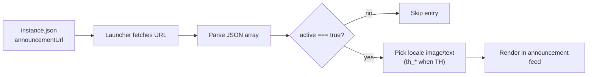

# การประกาศข่าวสารในแต่ละ Instance

Neko Launcher สามารถแสดงฟีดประกาศแยกตามแต่ละ instance ได้ ทั้งข่าวสาร กิจกรรม และประกาศสำคัญ โดยแสดงอยู่ภายใน launcher โดยตรง คุณเพียงตั้งค่า field `announcementUrl` ในไฟล์ configuration ของ instance ให้ชี้ไปยังไฟล์ JSON ที่คุณโฮสต์ไว้เอง launcher จะดึงข้อมูลนั้นมา จัดเรียงรายการ แล้วแสดงเฉพาะรายการที่ยังใช้งานอยู่ พร้อมรูปภาพและข้อความที่แปลตามภาษาได้

นี่เป็นวิธีที่เป็นมิตรที่สุดในการบอกผู้เล่นว่า "คืนนี้จะปิดปรับปรุงเซิร์ฟเวอร์" หรือ "อีเวนต์ใหม่เริ่มแล้ว" โดยที่ผู้เล่นไม่ต้องออกจาก launcher เลย

---

## 📌 หลักการทำงาน

`announcementUrl` อยู่ในไฟล์ `instance.json` ของ instance และชี้ไปยังไฟล์ JSON ที่เข้าถึงได้จากภายนอก (เป็น **array** ของ object ประกาศ) ทุกครั้งที่ instance โหลดขึ้นมา launcher จะร้องขอ URL นั้น กรองเฉพาะรายการที่มี `active: true` แล้วนำมาแสดงผล



คำขอไปยัง `announcementUrl` จะแนบ header ระบุตัวตนชุดเดียวกับคำขออื่น ๆ ของ instance นั่นคือ `X-UUID` (Minecraft UUID ของผู้เล่น) และ `online` (`"true"` สำหรับบัญชี Xbox/Microsoft จริง และ `"false"` ในกรณีอื่น) ดังนั้นคุณจึงสามารถจำกัดสิทธิ์หรือปรับแต่งฟีดเฉพาะบุคคลได้จากฝั่งเซิร์ฟเวอร์หากต้องการ ดูรายละเอียดเพิ่มเติมที่ [HTTP Headers](http-headers.md)

---

## ⚙️ การตั้งค่า

เพิ่ม `announcementUrl` ลงในไฟล์ configuration ของ instance:

```json
{
  "name": "my-instance",
  "displayName": "My Instance",
  "description": "A cozy modded server",
  "onlineMode": true,
  "minecraft": {
    "version": "1.21.8",
    "loader": { "type": "fabric", "build": "latest", "enable": true }
  },
  "announcementUrl": "https://example.com/announcements.json"
}
```

URL ต้องให้บริการข้อมูลเป็น JSON **array** ผ่าน HTTPS และเข้าถึงได้จากภายนอก สำหรับรายละเอียด field ทั้งหมดของ instance ดูที่ [Instance Configuration](instance-configuration.md)

---

## 📰 รูปแบบ JSON ของประกาศ

`announcementUrl` จะส่งกลับมาเป็น array ของ object ประกาศ โดยแต่ละ object มี field ดังนี้:

| Field       | ชนิดข้อมูล | จำเป็น | คำอธิบาย                                             |
|-------------|---------|----------|---------------------------------------------------------|
| `title`     | string  | ใช่      | หัวข้อประกาศ                                  |
| `category`  | string  | ใช่      | หนึ่งในค่า `NOTICE`, `NEWS`, หรือ `EVENT`                    |
| `link`      | string  | ใช่      | URL ที่จะเปิดขึ้นเมื่อผู้เล่นคลิกที่ประกาศ     |
| `active`    | boolean | ใช่      | แสดงเฉพาะรายการที่ตั้งค่าเป็น `true` เท่านั้น                   |
| `date`      | string  | ใช่      | วันที่/เวลาแบบ ISO 8601 (เช่น `2026-01-17T09:30:00.000Z`)   |
| `metadata`  | object  | ใช่      | รูปภาพและ field ที่แปลตามภาษา (ดูด้านล่าง)                |

### object `metadata`

`metadata` ใช้เก็บรูปภาพและข้อมูลการแปลตามภาษา (ไม่บังคับ) โดยมี key ที่รองรับดังนี้:

| Key            | ชนิดข้อมูล | คำอธิบาย                                              |
|----------------|--------|---------------------------------------------------------|
| `imageUrl`     | string | รูปภาพแบนเนอร์ที่แสดงคู่กับประกาศ               |
| `th_imageUrl`  | string | รูปภาพเวอร์ชันภาษาไทย (ใช้เมื่อ UI เป็นภาษาไทย)  |
| `th_title`     | string | หัวข้อเวอร์ชันภาษาไทย                       |
| *(กำหนดเอง)*     | any    | key เพิ่มเติมใด ๆ ที่คุณใส่เข้ามาจะถูกเก็บไว้และข้ามไปอย่างปลอดภัย |

key แบบ `th_*` ที่แปลตามภาษาใช้รูปแบบ `{locale}_{field}` เดียวกันกับที่ใช้ในส่วนอื่น ๆ ของ metadata ของ instance กล่าวคือ เมื่อ launcher ทำงานเป็นภาษาไทย จะเลือกใช้ `th_imageUrl` / `th_title` ก่อน และหากไม่มีก็จะกลับไปใช้ค่าพื้นฐานแทน

---

## 🧪 ตัวอย่าง

ไฟล์ `announcements.json` ที่พร้อมนำไปใช้งาน:

```json
[
  {
    "title": "Scheduled Maintenance",
    "category": "NOTICE",
    "link": "https://status.example.com",
    "active": true,
    "date": "2026-02-10T10:00:00.000Z",
    "metadata": {}
  },
  {
    "title": "Winter Event Is Live",
    "category": "EVENT",
    "link": "https://example.com/events/winter",
    "active": true,
    "date": "2026-01-17T09:30:00.000Z",
    "metadata": {
      "th_title": "อีเวนต์ฤดูหนาวเริ่มแล้ว",
      "imageUrl": "https://cdn.example.com/announcements/winter-en.webp",
      "th_imageUrl": "https://cdn.example.com/announcements/winter-th.webp"
    }
  },
  {
    "title": "Server 2.0 Release Notes",
    "category": "NEWS",
    "link": "https://example.com/blog/2-0",
    "active": false,
    "date": "2025-12-25T15:00:00.000Z",
    "metadata": {
      "imageUrl": "https://cdn.example.com/announcements/release.webp"
    }
  }
]
```

รายการที่สามมีค่า `active: false` จึงถูกซ่อนไว้จนกว่าคุณจะเปิดใช้งาน ซึ่งสะดวกสำหรับการเตรียมประกาศไว้ล่วงหน้า

---

## 🧾 การอ้างอิงชนิดข้อมูล

หากคุณสร้างฟีดด้วยโปรแกรม TypeScript type เหล่านี้อธิบายโครงสร้างข้อมูลไว้ โปรดสังเกตว่า `date` เป็น JSON **string** (ISO 8601) ตอนส่งข้อมูล แม้ว่าแอปของคุณอาจแปลงเป็น `Date` ก็ตาม:

```typescript
export interface AnnouncementMetadata {
  imageUrl?: string;
  th_imageUrl?: string;
  th_title?: string;
  [key: string]: unknown;
}

export interface Announcement {
  title: string;
  category: 'NOTICE' | 'NEWS' | 'EVENT';
  link: string;
  active: boolean;
  date: string; // ISO 8601
  metadata: AnnouncementMetadata;
}
```

---

## ✅ แนวทางที่ควรปฏิบัติ

- ให้บริการฟีดผ่าน **HTTPS** จาก CDN หรือเว็บโฮสต์ที่เชื่อถือได้
- ส่งข้อมูลเป็น JSON **array** ที่ถูกต้องเสมอ แม้จะมีเพียงรายการเดียวก็ตาม
- ใช้ timestamp แบบ ISO 8601 เต็มรูปแบบสำหรับ `date` เพื่อให้การจัดเรียงชัดเจนไม่กำกวม
- ใช้ `active` ในการสลับการแสดงผลแทนการลบรายการทิ้ง วิธีนี้ช่วยเก็บประวัติไว้และเปิดให้เตรียมโพสต์ล่วงหน้าได้
- ระบุ `th_imageUrl` / `th_title` เมื่อคุณต้องการให้ผู้เล่นชาวไทยเห็นเนื้อหาที่แปลแล้ว
- ปรับรูปภาพให้เหมาะกับเว็บ (WebP/AVIF) และมีขนาดพอเหมาะ เนื่องจากรูปจะโหลดภายใน UI ของ launcher

---

## 🔧 การแก้ไขปัญหา

- **ไม่มีอะไรแสดงขึ้นมาเลย** — ตรวจสอบว่า `announcementUrl` เข้าถึงได้จากภายนอกและส่งกลับเป็น JSON array (ไม่ใช่ object) และมีอย่างน้อยหนึ่งรายการที่มี `active: true`
- **ฟีดผิดรูปแบบ** — ตรวจสอบ JSON ด้วยเครื่องมือ validator เพราะเครื่องหมายคอมมาเกินเพียงตัวเดียวก็ทำให้ฟีดทั้งหมดหายไปได้
- **รูปภาพไม่แสดง** — ตรวจสอบว่าลิงก์ `imageUrl` / `th_imageUrl` โหลดได้ผ่าน HTTPS เมื่อเปิดโดยตรง
- **ภาษาแสดงผิด** — ตรวจสอบว่า key แบบ `th_*` สะกดถูกต้อง (`th_imageUrl`, `th_title`)
- **ถูกจำกัดสิทธิ์การเข้าถึงโดยไม่คาดคิด** — หากเซิร์ฟเวอร์ของคุณกรองด้วย header `X-UUID` / `online` ตรวจสอบให้แน่ใจว่า endpoint ของฟีดอนุญาตบัญชีที่คุณต้องการ

---

## ดูเพิ่มเติม

- [Instance Configuration](instance-configuration.md)
- [Instance Manifest](instance-manifest.md)
- [Social Links](social-links.md)
- [HTTP Headers](http-headers.md)
- [DNS Discovery](dns-discovery.md)
- [Documentation Index](README.md)
