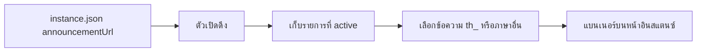

# ฟีดประกาศ

ตัวเปิดแสดงแบนเนอร์ประกาศต่ออินสแตนซ์ อินสแตนซ์บนแดชบอร์ดจัดการในแท็บ **Announcements** อินสแตนซ์ที่โฮสต์เองชี้ `metadata.announcementUrl` ไปที่ไฟล์ JSON หน้านี้อธิบายรูปแบบฟีด

---

## มาจากไหน

`metadata.announcementUrl` (สะท้อนเป็น `announcementUrl` ระดับบนสุดด้วย) ถูกดึงเมื่อเปิดหน้าอินสแตนซ์ พร้อม header ระบุตัวผู้เล่น response เป็น **JSON array เปล่า** แสดงเฉพาะรายการที่ `active: true` เรียงใหม่สุดก่อน


```mermaid
flowchart LR
  A[instance.json announcementUrl] --> B[ตัวเปิดดึง]
  B --> C[เก็บรายการที่ active]
  C --> D[เลือกข้อความ th_ หรือภาษาอื่น]
  D --> E[แบนเนอร์บนหน้าอินสแตนซ์]
```

อินสแตนซ์บนแดชบอร์ดใช้ `https://api.neko-launcher.com/api/v1/instances/<name>/announcements` ซึ่งไม่ตอบอะไรให้ผู้เล่นที่ไม่มีสิทธิ์ในอินสแตนซ์ที่ถูกล็อก

## รูปแบบ

```json
[
  {
    "title": "ปิดปรับปรุงตามกำหนด",
    "category": "NOTICE",
    "link": "https://status.example.com",
    "active": true,
    "date": "2026-10-01T10:00:00.000Z",
    "metadata": {}
  },
  {
    "title": "Winter event is live",
    "category": "EVENT",
    "link": "https://example.com/events/winter",
    "active": true,
    "date": "2026-09-20T09:30:00.000Z",
    "metadata": {
      "th_title": "อีเวนต์ฤดูหนาวเริ่มแล้ว",
      "imageUrl": "https://cdn.example.com/winter-en.webp",
      "th_imageUrl": "https://cdn.example.com/winter-th.webp"
    }
  }
]
```

| ฟิลด์ | ชนิด | บังคับ | หมายเหตุ |
|---|---|---|---|
| `title` | string | ใช่ | พาดหัว |
| `category` | `NOTICE`, `NEWS`, `EVENT` | ใช่ | สีของแบนเนอร์ |
| `link` | URL | ไม่ | เปิดเมื่อคลิก |
| `active` | boolean | ใช่ | แสดงเฉพาะ `true` |
| `date` | ISO 8601 | ใช่ | ใช้เรียงและแสดง |
| `metadata` | object | ไม่ | `imageUrl` และฉบับภาษา `th_title`, `th_imageUrl`, `jp_…`, `ru_…` key ที่ไม่รู้จักถูกข้าม |

key แยกภาษาใช้กฎ `{lang}_{field}` เหมือน metadata ของอินสแตนซ์: ตัวเปิดใช้ภาษาของผู้เล่นและใช้ฟิลด์หลักเมื่อไม่มี

## ดูเพิ่มเติม

- [ประกาศในแดชบอร์ด](../dashboard/announcements.md)
- [การตั้งค่าอินสแตนซ์](instance-configuration.md)
