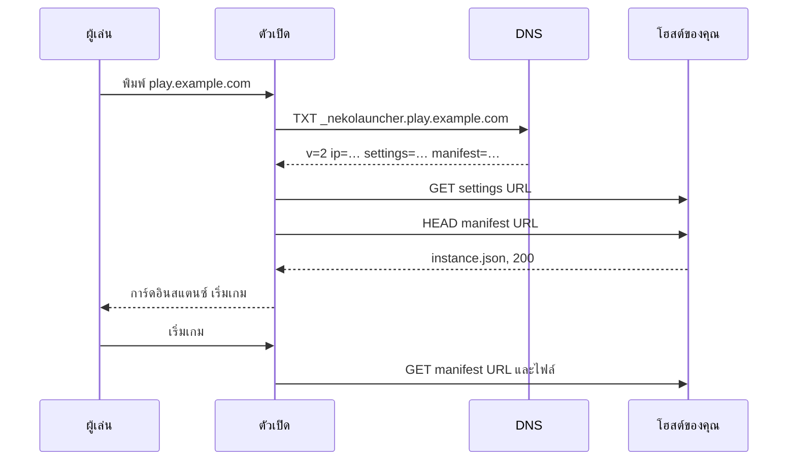

# DNS Discovery

อินสแตนซ์ที่โฮสต์เองถูกค้นพบผ่าน **DNS TXT record** ผู้เล่นพิมพ์โดเมนของคุณในตัวเปิด ตัวเปิดอ่าน record ดึงการตั้งค่าและ manifest ของคุณ แล้วติดตั้งม็อดแพ็ก เปลี่ยนไฟล์หรือ URL ได้ทุกเมื่อ ผู้เล่นทุกคนได้รับตอนเปิดเกมครั้งถัดไป

---

## การทำงาน



ตัวเปิดลอง `_nekolauncher.<domain>` ก่อน แล้ว `_alicemagiclauncher.<domain>` แบบเก่า ผลถูก cache 60 วินาทีในตัวเปิด

## TXT record (v2)

สตริงเดียวของคู่ `key=value` คั่นด้วย `;`:

```
v=2;ip=play.example.com;settings=https://cdn.example.com/instance.json;manifest=https://cdn.example.com/manifest.json
```

| Key | บังคับ | ความหมาย |
|---|---|---|
| `v` | ใช่ | `2` |
| `ip` | ใช่ | ที่อยู่ที่เกมเชื่อมต่อ (`host` หรือ `host:port`) ใช้ ping เพื่อ MOTD และจำนวนผู้เล่นด้วย |
| `settings` (นามแฝง `instanceUrl`) | ใช่ | URL ของการตั้งค่าอินสแตนซ์ [schema v2](instance-configuration.md) |
| `manifest` (นามแฝง `manifestUrl`) | ใช่ | URL ของ manifest [schema v2](instance-manifest.md) |
| `name` | ไม่ | ชื่อที่แสดง (override) |
| `iconUrl`, `backgroundUrl`, `discordUrl` | ไม่ | override การนำเสนอ |
| `minecraftVersion`, `loaderType`, `loaderBuild`, `version` | ไม่ | override ปกติเอาจากการตั้งค่า |
| `readonly`, `hideIp` | ไม่ | `true`/`false` `hideIp` ซ่อนที่อยู่ใน UI |
| `update` | ไม่ | ค่าอะไรก็ได้ที่คุณเปลี่ยนเพื่อล้าง cache (เช่น timestamp) |

Key ไม่สนตัวพิมพ์ key ที่ไม่รู้จักถูกข้าม

### รูปแบบเก่าคั่นด้วย `|`

record เก่ายังอ่านได้:

```
ip|settingsUrl|manifestUrl|iconUrl|backgroundUrl|discordUrl|version|name|loaderType|loaderBuild|readonly|hideIp|minecraftVersion
```

แนะนำ v2 ขยายและอ่านง่ายกว่า

## ตัวอย่าง

โดเมนหลัก `example.com` เกมอยู่ที่ `play.example.com`:

```
_nekolauncher.example.com   TXT   "v=2;ip=play.example.com;settings=https://cdn.example.com/instance.json;manifest=https://cdn.example.com/manifest.json"
```

ผู้เล่นพิมพ์ `example.com` ถ้าอยากให้พิมพ์ `play.example.com` ให้วาง record ที่ `_nekolauncher.play.example.com` แทน

## ไฟล์ปลายทางของ URL

ทั้งสอง URL ต้องเข้าถึงได้ผ่าน HTTPS โดยไม่ต้องใช้คุกกี้ แต่ละไฟล์เป็นได้ทั้งเอกสารเปล่าหรือ envelope ของ API `{ "code": 200, "message": "OK", "data": … }` ตัวเปิดส่ง header ระบุตัวผู้เล่นทุกครั้ง โฮสต์ของคุณจึงควบคุมสิทธิ์ได้ ดู [HTTP header](http-headers.md)

## หมายเหตุตามผู้ให้บริการ

- **TTL**: 300 วินาทีหรือน้อยกว่าระหว่างตั้งค่า
- **เครื่องหมายคำพูด**: ผู้ให้บริการส่วนใหญ่ต้องการค่าในเครื่องหมายคำพูดคู่ คุมให้ต่ำกว่า 255 ตัวอักษรหรือให้ผู้ให้บริการแบ่ง (ตัวเปิดต่อชิ้นให้)
- **Cloudflare**: type `TXT`, name `_nekolauncher.play` (สำหรับ `play.example.com`), content คือ record ด้านบน สถานะ proxy ไม่มีผลกับ TXT
- ตัวช่วยสร้างในตัวเปิดเพิ่ม record ผ่าน Cloudflare API ให้ได้เมื่อวาง API token

## ทดสอบ

```bash
# Linux / macOS
dig +short TXT _nekolauncher.play.example.com

# Windows
nslookup -type=TXT _nekolauncher.play.example.com
```

แล้วเช็คทั้งสอง URL:

```bash
curl -s https://cdn.example.com/instance.json | head -c 300
curl -sI https://cdn.example.com/manifest.json | head -1
```

## แก้ปัญหา

| อาการ | สาเหตุ |
|---|---|
| ตัวเปิดแสดงแค่ ping | ไม่พบ TXT record ที่ทั้งสอง prefix หรือ record ไม่มี `ip=` / `v=2` |
| การ์ดขึ้น เริ่มเกมล้มเหลว *Failed to resolve instance DNS records* | record ไม่มี `settings` หรือ `manifest` |
| การ์ดขึ้น ดาวน์โหลดล้มเหลว | URL ตอบสถานะไม่ใช่ 200 หรือ JSON ผิด |
| ไฟล์เก่ากลับมาเรื่อยๆ | manifest ยังระบุไฟล์นั้น อัปเดต manifest หรือเพิ่มพาธใน `ignored` |
| เปลี่ยนแล้วไม่เห็น | TTL ของ resolver และ cache 60 วินาทีของตัวเปิด เปลี่ยน `update=` เพื่อบังคับรีเฟรช |

## ดูเพิ่มเติม

- [สร้างอินสแตนซ์ของคุณเอง](../how-to/make-your-own-instance.md)
- [เข้าด้วย IP address](../how-to/join-with-ip-address.md)
