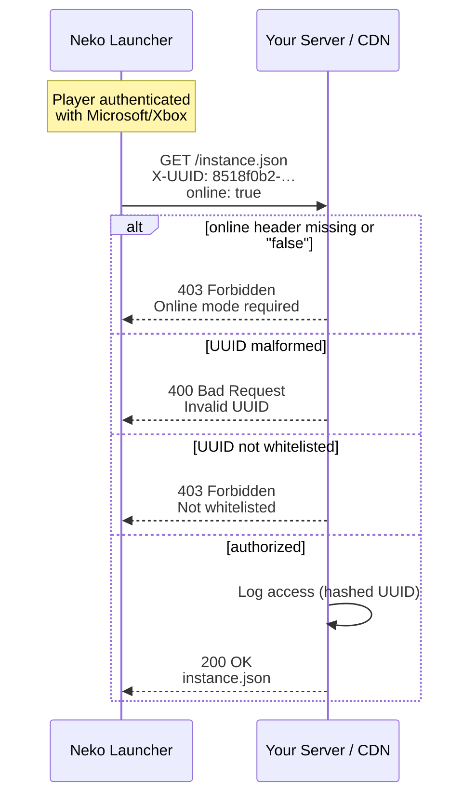

# HTTP Header Verification

Neko Launcher จะแนบ headers ที่ระบุตัวตนไปกับทุก request ที่ส่งไปยังเซิร์ฟเวอร์ instance ของคุณ ทั้ง config, manifest และการดาวน์โหลดไฟล์แต่ละไฟล์ ผู้ดูแลเซิร์ฟเวอร์สามารถอ่าน headers เหล่านี้เพื่อควบคุมการเข้าถึง ทำการวิเคราะห์ข้อมูล และป้องปรามการนำไปแจกจ่ายซ้ำโดยไม่ได้รับอนุญาต

---

## 🔎 ภาพรวม

มี headers สองตัวที่เดินทางไปกับทุก request ที่ launcher ส่งออกไป:

* **`X-UUID`** — UUID Minecraft ของผู้เล่น (แบบมีขีดกลาง)
* **`online`** — `"true"` สำหรับบัญชี Microsoft/Xbox จริง และ `"false"` สำหรับบัญชี offline/cracked

เนื่องจาก headers เหล่านี้มาพร้อมกับ request ของ config, manifest **และ** ไฟล์ต่างๆ คุณจึงสามารถบังคับใช้นโยบายได้ในทุกชั้น ไม่ว่าจะเป็น CDN edge, reverse proxy หรือโค้ดในระดับแอปพลิเคชัน การใช้งานที่พบบ่อยได้แก่:

* **การควบคุมการเข้าถึง** — จำกัดการดาวน์โหลดให้เฉพาะผู้เล่นที่อยู่ใน whitelist
* **การบังคับใช้ online mode** — ให้บริการเฉพาะบัญชีที่ผ่านการยืนยันตัวตนแล้ว
* **การวิเคราะห์ข้อมูล** — ติดตามว่า instance และผู้เล่นรายใดดึงไฟล์ไปบ้าง
* **การป้องกัน anti-leech** — ทำให้การ hotlink ตรงๆ ไร้ประโยชน์หากไม่มี headers เหล่านี้

> **ขอบเขตความน่าเชื่อถือ:** headers ถูกกำหนดโดยฝั่ง client และสามารถถูกปลอมแปลงได้ ให้ถือว่าเป็นด่านกั้นแบบหลวมๆ ไม่ใช่การยืนยันตัวตน โปรดอ่าน [Security Considerations](#-security-considerations) ก่อนนำไปใช้กับสิ่งที่มีความอ่อนไหว

### Request flow

Launcher จะแนบ headers ที่ระบุตัวตนไปกับทุก request จากนั้นเซิร์ฟเวอร์ของคุณจะอ่านค่าเหล่านั้นเพื่อตัดสินใจว่าจะให้บริการไฟล์หรือไม่



---

## 📋 อ้างอิง Header

| Header    | ประเภท          | ส่งเสมอ     | คำอธิบาย                                                | ตัวอย่าง                               |
| --------- | --------------- | ----------- | ------------------------------------------------------ | -------------------------------------- |
| `X-UUID`  | string          | ใช่         | UUID Minecraft ของผู้เล่น (แบบมีขีดกลาง)               | `8518f0b2-d106-4c39-88d5-c7da11c91bbe` |
| `online`  | boolean string  | ใช่         | บัญชีเป็นบัญชี Microsoft/Xbox จริงหรือไม่               | `true` หรือ `false`                    |

> ชื่อ HTTP header ไม่คำนึงถึงตัวพิมพ์เล็ก-ใหญ่ launcher จะส่ง `X-UUID` และ `online` แต่เฟรมเวิร์กบางตัวอาจแปลงให้เป็น `x-uuid` / ตัวพิมพ์เล็ก ดังนั้นเมื่ออ่านค่าควรจับคู่แบบไม่คำนึงถึงตัวพิมพ์

### `X-UUID`

* **รูปแบบ:** UUID Minecraft แบบมีขีดกลาง (hex รูปแบบ `8-4-4-4-12`)
* **ที่มา:** บัญชีของผู้เล่นที่ล็อกอินอยู่ ไม่ซ้ำกันในแต่ละบัญชี และคงที่ข้ามเซสชัน
* **หมายเหตุ:** บัญชี offline/cracked ก็ยังมี UUID ติดมาด้วย (สร้างจากชื่อผู้ใช้) ดังนั้นการมีเพียง `X-UUID` อย่างเดียวไม่ได้พิสูจน์ความถูกต้องแท้จริง ควรใช้ควบคู่กับ `online`

### `online`

* **รูปแบบ:** สตริงตรงตัวว่า `"true"` หรือ `"false"`
* **`true`** — บัญชีผ่านการยืนยันตัวตนผ่าน Microsoft/Xbox
* **`false`** — บัญชี offline/cracked

ภายในระบบ launcher จะตั้งค่านี้เป็น `"true"` เฉพาะเมื่อบัญชีเป็นการล็อกอิน Xbox/Microsoft ที่ยืนยันแล้วเท่านั้น และเป็น `"false"` ในกรณีอื่นๆ

---

## 📨 ตัวอย่าง Request

```http
GET /instance.json HTTP/1.1
Host: cdn.neko-launcher.com
X-UUID: 8518f0b2-d106-4c39-88d5-c7da11c91bbe
online: true
```

---

## 🛠️ ตัวอย่างการนำไปใช้

รูปแบบนั้นเหมือนกันในทุกที่ คือ อ่าน headers ทั้งสองตัว บังคับให้ `online === "true"` ตรวจสอบรูปแบบของ UUID จากนั้นจึงใช้ตรรกะ whitelist / rate-limit ของคุณเองก่อนให้บริการไฟล์

### Node.js (Express)

```javascript
const UUID_RE = /^[0-9a-f]{8}-[0-9a-f]{4}-[0-9a-f]{4}-[0-9a-f]{4}-[0-9a-f]{12}$/i;

app.get('/instance.json', (req, res) => {
  const playerUUID = req.headers['x-uuid'];
  const isOnline = req.headers['online'] === 'true';

  if (!playerUUID || !UUID_RE.test(playerUUID)) {
    return res.status(400).json({ error: 'Invalid UUID' });
  }
  if (!isOnline) {
    return res.status(403).json({ error: 'Online mode required' });
  }
  if (!isPlayerAllowed(playerUUID)) {
    return res.status(403).json({ error: 'Not whitelisted' });
  }

  logPlayerAccess(playerUUID, 'instance.json');
  res.json(instanceConfig);
});
```

### PHP

```php
<?php
$playerUUID = $_SERVER['HTTP_X_UUID'] ?? null;
$isOnline = ($_SERVER['HTTP_ONLINE'] ?? 'false') === 'true';

if (!$playerUUID || !preg_match('/^[0-9a-f]{8}-[0-9a-f]{4}-[0-9a-f]{4}-[0-9a-f]{4}-[0-9a-f]{12}$/i', $playerUUID)) {
    http_response_code(400);
    die(json_encode(['error' => 'Invalid UUID']));
}

if (!$isOnline) {
    http_response_code(403);
    die(json_encode(['error' => 'Online mode required']));
}

if (!isPlayerWhitelisted($playerUUID)) {
    http_response_code(403);
    die(json_encode(['error' => 'Not whitelisted']));
}

logAccess($playerUUID);
header('Content-Type: application/json');
echo file_get_contents('instance.json');
```

### Python (Flask)

```python
import re
from flask import Flask, request, jsonify, send_file

app = Flask(__name__)

UUID_PATTERN = re.compile(
    r'^[0-9a-f]{8}-[0-9a-f]{4}-[0-9a-f]{4}-[0-9a-f]{4}-[0-9a-f]{12}$', re.I
)

@app.route('/instance.json')
def instance_config():
    player_uuid = request.headers.get('X-UUID')
    is_online = request.headers.get('online') == 'true'

    if not player_uuid or not UUID_PATTERN.match(player_uuid):
        return jsonify({'error': 'Invalid UUID'}), 400
    if not is_online:
        return jsonify({'error': 'Online mode required'}), 403
    if not is_player_whitelisted(player_uuid):
        return jsonify({'error': 'Not whitelisted'}), 403

    log_player_access(player_uuid, 'instance.json')
    return send_file('instance.json')
```

### Nginx (reverse proxy)

บังคับการตรวจสอบชั้นแรกอย่างรวดเร็วที่ edge จากนั้นส่ง headers ต่อไปยัง backend ของคุณเพื่อจัดการตรรกะที่ละเอียดยิ่งขึ้น:

```nginx
server {
    listen 443 ssl;
    server_name cdn.neko-launcher.com;

    location = /instance.json {
        # Require both headers up front
        if ($http_x_uuid = "") {
            return 403;
        }
        if ($http_online != "true") {
            return 403;
        }

        proxy_pass http://backend:3000;
        proxy_set_header X-UUID $http_x_uuid;
        proxy_set_header Online $http_online;
    }
}
```

---

## 🎯 กรณีการใช้งาน

### Whitelist ตาม UUID

```javascript
const WHITELIST = new Set([
  '8518f0b2-d106-4c39-88d5-c7da11c91bbe',
  'a1b2c3d4-e5f6-7890-abcd-ef1234567890',
]);

const isAllowed = (uuid) => WHITELIST.has(uuid);
```

### การบังคับใช้ online mode

```javascript
if (req.headers['online'] !== 'true') {
  return res.status(403).json({
    error: 'This instance requires a legitimate Minecraft account',
  });
}
```

### Rate limiting ต่อผู้เล่น

```javascript
const rateLimit = new Map();

function checkRateLimit(uuid) {
  const count = rateLimit.get(uuid) || 0;
  if (count > 10) return false; // too many requests

  rateLimit.set(uuid, count + 1);
  setTimeout(() => rateLimit.delete(uuid), 3600000); // reset after 1 hour
  return true;
}
```

### การวิเคราะห์ข้อมูล

```javascript
function logDownload(req, file) {
  analytics.track({
    event: 'file_download',
    uuid: req.headers['x-uuid'],
    file,
    online: req.headers['online'] === 'true',
    timestamp: new Date(),
  });
}
```

### Anti-leech

ปฏิเสธทุก request ที่ไม่มีคู่ headers ครบหรือมี UUID ที่ผิดรูปแบบ เพื่อให้การ hotlink เปล่าๆ ไม่ได้อะไรที่มีประโยชน์กลับไป:

```javascript
const UUID_RE = /^[0-9a-f]{8}-[0-9a-f]{4}-[0-9a-f]{4}-[0-9a-f]{4}-[0-9a-f]{12}$/i;

function validateRequest(req) {
  const uuid = req.headers['x-uuid'];
  const online = req.headers['online'];
  if (!uuid || !online) return false;
  return UUID_RE.test(uuid);
}
```

---

## 🔒 ข้อควรพิจารณาด้านความปลอดภัย

### Headers สามารถถูกปลอมแปลงได้

HTTP client ใดๆ ก็สามารถตั้งค่า `X-UUID` และ `online` เป็นอะไรก็ได้ตามใจ ให้ใช้เป็นด่านกั้นเพื่อความสะดวก ไม่ใช่หลักฐานยืนยันตัวตน

* เพิ่มการยืนยันจริงซ้อนทับด้านบน เช่น signed URLs, API tokens หรือ per-instance secrets สำหรับสิ่งที่ต้องป้องกัน
* ให้บริการทุกอย่างผ่าน HTTPS เพื่อป้องกันการแก้ไข header ระหว่างการส่ง
* ใช้ควบคู่กับ rate limiting แบบอิง IP และการเฝ้าระวังความผิดปกติ

### ความเป็นส่วนตัวของ UUID

UUID ของ Minecraft เป็นข้อมูลกึ่งสาธารณะ แต่คุณยังเป็นเจ้าของวิธีการจัดการมันอยู่ดี

* อย่าเปิดเผย UUID ดิบในบันทึกหรือ response สาธารณะ
* Hash UUID ก่อนส่งไปยังบริการวิเคราะห์ข้อมูลของบุคคลที่สาม
* ปฏิบัติตามกฎระเบียบความเป็นส่วนตัวที่เกี่ยวข้อง (GDPR และที่คล้ายกัน) และจัดทำเอกสารนโยบายการเก็บรักษาข้อมูลของคุณ

### รหัส response ที่แนะนำ

| รหัส | ความหมาย                           |
| ---- | ---------------------------------- |
| 200  | ได้รับอนุญาต — ให้บริการไฟล์แล้ว    |
| 400  | `X-UUID` ขาดหายหรือผิดรูปแบบ        |
| 403  | บัญชี offline หรือไม่อยู่ใน whitelist |
| 429  | เกิน rate limit                    |
| 500  | ข้อผิดพลาดฝั่งเซิร์ฟเวอร์           |

---

## ✅ การทดสอบด้วย curl

```bash
# Authorized request
curl -H "X-UUID: 8518f0b2-d106-4c39-88d5-c7da11c91bbe" \
     -H "online: true" \
     https://cdn.neko-launcher.com/instance.json

# No headers — should be rejected
curl https://cdn.neko-launcher.com/instance.json

# Offline account — should be rejected if online mode is required
curl -H "X-UUID: 8518f0b2-d106-4c39-88d5-c7da11c91bbe" \
     -H "online: false" \
     https://cdn.neko-launcher.com/instance.json
```

---

## ดูเพิ่มเติม

* [DNS Discovery](dns-discovery.md) — ชี้โดเมนไปยัง instance ของคุณเพื่อให้ผู้เล่นเข้าร่วมด้วย IP ได้
* [Instance Configuration](instance-configuration.md) — schema ของ `instance.json`
* [Instance Manifest](instance-manifest.md) — file manifest ที่ launcher ดาวน์โหลด
* [Announcement Instance](announcement-instance.md) — ฟีดประกาศภายใน launcher
* [กลับไปยังสารบัญเอกสาร](README.md)
