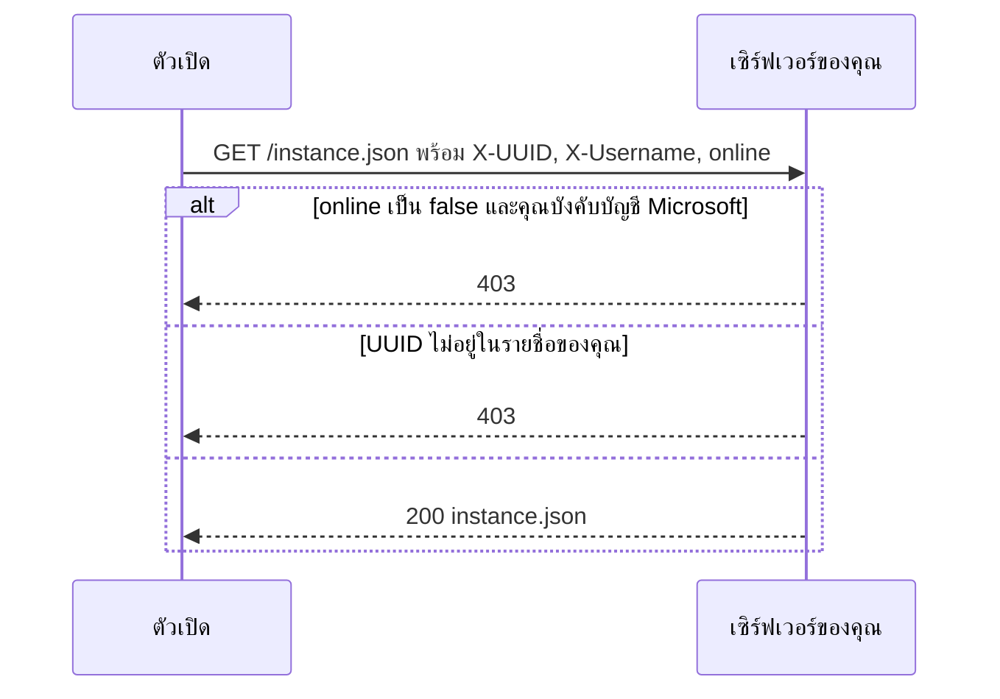

# HTTP header และการยืนยันตัวตน

ตัวเปิดส่งอะไรไปกับแต่ละคำขอ และเซิร์ฟเวอร์ที่โฮสต์เองหรือ Neko API ตัดสินใจตอบอย่างไร

---

## Header ระบุตัวตน

ทุกการอ่านที่ตัวเปิดทำกับอินสแตนซ์ (การตั้งค่า manifest ประกาศ และแต่ละไฟล์จาก manifest ที่โฮสต์เอง) มี:

| Header | ค่า | ตัวอย่าง |
|---|---|---|
| `X-UUID` | Minecraft UUID ของบัญชีที่เลือก ไม่มีขีด ตัวพิมพ์เล็ก | `8518f0b2d1064c3988d5c7da11c91bbe` |
| `X-Username` | ชื่อ Minecraft ของบัญชี | `Aomkoyo` |
| `online` | `true` สำหรับบัญชี Microsoft/Xbox, `false` สำหรับบัญชีออฟไลน์ | `true` |

ชื่อ header ไม่สนตัวพิมพ์ Neko API ปรับ UUID (มีขีดหรือไม่) และชื่อ (ตัวพิมพ์) ก่อนเทียบไวต์ลิสต์

> header เหล่านี้ client ส่งเอง ปลอมได้ Neko API ใช้เป็นตัวตนสำหรับ **อ่าน** อินสแตนซ์ที่มีไวต์ลิสต์เท่านั้น สิ่งที่ทำแทนผู้เล่น (ใบสมัคร สลิป) ต้องใช้ token ที่ลงนาม เซิร์ฟเวอร์ที่โฮสต์เองควรถือเป็นด่านแบบหลวม

### ลำดับคำขอบนโฮสต์ของคุณเอง


```mermaid
sequenceDiagram
    participant L as ตัวเปิด
    participant S as เซิร์ฟเวอร์ของคุณ
    L->>S: GET /instance.json พร้อม X-UUID, X-Username, online
    alt online เป็น false และคุณบังคับบัญชี Microsoft
        S-->>L: 403
    else UUID ไม่อยู่ในรายชื่อของคุณ
        S-->>L: 403
    else
        S-->>L: 200 instance.json
    end
```

`403` ที่ URL ของ manifest ทำให้ตัวเปิดแสดงอินสแตนซ์เป็น **ถูกล็อก** (การ์ดเหลือง) ไม่ใช่เสีย

### ตัวอย่างการตรวจ (Node.js)

```javascript
app.get('/instance.json', (req, res) => {
  const uuid = String(req.headers['x-uuid'] ?? '').replace(/-/g, '').toLowerCase();
  const online = req.headers['online'] === 'true';
  if (!/^[0-9a-f]{32}$/.test(uuid)) return res.status(400).end();
  if (!online) return res.status(403).json({ error: 'Online mode required' });
  if (!whitelist.has(uuid)) return res.status(403).json({ error: 'Not whitelisted' });
  res.json(instanceConfig);
});
```

## Neko JWT (ตัวตนที่ลงนาม)

สำหรับใบสมัคร การอัปโหลดสลิป และสถานะของผู้ดูเอง ตัวเปิดเข้าสู่ระบบกับ Neko API:

1. ตัวเปิดรีเฟรช token ของ Microsoft เองแล้วส่ง **Microsoft access token** อายุสั้นไป `POST /api/v1/auth/minecraft` (`{ "accessToken": "…" }`) ตัวเปิดรุ่นเก่าส่ง refresh token แทน API รับทั้งสองแบบ
2. API ตรวจความเป็นเจ้าของ Minecraft ผ่าน Xbox แล้วคืนคู่ Neko JWT
3. คำขอส่ง `Authorization: Bearer <accessToken>`

ตัวตนเดียวกันนี้ใช้เมื่อผู้เล่นเข้าสู่ระบบบนเว็บ ผู้ใช้แดชบอร์ดและผู้ใช้ตัวเปิดที่มีบัญชี Minecraft เดียวกันจึงเป็นบัญชีเดียว สมาชิกเวิร์กสเปซถูกจดจำผ่าน token นี้ ไม่ใช่ผ่าน `X-UUID`

## API key (ปลั๊กอินเซิร์ฟเวอร์)

ปลั๊กอินเซิร์ฟเวอร์ใช้ API key ของเวิร์กสเปซใน header `x-api-key` กับ `/api/v1/server/…` ดู [Server API](server-api.md)

## Envelope ของ response

Neko API ห่อ response เป็น:

```json
{ "code": 200, "message": "OK", "data": { … } }
```

สอง route ตอบ **JSON array เปล่า** เพื่อเข้ากันได้กับตัวเปิดรุ่นเก่า: `GET /instances/<name>/install` และ `GET /instances/<name>/announcements` เมื่อตัวเปิดอ่านการตั้งค่าหรือ manifest ที่โฮสต์เอง รับได้ทั้งเอกสารเปล่าและ envelope

อินสแตนซ์ที่ถูกล็อกตอบ `GET /instances/<name>` ด้วย **403** และ `data` แบบ branding เท่านั้น (ชื่อ ชื่อที่แสดง คำอธิบาย ไอคอน เวอร์ชัน Minecraft แท็ก `access: false`, `applicationMode` และข้อความ no-access ของเจ้าของ) เพื่อให้ตัวเปิดยังแสดงหน้าได้

## ดูเพิ่มเติม

- [Server API](server-api.md)
- [DNS discovery](dns-discovery.md)
