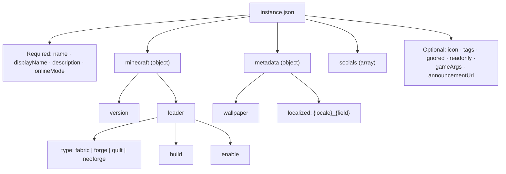

# การตั้งค่า Instance (`instance.json`)

ทุก instance ของ Neko Launcher ถูกอธิบายด้วยไฟล์ JSON เพียงไฟล์เดียว โดยทั่วไปตั้งชื่อว่า `instance.json` และเสิร์ฟจาก instance URL ของคุณ ไฟล์นี้กำหนดชื่อที่แสดง เวอร์ชัน Minecraft และ mod loader รวมถึง metadata, tags, กฎการซิงค์ และลิงก์โซเชียลที่เป็นตัวเลือกเพิ่มเติม

UI สร้าง/แก้ไข instance ของ launcher จะตรวจสอบความถูกต้องกับ JSON Schema ดังนั้นคุณจะได้รับการเติมข้อความอัตโนมัติและข้อผิดพลาดแบบ inline ในโปรแกรมแก้ไขใดก็ตามที่รองรับ `$schema`

```json
{
  "$schema": "https://cdn.neko-launcher.com/schema/neko-launcher.json",
  "name": "neko-smp",
  "displayName": "Neko SMP",
  "description": "A cozy modded survival server.",
  "onlineMode": true,
  "minecraft": {
    "version": "1.21.8",
    "loader": { "type": "fabric", "build": "0.17.2", "enable": true }
  }
}
```

> URL schema ตามหลักคือ `https://cdn.neko-launcher.com/schema/neko-launcher.json` ส่วน `https://cdn.neko-launcher.com/schema/alice-magic-launcher.json` ก็เสิร์ฟให้เช่นกันและใช้งานได้ในฐานะ alias

---

## 🧩 โครงสร้างการตั้งค่า

การตั้งค่าเป็นโครงสร้างแบบ tree: ฟิลด์ระดับบนสุดจำนวนไม่มาก, object `minecraft` ที่ซ้อนอยู่ซึ่งภายในเก็บ `loader` และบล็อก `metadata` / `socials` ที่เป็นตัวเลือก



---

## ฟิลด์ที่จำเป็น

| ฟิลด์         | ชนิดข้อมูล | คำอธิบาย                                                                            |
| ------------- | ------- | -------------------------------------------------------------------------------------- |
| `name`        | string  | ตัวระบุเฉพาะของ instance (ตัวอักษรพิมพ์เล็ก, ตัวเลข, ขีดกลาง, ขีดล่าง) |
| `displayName` | string  | ชื่อที่อ่านง่ายซึ่งแสดงใน launcher                                             |
| `description` | string  | คำอธิบายสั้น ๆ ของ instance                                                     |
| `onlineMode`  | boolean | กำหนดว่า instance ต้องการการยืนยันตัวตนออนไลน์ (Xbox/Microsoft) หรือไม่ |
| `minecraft`   | object  | การตั้งค่าเวอร์ชัน Minecraft และ loader (ดูด้านล่าง)                    |

---

## ฟิลด์ที่เป็นตัวเลือก

| ฟิลด์             | ชนิดข้อมูล          | คำอธิบาย                                                                 |
| ----------------- | ------------- | --------------------------------------------------------------------------- |
| `icon`            | string (URI)  | URL ของรูปไอคอน instance                                             |
| `metadata`        | object        | Wallpaper, ข้อความที่แปลภาษา และฟิลด์กำหนดเองใด ๆ                  |
| `tags`            | string[]      | แท็กแบบอิสระที่ใช้จัดหมวดหมู่ instance (ประเภท, คุณสมบัติ, ชุมชน)      |
| `ignored`         | string[]      | Path หรือ glob ที่ยกเว้นจากการซิงค์ manifest (ดูด้านล่าง)                    |
| `readonly`        | boolean       | หากเป็น `true` ไฟล์ของ instance จะถูกจัดการโดยเซิร์ฟเวอร์และผู้ใช้แก้ไขไม่ได้ |
| `gameArgs`        | string[]      | อาร์กิวเมนต์ JVM และเกมเพิ่มเติมที่ส่งตอนเปิด                             |
| `socials`         | array         | ลิงก์ชุมชน / ร้านค้า / โซเชียล ดู [ลิงก์โซเชียล](social-links.md)     |
| `announcementUrl` | string (URI)  | URL ของฟีด JSON ประกาศ ดู [ประกาศ](announcement-instance.md) |

---

## ⛏️ Minecraft และ loader

Object `minecraft` เก็บเวอร์ชันเป้าหมายและ `loader` ที่เป็นตัวเลือก

```json
"minecraft": {
  "version": "1.21.8",
  "loader": {
    "type": "fabric",
    "build": "0.17.2",
    "enable": true
  }
}
```

### `version`

* เวอร์ชันรีลีสที่เฉพาะเจาะจง เช่น `1.21.8` หรือ `1.20.1`
* หรือใช้ค่า `latest` เพื่อติดตามเวอร์ชันใหม่ล่าสุดเสมอ

### `loader`

| ฟิลด์    | ชนิดข้อมูล | คำอธิบาย                                        |
| -------- | ------- | -------------------------------------------------- |
| `type`   | string  | หนึ่งใน `fabric`, `forge`, `quilt`, `neoforge`     |
| `build`  | string  | เวอร์ชัน/build ของ loader ที่จะติดตั้ง                   |
| `enable` | boolean | ตั้งเป็น `false` เพื่อรันแบบ vanilla โดยไม่ใช้ loader     |

**Loader ที่รองรับ:** Fabric, Forge, Quilt, NeoForge

---

## 🎨 Metadata และการแปลภาษา

`metadata` เป็น object ที่ยืดหยุ่น ใช้เก็บ wallpaper, ค่าที่แปลภาษาแทนที่ค่าเดิม และฟิลด์กำหนดเองใด ๆ ที่เซิร์ฟเวอร์ของคุณต้องการเปิดเผย

```json
"metadata": {
  "wallpaper": "https://cdn.example.com/wallpaper.webp",
  "th_displayName": "เนโกะ เอสเอ็มพี",
  "th_description": "เซิร์ฟเวอร์เอาชีวิตรอดแบบมอด",
  "customField": "Anything you like"
}
```

ฟิลด์ที่แปลภาษาใช้รูปแบบ `{locale}_{field}` — ตัวอย่างเช่น `th_displayName`, `th_description` หรือ `ja_description` เมื่อ launcher ถูกตั้งเป็น locale นั้น ค่าเหล่านี้จะแทนที่ `displayName` / `description` เดิม

---

## 🏷️ Tags

Tags เป็นสตริงแบบอิสระที่ launcher ใช้จัดหมวดหมู่และกรอง instance

```json
"tags": ["Survival", "Modded", "RPG", "Community"]
```

---

## 🚫 ไฟล์ที่ถูกยกเว้น (Ignored)

`ignored` ระบุ path และรูปแบบ glob ที่ถูกยกเว้นจากการซิงค์ manifest — มีประโยชน์สำหรับข้อมูลเฉพาะเครื่องที่คุณไม่ต้องการให้ถูกเขียนทับหรือแพ็คเกจ

```json
"ignored": [
  "logs",
  "crash-reports",
  "screenshots",
  "*.log",
  "saves/*/playerdata"
]
```

รองรับทั้ง path ที่แน่นอน, รูปแบบ glob และ path ที่ซ้อนกัน ดู [Instance Manifest](instance-manifest.md) สำหรับวิธีที่การซิงค์ใช้กฎเหล่านี้

---

## ⚙️ อาร์กิวเมนต์เกม

`gameArgs` จะถูกเพิ่มต่อท้ายตอนเปิด — ผสมอาร์กิวเมนต์เกมและแฟล็ก JVM ได้ตามต้องการ

```json
"gameArgs": [
  "--quickPlayMultiplayer=play.furi.moe",
  "-Xmx4G",
  "-XX:+UseG1GC"
]
```

---

## 📦 ตัวอย่างที่สมบูรณ์

```json
{
  "$schema": "https://cdn.neko-launcher.com/schema/neko-launcher.json",
  "name": "neko-smp",
  "displayName": "Neko SMP",
  "description": "A cozy modded survival server.",
  "onlineMode": true,
  "icon": "https://cdn.example.com/icon.png",
  "minecraft": {
    "version": "1.21.8",
    "loader": { "type": "fabric", "build": "0.17.2", "enable": true }
  },
  "metadata": {
    "wallpaper": "https://cdn.example.com/wallpaper.webp",
    "th_displayName": "เนโกะ เอสเอ็มพี",
    "th_description": "เซิร์ฟเวอร์เอาชีวิตรอดแบบมอด"
  },
  "tags": ["Survival", "Modded", "Community"],
  "ignored": ["logs", "crash-reports", "screenshots", "*.log"],
  "readonly": false,
  "gameArgs": ["-Xmx4G", "-XX:+UseG1GC"],
  "announcementUrl": "https://cdn.example.com/announcements.json",
  "socials": [
    { "type": "discord", "url": "https://alice-discord.furi.moe" }
  ]
}
```

---

## 🔐 หมายเหตุเรื่องการควบคุมการเข้าถึง

เมื่อ launcher ดึง `instance.json` ของคุณ (รวมถึง manifest และไฟล์ต่าง ๆ) มันจะส่ง header สองตัวเพื่อให้ผู้ดูแลเซิร์ฟเวอร์สามารถควบคุมการเข้าถึงได้:

* `X-UUID` — Minecraft UUID แบบมีขีดกลางของผู้เล่น
* `online` — `"true"` สำหรับบัญชี Xbox/Microsoft จริง, `"false"` สำหรับ offline/cracked

ดู [HTTP Headers](http-headers.md) สำหรับสัญญาการร้องขอ (request contract) แบบเต็ม

---

## ดูเพิ่มเติม

* [Instance Manifest](instance-manifest.md) — ประกาศไฟล์ที่ launcher ดาวน์โหลดและตรวจสอบ
* [ลิงก์โซเชียล](social-links.md) — ตั้งค่าลิงก์ชุมชนและร้านค้า
* [ประกาศ](announcement-instance.md) — เผยแพร่ประกาศ, ข่าวสาร และอีเวนต์ภายใน launcher
* [DNS Discovery](dns-discovery.md) — ตั้งค่า instance อัตโนมัติจากเรคคอร์ด DNS ของโดเมน
* [HTTP Headers](http-headers.md) — header ที่ส่งไปพร้อมกับการร้องขอ instance
* [กลับไปยังสารบัญเอกสาร](README.md)
