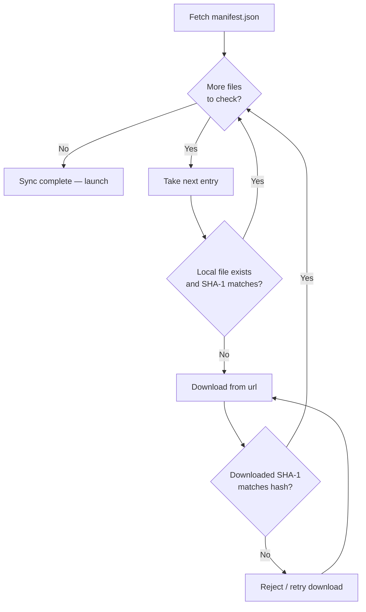

# Instance Manifest Schema

**Manifest** คือสัญญาว่าด้วยความสมบูรณ์ของไฟล์ (file-integrity contract) สำหรับ instance ของ Neko Launcher เป็นไฟล์ JSON แบบ **array** ที่แสดงรายการไฟล์ทุกไฟล์ที่ launcher ควรดาวน์โหลดเพื่อเปิดใช้งาน instance ของคุณ ไม่ว่าจะเป็น mods, resource packs, shader packs, configs, scripts และ asset อื่นๆ แต่ละรายการจะมี URL, ขนาดที่คาดหวัง และ **SHA-1 hash** เพื่อให้ launcher ตรวจสอบสิ่งที่ดาวน์โหลดมาได้ และข้ามไฟล์ที่เป็นเวอร์ชันล่าสุดอยู่แล้ว

config ของ instance จะชี้ไปยัง manifest ผ่านฟิลด์ `manifestUrl` และ DNS discovery ก็สามารถประกาศ manifest ได้โดยตรงด้วยคีย์ `manifestUrl=` (มีชื่อเรียกอีกอย่างว่า `manifest=`) ดูเพิ่มเติมที่ [Instance Configuration](instance-configuration.md) และ [DNS Discovery](dns-discovery.md)

* **Type**: `array`
* **`$schema`** (สำหรับการตรวจสอบใน editor): `https://cdn.neko-launcher.com/schema/neko-launcher.json`
* **Purpose**: รายการไฟล์ที่ดาวน์โหลดได้พร้อมข้อมูลความถูกต้อง

---

## 🧩 โครงสร้างของ Manifest

Manifest เป็น JSON array ของ object ไฟล์ ไม่มีสิ่งอื่นในระดับบนสุด:

```json
[
  {
    "path": "mods/example-mod.jar",
    "url": "https://cdn.example.com/mods/example-mod.jar",
    "size": 1234567,
    "hash": "4964121fd2d75eebec77dd8b723bc381952fe43a"
  }
]
```

### ฟิลด์ของแต่ละรายการ

| Field  | Type         | จำเป็น | คำอธิบาย                                            |
| ------ | ------------ | -------- | -------------------------------------------------- |
| `path` | string       | ✓        | path ปลายทาง แบบสัมพัทธ์กับรากของ instance          |
| `url`  | string (URI) | ✓        | URL สำหรับดาวน์โหลดที่เข้าถึงได้แบบสาธารณะ            |
| `size` | integer      | ✓        | ขนาดไฟล์ที่คาดหวังเป็นไบต์                            |
| `hash` | string       | ✓        | **SHA-1** hash (hex) สำหรับตรวจสอบความถูกต้อง         |

ทั้งสี่ฟิลด์เป็น **ฟิลด์ที่จำเป็น** สำหรับทุกรายการ

---

## 🔄 launcher ใช้ Manifest อย่างไร

เมื่อ instance ทำการ sync launcher จะดึง manifest มาแล้วเทียบกับสิ่งที่มีอยู่บนดิสก์แล้ว โดยจะดาวน์โหลดเฉพาะไฟล์ที่ขาดหายไปหรือมีการเปลี่ยนแปลงเท่านั้น ทำให้การเปิดซ้ำในครั้งต่อๆ ไปยังคงรวดเร็ว



คำขอดาวน์โหลดจะแนบ header ระบุตัวตนของผู้เล่นไปด้วย เพื่อให้ผู้ดูแลเซิร์ฟเวอร์สามารถควบคุมการเข้าถึงได้ ดูเพิ่มเติมที่ [HTTP Headers](http-headers.md):

* `X-UUID` — Minecraft UUID ของผู้เล่นในรูปแบบมีขีดคั่น (ส่งเสมอ)
* `online` — `"true"` สำหรับบัญชี Xbox/Microsoft จริง และ `"false"` สำหรับบัญชี offline/cracked

---

## 📁 แนวทางการกำหนด Path

ฟิลด์ `path` เป็นตัวกำหนดว่าแต่ละไฟล์จะไปอยู่ที่ใดภายใน instance directory

### ไดเรกทอรีที่ใช้กันทั่วไป

| Directory         | เนื้อหา                                     |
| ----------------- | ------------------------------------------ |
| `mods/`           | ไฟล์ JAR ของ Mod                           |
| `resourcepacks/`  | Resource packs                             |
| `shaderpacks/`    | Shader packs                               |
| `config/`         | ไฟล์การตั้งค่า Mod                         |
| `defaultconfigs/` | การตั้งค่าเริ่มต้นของ Mod                  |
| `kubejs/`         | สคริปต์ KubeJS                             |
| `scripts/`        | CraftTweaker หรือสคริปต์อื่นๆ              |

### กฎของ Path

* ใช้เครื่องหมายทับไปข้างหน้า `/` เท่านั้น อย่าใช้แบ็กสแลชแม้จะอยู่บน Windows
* Path เป็นแบบ **สัมพัทธ์กับรากของ instance** ไม่มีเครื่องหมายทับนำหน้า
* รักษาชื่อไฟล์เดิมไว้ตามความเป็นไปได้ (loaders มักจับคู่ด้วยชื่อไฟล์)

> **เคล็ดลับ:** ไฟล์ที่ผู้เล่นอาจแก้ไขหรือสร้างขึ้นเองในเครื่อง (options, saves, custom configs) โดยทั่วไปไม่ควรอยู่ใน manifest ให้ใช้รายการ `ignored` ใน [Instance Configuration](instance-configuration.md) เพื่อป้องกันไม่ให้ launcher เข้าไปยุ่งกับไฟล์เหล่านั้น

---

## 🔐 การตรวจสอบ Hash

ฟิลด์ `hash` เป็น **SHA-1** hex digest launcher ใช้ค่านี้เพื่อ:

* ยืนยันว่าไฟล์ที่ดาวน์โหลดมาตรงกับเนื้อหาที่คาดหวัง (ความถูกต้องแท้จริง)
* ตรวจจับความเสียหายระหว่างการดาวน์โหลด
* ข้ามการดาวน์โหลดซ้ำสำหรับไฟล์ที่ตรงกันบนดิสก์อยู่แล้ว

### การสร้าง SHA-1 Hash

**Linux / macOS:**

```bash
sha1sum file.jar
```

**Windows (PowerShell):**

```powershell
Get-FileHash -Algorithm SHA1 file.jar
```

**Node.js:**

```javascript
const crypto = require('crypto');
const fs = require('fs');

const hash = crypto.createHash('sha1');
hash.update(fs.readFileSync('file.jar'));
console.log(hash.digest('hex'));
```

ฟิลด์ `size` ควรตรงกับจำนวนไบต์จริงด้วย ซึ่งเป็นการตรวจสอบเบื้องต้นอย่างรวดเร็วก่อนที่ launcher จะเสียเวลาไปคำนวณ hash

---

## 📦 ตัวอย่างฉบับสมบูรณ์

```json
[
  {
    "path": "mods/iris-fabric-1.9.2+mc1.21.8.jar",
    "url": "https://cdn.modrinth.com/data/YL57xq9U/versions/x2f4KxP0/iris-fabric-1.9.2%2Bmc1.21.8.jar",
    "size": 2741900,
    "hash": "4964121fd2d75eebec77dd8b723bc381952fe43a"
  },
  {
    "path": "mods/sodium-fabric-0.6.5+mc1.21.8.jar",
    "url": "https://cdn.modrinth.com/data/AANobbMI/versions/b2fzXn3C/sodium-fabric-0.6.5%2Bmc1.21.8.jar",
    "size": 891234,
    "hash": "9876543210abcdef9876543210abcdef98765432"
  },
  {
    "path": "resourcepacks/Faithful 64x - Release 10.zip",
    "url": "https://cdn.modrinth.com/data/r4GILswZ/versions/5T6GekBK/Faithful%2064x%20-%20Release%2010.zip",
    "size": 18001871,
    "hash": "00413cf363e708c93a11f87dd425f0a164f3c1fb"
  },
  {
    "path": "config/iris.properties",
    "url": "https://cdn.example.com/config/iris.properties",
    "size": 2048,
    "hash": "abcdef1234567890abcdef1234567890abcdef12"
  }
]
```

---

## ✅ แนวทางปฏิบัติที่ดี

**การจัดระเบียบไฟล์**

* จัดกลุ่มไฟล์ที่เกี่ยวข้องเข้าด้วยกัน (mods ทั้งหมดไว้ด้วยกัน, configs ไว้ด้วยกัน)
* ตั้งชื่อไฟล์ให้สื่อความหมายและสอดคล้องกัน เพราะ loaders หลายตัวจับคู่ mods ด้วยชื่อ

**การจัดการ URL**

* ให้บริการไฟล์ผ่าน CDN เพื่อความเร็วในการดาวน์โหลดที่ดีขึ้น
* เข้ารหัส URL สำหรับอักขระพิเศษ (`+`, ช่องว่าง) เพื่อให้ลิงก์ทำงานได้ถูกต้อง
* ตรวจสอบให้แน่ใจว่าทุก URL เข้าถึงได้แบบสาธารณะ และรองรับ header `X-UUID` / `online` หากคุณควบคุมการเข้าถึง

**การทำให้ manifest เป็นปัจจุบันอยู่เสมอ**

* อัปเดต manifest ทุกครั้งที่เพิ่มหรือลบไฟล์ และปรับ `size`/`hash` ทุกครั้งที่มีการเปลี่ยนแปลง
* ติดตามการเปลี่ยนแปลงของ manifest ใน version control ควบคู่ไปกับ config ของ instance

**ประสิทธิภาพ**

* ลดจำนวนไฟล์ทั้งหมดให้น้อยที่สุดตามความเหมาะสม เพราะแต่ละรายการหมายถึงการตรวจสอบ hash หนึ่งครั้งบวกกับคำขอที่อาจเกิดขึ้น
* ใช้รูปแบบที่บีบอัดแล้ว (ZIP, JAR) ที่ใช้กันอยู่ในระบบนิเวศเป็นปกติ

---

## 🧪 รายการตรวจสอบก่อนเผยแพร่

ก่อนที่คุณจะเผยแพร่ manifest ให้ตรวจสอบ:

1. **ไวยากรณ์ JSON** — ไฟล์ parse ได้เป็น array ของ object ที่ถูกต้อง
2. **URLs** — ทุก `url` ดาวน์โหลดได้สำเร็จ (รวมถึงผ่านการควบคุมการเข้าถึงใดๆ)
3. **Hashes** — แต่ละ `hash` ตรงกับ SHA-1 ของไฟล์จริง
4. **Sizes** — แต่ละ `size` ตรงกับจำนวนไบต์จริง
5. **Paths** — ใช้เครื่องหมายทับไปข้างหน้า ไม่มีทับนำหน้า และชี้ไปยังไดเรกทอรีปลายทางที่ถูกต้อง

---

## ดูเพิ่มเติม

* [Instance Configuration](instance-configuration.md) — schema หลักของ instance ที่อ้างอิงถึง manifest นี้
* [DNS Discovery](dns-discovery.md) — การประกาศ `manifestUrl` ผ่าน TXT records
* [HTTP Headers](http-headers.md) — header `X-UUID` และ `online` ที่ส่งไปพร้อมกับคำขอดาวน์โหลด
* [Announcement Instance](announcement-instance.md) — รูปแบบของฟีดประกาศ
* [กลับไปยังสารบัญเอกสาร](README.md)
