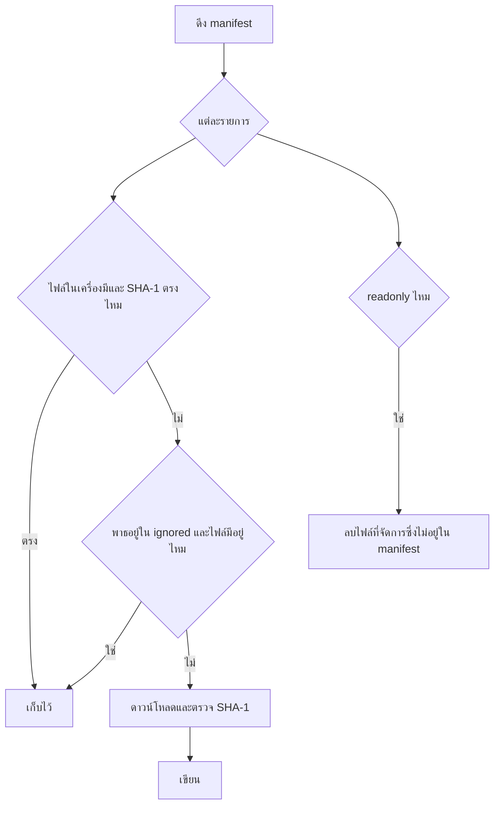

# Manifest ของอินสแตนซ์ (schema v2)

Manifest ระบุทุกไฟล์ที่ตัวเปิดรักษาให้ตรงกันในโฟลเดอร์อินสแตนซ์: ดาวน์โหลดจากไหนและตรวจสอบอย่างไร Neko API ให้บริการที่ `GET /api/v1/instances/<name>/install` ส่วนเจ้าของที่โฮสต์เองเขียน `manifest.json` แล้วชี้ key `manifest=` ใน DNS record ไปที่ไฟล์นั้น

- Schema: `https://cdn.neko-launcher.com/schema/nekolauncher-manifest.json` (เวอร์ชัน 2, 2026-09-21)
- Schema ก่อนหน้า (ล้าสมัย): `https://cdn.neko-launcher.com/schema/alice-magic-manifest.json`

---

## รูปร่าง

JSON **array** ของรายการไฟล์ หรือ envelope ของ API ที่มี array อยู่ใน `data`

```json
[
  {
    "path": "mods/fabric-api-0.100.0.jar",
    "url": "https://cdn.modrinth.com/data/P7dR8mSH/versions/abc123/fabric-api-0.100.0.jar",
    "size": 2154321,
    "hash": "3f786850e387550fdab836ed7e6dc881de23001b",
    "storageType": "MODRINTH"
  },
  {
    "path": "config/server.toml",
    "url": "https://cdn.example.com/config/server.toml",
    "size": 812,
    "hash": "89e6c98d92887913cadf06b2adb97f26cde4849b"
  }
]
```

## ฟิลด์

| ฟิลด์ | ชนิด | บังคับ | หมายเหตุ |
|---|---|---|---|
| `path` | string | ใช่ | สัมพัทธ์กับโฟลเดอร์อินสแตนซ์ ใช้ `/` ไม่มี `/` นำหน้า ไม่มี `..` |
| `url` | URL | ใช่ | ดาวน์โหลดตรง signed URL ใช้ได้ ตัวเปิดดึง manifest ใหม่ทุกครั้งที่เปิดเกม |
| `size` | integer | ใช่ | ไบต์ ใช้ข้ามไฟล์ที่ไม่เปลี่ยนและกำหนดเวลาดาวน์โหลด |
| `hash` | string | ใช่ | SHA-1 ของเนื้อหา hex 40 ตัว |
| `storageType` | `S3`, `MODRINTH`, `CURSEFORGE` | ไม่ | URL ชี้ไปที่ไหน เป็นข้อมูลประกอบ |

## ตัวเปิดใช้อย่างไร


```mermaid
flowchart TD
    A[ดึง manifest] --> B{แต่ละรายการ}
    B --> C{ไฟล์ในเครื่องมีและ SHA-1 ตรงไหม}
    C -- ตรง --> D[เก็บไว้]
    C -- ไม่ --> E{พาธอยู่ใน ignored และไฟล์มีอยู่ไหม}
    E -- ใช่ --> D
    E -- ไม่ --> F[ดาวน์โหลดและตรวจ SHA-1]
    F --> G[เขียน]
    B --> H{readonly ไหม}
    H -- ใช่ --> I[ลบไฟล์ที่จัดการซึ่งไม่อยู่ใน manifest]
```

- ไฟล์ใต้พาธ **ignored** ดาวน์โหลดครั้งเดียว (เมื่อไม่มี) และไม่เขียนทับ
- เมื่อเปิด `readonly` ไฟล์ในโฟลเดอร์ที่จัดการซึ่งไม่อยู่ใน manifest ถูกลบ `mods/.connector` และ marker ของตัวเปิดไม่ถูกแตะ
- เมื่อเปิด **ซ่อนม็อด** รายการใต้ `mods/` ถูกเก็บนอกโฟลเดอร์อินสแตนซ์และฉีดตอนเปิดเกม
- แต่ละดาวน์โหลดมีกำหนดเวลาตาม `size` ดาวน์โหลดที่ค้างทำให้การเปิดเกมล้มเหลวพร้อมข้อความ ไม่แขวน

## สร้าง hash

```bash
# Linux / macOS
sha1sum mods/*.jar

# PowerShell
Get-FileHash -Algorithm SHA1 mods\*.jar
```

สคริปต์สั้นๆ ที่เดินโฟลเดอร์แล้วพิมพ์รายการ:

```bash
find . -type f | sort | while read -r f; do
  p="${f#./}"
  printf '{"path":"%s","url":"https://cdn.example.com/%s","size":%s,"hash":"%s"},\n' \
    "$p" "$p" "$(stat -c %s "$f")" "$(sha1sum "$f" | cut -d" " -f1)"
done
```

## แนวทาง

- คง `path` ให้คงที่ เปลี่ยนชื่อไฟล์ = ทุกคนดาวน์โหลดใหม่
- ให้บริการไฟล์ผ่าน HTTPS ด้วยขนาดที่ถูกต้อง ขนาดไม่ตรงถือว่าไฟล์เปลี่ยน
- ใส่การตั้งค่าผู้เล่น (`options.txt`, ปุ่มลัด, รีซอร์สแพ็ก) ในรายการ `ignored` ของอินสแตนซ์แทนการไม่ใส่ใน manifest เพื่อให้ผู้เล่นใหม่ได้ค่าเริ่มต้นของคุณ
- อย่าใส่ `mods/.connector` หรือ cache ต่อเครื่องอื่นๆ

## ต่างจาก v1

- เพิ่ม `storageType` (ไม่บังคับ)
- `hash` ต้องเป็น SHA-1 hex `path` ห้ามย้อนขึ้น
- รับ envelope ของ API ที่ระดับบนสุด
- manifest v1 ยังเป็นเอกสาร v2 ที่ถูกต้อง

## ดูเพิ่มเติม

- [การตั้งค่าอินสแตนซ์](instance-configuration.md)
- [ไฟล์และเวอร์ชันในแดชบอร์ด](../dashboard/files-and-versions.md)
