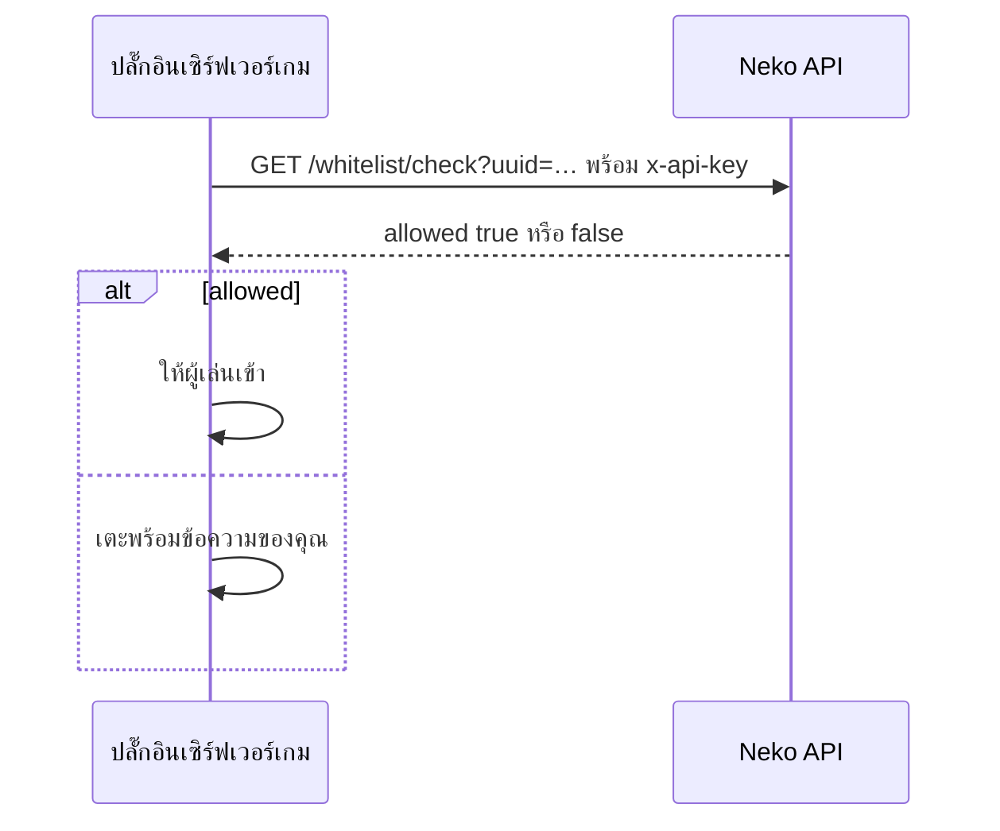

# Server API

API แบบอ่านอย่างเดียวสำหรับ **เซิร์ฟเวอร์ Minecraft** ของคุณ (ปลั๊กอินหรือม็อด) เพื่อบังคับไวต์ลิสต์ชุดเดียวกับที่ตัวเปิดใช้ ผู้เล่นที่ไม่เคยได้เข้าอินสแตนซ์ในตัวเปิดจะเข้าเซิร์ฟเวอร์เกมไม่ได้เช่นกัน

---

## การยืนยันตัวตน

สร้าง **API key** ของเวิร์กสเปซในแดชบอร์ด (**Settings → API key**) แล้วส่งเป็น:

```
x-api-key: <key>
```

key ผูกกับเวิร์กสเปซ อ่านได้ทุกอินสแตนซ์ที่เวิร์กสเปซเป็นเจ้าของ เก็บไว้บนเซิร์ฟเวอร์เท่านั้น

Base URL: `https://api.neko-launcher.com/api/v1/server` response ใช้ envelope `{ code, message, data }`

## Route

### รายการอินสแตนซ์

```
GET /server/instances
```

`data` คือรายการอินสแตนซ์ที่ key นี้อ่านได้ (`name`, `displayName`, `visibility`, `enforceWhitelist`)

### ตรวจผู้เล่นหนึ่งคน

```
GET /server/instances/<name>/whitelist/check?uuid=<uuid>
GET /server/instances/<name>/whitelist/check?username=<name>
```

ใช้พารามิเตอร์ใดก็ได้ UUID มีหรือไม่มีขีด ชื่อไม่สนตัวพิมพ์

```json
{ "code": 200, "message": "OK", "data": { "allowed": true, "matchType": "uuid" } }
```

`allowed` ใช้กฎเดียวกับตัวเปิด: `true` สำหรับอินสแตนซ์เปิด (OFFICIAL หรือ PUBLIC/UNLISTED ที่ไม่มี *Enforce whitelist*) นอกนั้น `true` เฉพาะเมื่อมีรายการไวต์ลิสต์

### อ่านไวต์ลิสต์

```
GET /server/instances/<name>/whitelist?limit=500&cursor=<nextCursor>
```

หน้าของรายการ (`matchType`, `minecraftUuid`, `username`, `createdAt`) `limit` ค่าเริ่มต้น 500 สูงสุด 2000 ส่ง `nextCursor` จากหน้าก่อนเพื่ออ่านต่อ

## ตัวอย่าง: ตรวจตอนล็อกอิน



cache คำตอบที่ผ่านไว้หนึ่งถึงสองนาที และเมื่อ API ติดต่อไม่ได้ให้ **ปิด** (ปฏิเสธ) หรือเปิดตามนโยบายของคุณเอง

## ดูเพิ่มเติม

- [ไวต์ลิสต์และใบสมัคร](../dashboard/whitelist-and-applications.md)
- [HTTP header และการยืนยันตัวตน](http-headers.md)
