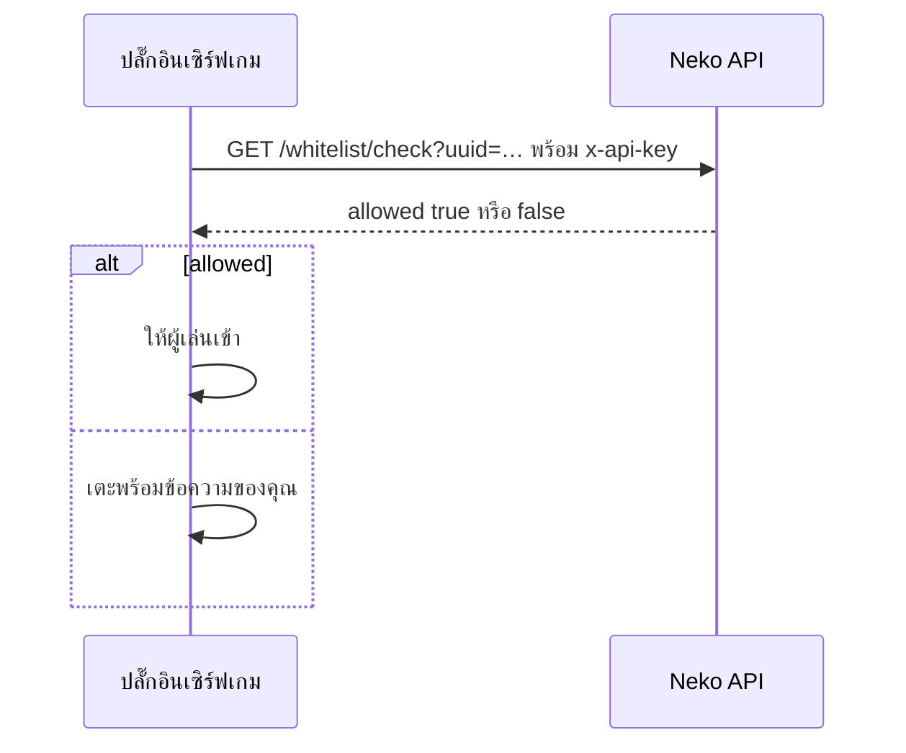

# Server API

API สำหรับ **เซิร์ฟเวอร์ Minecraft** ของคุณ (ปลั๊กอินหรือม็อด) บอต หรือ backend ของคุณเอง: บังคับ whitelist ชุดเดียวกับที่ตัวเปิดใช้ จัดการรายชื่อ และส่งจำนวนผู้เล่นออนไลน์

---

## API keys

สร้าง key ได้ในแดชบอร์ดที่ **Developer → API keys** แต่ละ key มี:

- **ชื่อ** เพื่อให้รู้ว่าเซิร์ฟไหนใช้
- **สิทธิ์** ให้เท่าที่จำเป็นเท่านั้น
- รายการ **instance** ที่แตะได้ (ไม่เลือก = ทุก instance)
- **วันหมดอายุ** (ไม่บังคับ)

| สิทธิ์ | ทำได้ |
|---|---|
| `instances:read` | ดูรายการ instance |
| `whitelist:read` | เช็กผู้เล่น อ่าน whitelist |
| `whitelist:write` | เพิ่ม/ลบผู้เล่น เปลี่ยนวันหมดอายุ |
| `status:write` | ส่งจำนวนผู้เล่นออนไลน์ |

มีชุดสำเร็จรูปสองแบบ: **ปลั๊กอินเซิร์ฟ** (`instances:read`, `whitelist:read`, `status:write`) และ **จัดการ whitelist** (`instances:read`, `whitelist:read`, `whitelist:write`)

key (`nk_…`) แสดง **ครั้งเดียว** ระบบเก็บแค่ hash ส่งใน header:

```
x-api-key: nk_…
```

เก็บไว้ฝั่งเซิร์ฟเวอร์เท่านั้น ห้ามใส่ใน client ของผู้เล่น เพิกถอน key ได้ที่หน้าเดียวกันและจะใช้ไม่ได้ทันที สร้างได้สูงสุด 25 key ต่อ workspace

> Workspace key แบบเดิม (**Settings → API key**) ยังใช้ได้ ทำงานเหมือน key ที่มี `instances:read`, `whitelist:read` และ `status:write` กับทุก instance

Base URL: `https://api.neko-launcher.com/api/v1/server` คำตอบอยู่ในรูป `{ code, message, data }`

## Routes

| Method | Path | สิทธิ์ |
|---|---|---|
| `GET` | `/server/instances` | `instances:read` |
| `GET` | `/server/instances/<name>/whitelist/check` | `whitelist:read` |
| `GET` | `/server/instances/<name>/whitelist` | `whitelist:read` |
| `POST` | `/server/instances/<name>/whitelist` | `whitelist:write` |
| `PATCH` | `/server/instances/<name>/whitelist/<id>` | `whitelist:write` |
| `PATCH` | `/server/instances/<name>/whitelist/bulk` | `whitelist:write` |
| `DELETE` | `/server/instances/<name>/whitelist/<id>` | `whitelist:write` |
| `POST` | `/server/instances/<name>/whitelist/bulk-remove` | `whitelist:write` |
| `POST` | `https://api.neko-launcher.com/mcstatus/report` | `status:write` |

instance ที่ไม่อยู่ในรายการของ key จะตอบ `404` เหมือนไม่มีอยู่

### ดูรายการ instance

```
GET /server/instances
```

`data` คือ instance ที่ key นี้อ่านได้ (`name`, `displayName`, `visibility`, `enforceWhitelist`, `whitelistCount`)

### เช็กผู้เล่น 1 คน

```
GET /server/instances/<name>/whitelist/check?uuid=<uuid>
GET /server/instances/<name>/whitelist/check?username=<name>
```

ใช้อย่างใดอย่างหนึ่ง UUID มีหรือไม่มีขีดก็ได้ ชื่อไม่สนตัวพิมพ์ใหญ่เล็ก

```json
{ "code": 200, "message": "OK", "data": { "allowed": true, "matchType": "uuid" } }
```

`allowed` ใช้กฎเดียวกับตัวเปิด: `true` สำหรับ instance ที่เปิดอยู่ (OFFICIAL หรือ PUBLIC/UNLISTED ที่ไม่ได้เปิด *Enforce whitelist*) นอกนั้น `true` เฉพาะคนที่มี entry ที่ยังไม่หมดอายุ

### อ่าน whitelist

```
GET /server/instances/<name>/whitelist?limit=500&cursor=<nextCursor>
```

ได้ entry ที่ยังใช้ได้ทีละหน้า (`id`, `matchType`, `minecraftUuid`, `username`, `addedAt`, `expiresAt`) `limit` ค่าเริ่มต้น 500 สูงสุด 2000 ส่ง `nextCursor` จากหน้าก่อนไปเรื่อย ๆ จนเป็น `null`

### แก้ whitelist

route เขียนใช้ body เดียวกับ [Whitelist API](whitelist-api.md#routes): เพิ่มด้วย `{ value, matchType?, username?, expiresAt? }`, ตั้งวันหมดอายุด้วย `{ expiresAt }` (`null` = ล้าง), route แบบหลายรายการรับ `ids` ได้สูงสุด 1000

```bash
curl -X POST https://api.neko-launcher.com/api/v1/server/instances/my-smp/whitelist \
  -H "x-api-key: nk_..." -H "content-type: application/json" \
  -d '{"value":"Notch","expiresAt":"2026-12-31T23:59:00+07:00"}'
```

การแก้ผ่านทางนี้ส่ง [webhooks](whitelist-api.md#webhooks) เหมือนแก้ในแดชบอร์ด

### ส่งจำนวนผู้เล่นออนไลน์

```
POST https://api.neko-launcher.com/mcstatus/report
{ "instanceId": "<name>", "online": 12 }
```

ตัวเปิดจะแสดงตัวเลขนี้บนการ์ด instance

## ข้อผิดพลาด

| HTTP | ความหมาย |
|---|---|
| `400` | ข้อมูลไม่ถูกต้อง: UUID ผิด, วันหมดอายุในอดีต, ids เกิน 1000 |
| `401` | ไม่มี key, key ไม่ถูกต้อง, ถูกเพิกถอน หรือหมดอายุ |
| `403` | key ไม่มีสิทธิ์นี้ หรือ whitelist เต็มโควตาแพ็กเกจ |
| `404` | ไม่มี instance นี้ หรือไม่อยู่ในรายการของ key |

## SDK

SDK ทางการสำหรับ Node.js ครอบทุก route และตรวจ webhook ให้ ไม่มี dependency ใช้ได้กับ Node 18 ขึ้นไป

```bash
npm install @neko-launcher/sdk
```

```js
import { NekoClient, constructEvent } from '@neko-launcher/sdk';

const neko = new NekoClient({ apiKey: process.env.NEKO_API_KEY });

const { allowed } = await neko.checkPlayer('my-smp', { uuid: player.uuid });

for await (const entry of neko.whitelistEntries('my-smp')) {
  // sync ทั้งรายชื่อทีละหน้า
}

const entry = await neko.addPlayer('my-smp', { value: 'Notch', expiresAt: new Date(Date.now() + 30 * 864e5) });
await neko.setExpiry('my-smp', entry.id, null);
await neko.removePlayer('my-smp', entry.id);
await neko.reportOnline('my-smp', 12);

// ใน endpoint ของ webhook (ต้องเป็น body ดิบ!)
const event = constructEvent({ body: rawBody, headers: req.headers, secret: process.env.NEKO_WEBHOOK_SECRET });
```

ถ้าเรียกไม่สำเร็จจะ throw `NekoApiError` ที่มี `status` และ `message` จาก API ดูทุก method ได้ใน [README ของแพ็กเกจ](https://www.npmjs.com/package/@neko-launcher/sdk)

## ตัวอย่าง: เช็กตอนผู้เล่นเข้าเซิร์ฟ


```mermaid
sequenceDiagram
    participant G as ปลั๊กอินเซิร์ฟเกม
    participant API as Neko API
    G->>API: GET /whitelist/check?uuid=… พร้อม x-api-key
    API-->>G: allowed true หรือ false
    alt allowed
        G->>G: ให้ผู้เล่นเข้า
    else
        G->>G: เตะพร้อมข้อความของคุณ
    end
```

แคชคำตอบที่ผ่านไว้สักนาทีสองนาที และถ้าเรียก API ไม่ได้ให้ **ปฏิเสธ** (fail closed) หรือปล่อยผ่านตามนโยบายของคุณ เซิร์ฟใหญ่ควร sync ทั้งรายชื่อด้วย `whitelistEntries()` ตอนเปิดเซิร์ฟ แล้วอัปเดตต่อด้วย [webhooks](whitelist-api.md#webhooks)

## ดูเพิ่ม

- [Whitelist API และ webhooks](whitelist-api.md)
- [Whitelist และใบสมัคร](../dashboard/whitelist-and-applications.md)
- [HTTP headers และการยืนยันตัวตน](http-headers.md)
