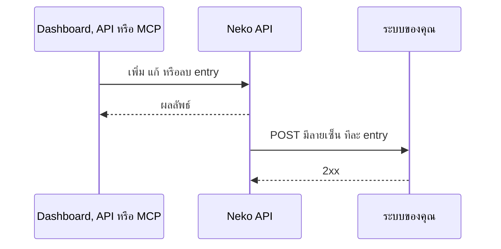

# Whitelist API และ Webhooks

จัดการ whitelist ของ instance จากเครื่องมือของคุณเอง: เพิ่มผู้เล่นพร้อมวันหมดอายุ, ตั้งหรือล้างวันหมดอายุทีละหลายคน, ลบผู้เล่น และรับ webhook ที่มีลายเซ็นทุกครั้งที่รายชื่อเปลี่ยน

เข้าถึงได้ 3 ทาง:

| ช่องทาง | การยืนยันตัวตน | ทำอะไรได้ |
|---|---|---|
| **[Server API](server-api.md)** | API key (`x-api-key`) จาก **Developer → API keys** | ดูรายชื่อ, เช็ก, เพิ่ม, เปลี่ยนวันหมดอายุ, ลบ, ส่งจำนวนผู้เล่นออนไลน์ เหมาะกับปลั๊กอิน บอต และ backend |
| **Dashboard API** (หน้านี้) | Bearer token ของสมาชิก workspace ที่ล็อกอินอยู่และมีสิทธิ์ *instance settings* | ทุกอย่างด้านล่าง |
| **MCP** (ผู้ช่วย AI) | OAuth ผ่าน **Settings → Connected apps** | ทำแบบเดียวกันผ่าน tools ดู [MCP tools](#mcp-tools) |

Base URL: `https://api.neko-launcher.com/api/v1` คำตอบอยู่ในรูป `{ code, message, data }` เอกสารแบบลองเรียกได้อยู่ที่ `https://api.neko-launcher.com/docs`

---

## Routes

ทุก route ใช้ชื่อ instance (id ใน URL) แทน `<name>` ฝั่ง [Server API](server-api.md) มี route เขียนแบบเดียวกันที่ `/server/instances/<name>/…`

### ดูรายชื่อ

```
GET /instances/<name>/whitelist
```

`data` คือทุก entry รวมที่หมดอายุแล้ว: `id`, `matchType` (`uuid` หรือ `username`), `minecraftUuid`, `username`, `createdAt`, `expiresAt`

### เพิ่มผู้เล่น

```
POST /instances/<name>/whitelist
```

```json
{ "value": "069a79f4-44e9-4726-a5be-fca90e38aaf5", "expiresAt": "2026-12-31T23:59:00+07:00" }
```

| ฟิลด์ | จำเป็น | ความหมาย |
|---|---|---|
| `value` | ใช่ | UUID (มีหรือไม่มีขีดก็ได้) หรือชื่อผู้เล่น |
| `matchType` | ไม่ | `uuid` หรือ `username` ถ้าไม่ส่ง API จะตัดสินให้: ถ้าเป็น UUID จับคู่ด้วย UUID นอกนั้นจับคู่ด้วยชื่อ |
| `username` | ไม่ | ชื่อที่แสดงคู่กับ entry แบบ UUID |
| `expiresAt` | ไม่ | วันเวลา ISO 8601 ในอนาคตพร้อม time zone สิทธิ์หมดตอนนั้นพอดี ไม่ส่งหรือส่ง `null` = ไม่หมดอายุ |

ตอบ `201` พร้อม entry, `409` ถ้าซ้ำ, `403` ถ้า whitelist เต็มโควตาแพ็กเกจ entry ที่หมดอายุไม่นับรวมในโควตา

### ตั้งหรือล้างวันหมดอายุ 1 รายการ

```
PATCH /instances/<name>/whitelist/<id>
{ "expiresAt": "2026-12-31T23:59:00Z" }
```

`null` = ไม่มีวันหมดอายุ การตั้งวันใหม่ให้ entry ที่หมดอายุแล้วจะทำให้กลับมาใช้ได้และนับรวมโควตาอีกครั้ง

### ตั้งหรือล้างวันหมดอายุหลายรายการ

```
PATCH /instances/<name>/whitelist/bulk
{ "ids": ["<id>", "<id>"], "expiresAt": "2026-12-31T23:59:00Z" }
```

สูงสุด **1000** id ต่อครั้ง id ของ instance อื่นจะถูกข้าม `data` คือ `{ "updated": <จำนวน>, "expiresAt": … }` ถ้าการเปลี่ยนจะทำให้ entry ที่หมดอายุกลับมาเกินโควตา จะไม่มีอะไรเปลี่ยนและ API ตอบ `403`

### ลบผู้เล่น

```
DELETE /instances/<name>/whitelist/<id>
POST   /instances/<name>/whitelist/bulk-remove   { "ids": ["<id>", …] }
```

ลบหลายรายการได้สูงสุด 1000 id ตอบ `{ "removed": <จำนวน>, "ids": [...] }`

## Webhooks

ส่งการเปลี่ยนแปลงของ whitelist และใบสมัครไปยังระบบของคุณ เช่น sync เซิร์ฟเวอร์เกม หรือโพสต์ผ่านบอต Discord

Webhook เป็นของ workspace เพิ่มได้ในแดชบอร์ดที่ **Developer → Webhooks**:

1. วาง URL ปลายทางแล้วกด **ทดสอบ** แดชบอร์ดจะส่ง `ping` และแสดงผลตอบกลับ
2. เลือก event และจะจำกัดเฉพาะบาง instance ก็ได้
3. บันทึก แล้วคัดลอก **signing secret** (`whsec_…`) ซึ่งแสดงครั้งเดียว กด **Rotate secret** เพื่อออกอันใหม่

สร้างได้สูงสุด 10 webhook ต่อ workspace URL ต้องเป็น HTTPS สาธารณะและไม่มี credentials แดชบอร์ดแสดงการส่ง 50 ครั้งล่าสุดของแต่ละ webhook พร้อมสถานะ

> Webhook ที่เคยตั้งไว้ใน instance ก่อนตุลาคม 2026 (*Whitelist → Webhook on whitelist changes*) ถูกย้ายมาเป็น webhook ของ workspace พร้อม event whitelist ทั้งสามให้อัตโนมัติ และตอนนี้ได้รับคำขอแบบมีลายเซ็นด้วย

### Events

| Event | เมื่อไหร่ |
|---|---|
| `whitelist.added` | เพิ่มผู้เล่นด้วยมือ, นำเข้า, ผ่าน API หรือจากการอนุมัติใบสมัคร (รวมหลังจ่ายค่าเข้า) ไม่ส่งถ้าซ้ำ |
| `whitelist.updated` | ตั้งหรือล้างวันหมดอายุ ทั้งทีละรายการและหลายรายการ |
| `whitelist.removed` | ลบ entry ทั้งทีละรายการและหลายรายการ |
| `application.submitted` | ผู้เล่นส่งใบสมัคร |
| `application.approved` / `application.rejected` | ใบสมัครได้รับการตัดสิน |
| `application.payment_required` | อนุมัติแล้วและรอชำระค่าเข้า |
| `payment.received` / `payment.approved` / `payment.rejected` | ส่งสลิปค่าเข้าและผลการตรวจ |
| `ping` | ปุ่ม **ทดสอบ** ในแดชบอร์ด |

แต่ละ event เป็น HTTPS `POST` แบบ `content-type: application/json` พร้อม header:

| Header | ค่า |
|---|---|
| `x-neko-event` | ชื่อ event |
| `x-neko-delivery` | id เฉพาะของการส่งครั้งนี้ |
| `x-neko-timestamp` | Unix time (วินาที) ตอนส่ง |
| `x-neko-signature` | `sha256=` + HMAC-SHA256 แบบ hex ของ `<timestamp>.<body ดิบ>` ด้วย secret ของ webhook |

การเปลี่ยนแบบหลายรายการจะส่งทีละ entry ต่อกันไป

```json
{
  "event": "whitelist.updated",
  "deliveryId": "3f0c9a…",
  "occurredAt": "2026-10-02T10:00:00.000Z",
  "instance": { "name": "koyo-7f3a", "displayName": "KoyoSMP" },
  "player": { "matchType": "uuid", "username": "Notch", "uuid": "069a79f444e94726a5befca90e38aaf5" },
  "whitelist": { "createdAt": "2026-09-01T08:00:00.000Z", "expiresAt": "2026-12-31T16:59:00.000Z" }
}
```

event ของใบสมัครและการชำระเงินมี `"application": { "id", "applicantUsername", "applicantUuid", "reviewNote"?, "fee"?, "deadline"? }` แทน `player` และ `whitelist`

### ตรวจลายเซ็น

คำนวณ HMAC จาก body **ดิบ** ตามที่ได้รับ (ก่อน parse JSON) เทียบแบบ constant time และปฏิเสธ timestamp ที่เก่าเกินไม่กี่นาที เพื่อกันการนำคำขอที่ถูกดักไปส่งซ้ำ

```js
import { createHmac, timingSafeEqual } from 'node:crypto';

function verify(rawBody, headers, secret) {
  const ts = headers['x-neko-timestamp'];
  if (Math.abs(Date.now() / 1000 - Number(ts)) > 300) return false;
  const expected = 'sha256=' + createHmac('sha256', secret).update(`${ts}.${rawBody}`).digest('hex');
  const got = String(headers['x-neko-signature'] ?? '');
  return got.length === expected.length && timingSafeEqual(Buffer.from(got), Buffer.from(expected));
}
```

[SDK](server-api.md#sdk) ทำให้ได้ด้วย `constructEvent()`

### การส่ง

ส่งแบบ best-effort: แต่ละคำขอ timeout ที่ 5 วินาทีและไม่ส่งซ้ำ ให้ตอบ `2xx` ให้เร็วแล้วค่อยทำงานต่อ ถ้าห้ามพลาดเลย ให้ดึงรายชื่อเป็นระยะด้วย [Server API](server-api.md) ด้วย



## MCP tools

ผู้ช่วย AI ที่เชื่อมผ่าน MCP (`https://api.neko-launcher.com/api/v1/mcp`) ทำได้แบบเดียวกัน:

| Tool | ทำอะไร |
|---|---|
| `whitelist_list` | ดูรายชื่อ |
| `whitelist_add` | เพิ่มด้วย `value` และ `matchType`, `expiresAt` ถ้าต้องการ |
| `whitelist_set_expiry` | ตั้งหรือล้างวันหมดอายุสูงสุด 1000 รายการ (`ids`, `expiresAt`) |
| `whitelist_remove` | ลบ 1 รายการ |
| `whitelist_remove_many` | ลบสูงสุด 1000 รายการ จะถามยืนยันก่อน |

ต้องมีสิทธิ์ *players* บนการเชื่อมต่อ และแพ็กเกจ workspace ต้องเปิด web MCP

## ดูเพิ่ม

- [Server API และ SDK](server-api.md)
- [Whitelist ใบสมัคร และลิงก์เชิญ](../dashboard/whitelist-and-applications.md)
