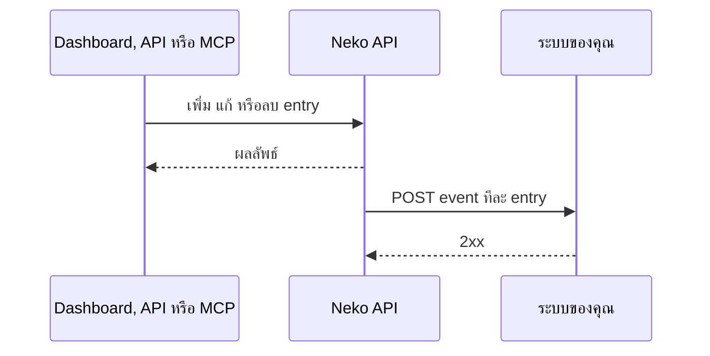

# Whitelist API และ Webhook

จัดการ whitelist ของ instance จากเครื่องมือของคุณเอง: เพิ่มผู้เล่นพร้อมวันหมดอายุ, ตั้งหรือล้างวันหมดอายุทีละหลายคน, ลบผู้เล่น และรับ webhook ทุกครั้งที่รายชื่อเปลี่ยน

เข้าถึงได้ 3 ทาง:

| ช่องทาง | การยืนยันตัวตน | ทำอะไรได้ |
|---|---|---|
| **Dashboard API** (หน้านี้) | Bearer token ของสมาชิก workspace ที่ล็อกอินอยู่และมีสิทธิ์ *instance settings* | ทุกอย่างด้านล่าง |
| **MCP** (ผู้ช่วย AI) | OAuth ผ่าน **Settings → Connected apps** | ทำแบบเดียวกันผ่าน tools ดู [MCP tools](#mcp-tools) |
| **[Server API](server-api.md)** | `x-api-key` ของ workspace | อ่านอย่างเดียว: ดูรายชื่อและเช็กผู้เล่น |

Base URL: `https://api.neko-launcher.com/api/v1` คำตอบอยู่ในรูป `{ code, message, data }` เอกสารแบบลองเรียกได้อยู่ที่ `https://api.neko-launcher.com/docs`

---

## Routes

ทุก route ใช้ชื่อ instance (id ใน URL) แทน `<name>`

### ดูรายชื่อ

```
GET /instances/<name>/whitelist
```

`data` คือทุก entry รวมที่หมดอายุแล้ว: `id`, `matchType` (`uuid` หรือ `username`), `minecraftUuid`, `username`, `createdAt`, `expiresAt`

### เพิ่มผู้เล่น

```
POST /instances/<name>/whitelist
```

```json
{ "value": "069a79f4-44e9-4726-a5be-fca90e38aaf5", "expiresAt": "2026-12-31T23:59:00+07:00" }
```

| Field | จำเป็น | ความหมาย |
|---|---|---|
| `value` | ใช่ | UUID (มีหรือไม่มีขีดก็ได้) หรือชื่อผู้เล่น |
| `matchType` | ไม่ | `uuid` หรือ `username` ถ้าไม่ส่ง API จะตรวจให้เอง: เป็น UUID ก็จับคู่ด้วย UUID นอกนั้นจับคู่ด้วยชื่อ |
| `username` | ไม่ | ชื่อที่เก็บไว้แสดงคู่กับ entry แบบ UUID |
| `expiresAt` | ไม่ | วันเวลาในอนาคตแบบ ISO 8601 พร้อม time zone สิทธิ์หมดตอนนั้น ไม่ส่งหรือ `null` = ไม่หมดอายุ |

ตอบ `201` พร้อม entry, `409` ถ้าซ้ำ, `403` ถ้าเต็มโควตาของแพ็กเกจ entry ที่หมดอายุแล้วไม่นับโควตา

### ตั้งหรือล้างวันหมดอายุทีละคน

```
PATCH /instances/<name>/whitelist/<id>
{ "expiresAt": "2026-12-31T23:59:00Z" }
```

`null` = ถาวร การตั้งวันใหม่ให้ entry ที่หมดอายุไปแล้วจะทำให้กลับมาใช้ได้ จึงนับโควตาอีกครั้ง

### ตั้งหรือล้างวันหมดอายุหลายคน

```
PATCH /instances/<name>/whitelist/bulk
{ "ids": ["<id>", "<id>"], "expiresAt": "2026-12-31T23:59:00Z" }
```

สูงสุด **1000** id ต่อครั้ง id ของ instance อื่นจะถูกข้าม `data` คือ `{ "updated": <จำนวน>, "expiresAt": … }` ถ้าการเปลี่ยนนี้ทำให้ entry ที่หมดอายุกลับมาเกินโควตาที่เหลือ จะไม่มีอะไรเปลี่ยนและตอบ `403`

### ลบผู้เล่น

```
DELETE /instances/<name>/whitelist/<id>
POST   /instances/<name>/whitelist/bulk-remove   { "ids": ["<id>", …] }
```

ลบหลายคนได้สูงสุด 1000 id ตอบ `{ "removed": <จำนวน>, "ids": [...] }`

## Webhook

ส่งการเปลี่ยนแปลงของ whitelist ไปที่ระบบของคุณ เช่น sync กับเซิร์ฟเวอร์เกมหรือโพสต์ผ่านบอต

ตั้งค่าใน dashboard (**Whitelist** → *Webhook เมื่อ whitelist เปลี่ยน*) หรือผ่าน API:

```
GET   /instances/<name>/whitelist/webhook          → { "configured": true }
PATCH /instances/<name>/whitelist/webhook          { "url": "https://example.com/neko" }
PATCH /instances/<name>/whitelist/webhook          { "url": null }   (ปิด)
```

URL ต้องเป็น HTTPS สาธารณะและไม่มี username/password ใน URL ระบบเก็บเป็นความลับ ไม่มี route ไหนส่ง URL กลับมา

### Events

| Event | เมื่อไหร่ |
|---|---|
| `whitelist.added` | เพิ่มผู้เล่นเอง, นำเข้า หรืออนุมัติใบสมัคร (รวมหลังจ่ายค่าเข้า) ไม่ส่งถ้าซ้ำ |
| `whitelist.updated` | ตั้งหรือล้างวันหมดอายุ ทั้งทีละคนและหลายคน |
| `whitelist.removed` | ลบ entry ทั้งทีละคนและหลายคน |

แต่ละ event เป็น HTTPS `POST` ที่มี `content-type: application/json` และ header `x-neko-event: <event>` การเปลี่ยนหลายคนพร้อมกันจะส่งทีละ request ต่อ entry เรียงกันไป

```json
{
  "event": "whitelist.updated",
  "occurredAt": "2026-10-02T10:00:00.000Z",
  "instance": { "name": "koyo-7f3a", "displayName": "KoyoSMP" },
  "player": { "matchType": "uuid", "username": "Notch", "uuid": "069a79f444e94726a5befca90e38aaf5" },
  "whitelist": { "createdAt": "2026-09-01T08:00:00.000Z", "expiresAt": "2026-12-31T16:59:00.000Z" }
}
```

ส่งแบบ best-effort: รอ 5 วินาทีแล้วตัด และไม่ส่งซ้ำ ให้ตอบ `2xx` เร็วๆ แล้วค่อยทำงานต่อ ถ้าห้ามพลาดเลย ให้อ่านรายชื่อเป็นระยะด้วย `GET /whitelist` หรือ [Server API](server-api.md) ด้วย



## MCP tools

ผู้ช่วย AI ที่ต่อผ่าน MCP (`https://api.neko-launcher.com/api/v1/mcp`) ทำได้แบบเดียวกัน:

| Tool | ทำอะไร |
|---|---|
| `whitelist_list` | ดูรายชื่อ |
| `whitelist_add` | เพิ่มด้วย `value` ส่ง `matchType` และ `expiresAt` ได้ถ้าต้องการ |
| `whitelist_set_expiry` | ตั้งหรือล้างวันหมดอายุได้สูงสุด 1000 entry (`ids`, `expiresAt`) |
| `whitelist_remove` | ลบหนึ่ง entry |
| `whitelist_remove_many` | ลบได้สูงสุด 1000 entry จะถามยืนยันก่อน |

ต้องให้สิทธิ์หมวด *players* กับการเชื่อมต่อ และแพ็กเกจของ workspace ต้องรวม web MCP

## ดูเพิ่มเติม

- [Whitelist, ใบสมัคร และลิงก์เชิญ](../dashboard/whitelist-and-applications.md)
- [Server API](server-api.md)
